# ForgeMind

## 智能工厂数字孪生与可验证生产平台

<p align="center">
  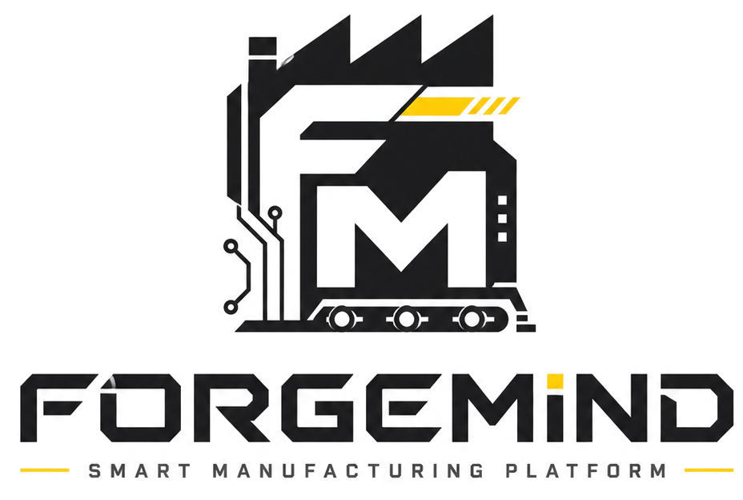
</p>

<p align="center">
  <strong>DESIGN · SIMULATE · DIAGNOSE · IMPROVE</strong><br>
  在数字世界搭建工厂，在确定性运行中验证方案，再把证据交给团队和现场。
</p>

ForgeMind 是一个面向智能工厂设计、生产配置、物流规划、离散仿真和运行诊断的可运行平台。它以浏览器中的 React + Three.js 工作台为核心，把网格建造、物品与配方、仓储与运输、确定性仿真、视觉检测、Agent 诊断和 Forge 生态协作入口连成一条闭环。

项目的关键原则是：**AI 可以缺席，工厂不能停。** 布局坐标、碰撞结论、寻路结果、物料守恒和仿真指标由本地确定性代码负责；根目录完整启动入口会预热 AI、语音和 TTS，使网站打开即用，但这些服务只承担解释、约束提取或方案辅助，不能直接成为工厂事实源。

> 当前实现、能力状态和未完成边界以 [`docs/ForgeMind-当前实现总览.md`](docs/ForgeMind-当前实现总览.md) 和 [`ForgeMind 项目方案.md`](ForgeMind%20项目方案.md) 为准。本文是面向使用者、开发者、评审者和生态接入方的项目入口。

## 目录

- [项目定位](#项目定位)
- [产品闭环](#产品闭环)
- [产品与模块](#产品与模块)
- [产品画面](#产品画面)
- [总体架构](#总体架构)
- [关键数据流](#关键数据流)
- [技术栈与工程结构](#技术栈与工程结构)
- [快速开始](#快速开始)
- [用户操作路径](#用户操作路径)
- [接口与数据边界](#接口与数据边界)
- [验证与质量门禁](#验证与质量门禁)
- [当前边界与路线图](#当前边界与路线图)
- [文档与资产](#文档与资产)

## 项目定位

### ForgeMind 解决什么问题

传统产线方案往往在 CAD、表格、经验和现场调试之间来回切换，布局、节拍、库存、运输和异常很难放在同一套可复现模型里验证。ForgeMind 把这些对象放进同一个数字工厂：

1. 在统一网格和多楼层空间里放置设备、传送带、仓储和运输载具。
2. 用物品、配方、端口和生产路线定义真实的加工关系。
3. 用离散传送带、机器状态机、AGV、无人机和真实库存推进生产仿真。
4. 用诊断、巡检、生成式规划和 What-if 比较寻找瓶颈与改进方案。
5. 用 ForgeCloud、ForgeLab、ForgeMove 和 ForgePass 保存、分享、协作和移动查看这些事实。

### 它不是什么

- 不是把大语言模型输出直接当作生产结论的聊天机器人。
- 不是由后端逐帧驱动的实时仿真服务器；当前运行时真相源在浏览器确定性引擎。
- 不是已经完成真实 OPC UA/MQTT 控制、专业时序数据库和公共资产市场的商业云平台。
- 不是用移动端替代桌面三维编辑器；ForgeMove 是现场摘要、任务、库存和监控入口。

## 产品闭环

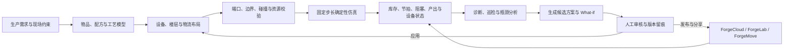

## 产品与模块

Forge 生态由一个核心工作台、一个统一身份入口、一个云端控制平面、一个资产入口、一个开放社区和一个移动端配套组成。

| 模块 | 入口 | 主要职责 | 当前状态 | 用户文档 |
| --- | --- | --- | --- | --- |
| **ForgeMind** | Web `/`，登录后进入工作台 | 三维工厂设计、生产资料、物流、仿真、诊断 | 已落地 | [`ForgeMind 模块用户文档`](docs/ForgeMind-模块用户文档.md) |
| **ForgePass** | 登录/注册页 | 统一注册、登录、续登、退出和产品身份 | 已落地 | [`ForgePass 用户文档`](docs/ForgePass-用户文档.md) |
| **ForgeCloud** | Web `/forgecloud` | 工作空间、项目版本、资源、发布、协作、设备/数据摘要 | 已落地；真实工业接入仍有限制 | [`ForgeCloud 用户文档`](docs/ForgeCloud-用户文档.md) |
| **ForgeHub** | Web `/forgehub` | 3D 资产制作与复用的生态入口 | 当前为预留/预览入口 | [`ForgeHub 用户文档`](docs/ForgeHub-用户文档.md) |
| **ForgeLab** | Web `/forgelab` | 工厂存档、模型资源、布局经验和设计公告社区 | 已落地 | [`ForgeLab 用户文档`](docs/ForgeLab-用户文档.md) |
| **ForgeMove** | 微信小程序 `ForgeMove/` | 移动摘要、任务、库存、监控和社区动态 | 已落地；需小程序部署配置 | [`ForgeMove 用户文档`](docs/ForgeMove-用户文档.md) |

模块间的技术关系、接口和权限边界见 [`Forge 生态模块技术文档`](docs/Forge生态-模块技术文档.md)。

### ForgeMind 工作台能力

| 能力面 | 内容 |
| --- | --- |
| 空间建造 | 1m 网格、多楼层、占地、旋转、碰撞、框选、真实模型 ghost 预览 |
| 生产资料 | 物品、模型、机器、配方、生产路线和端口数量约束 |
| 物流与仓储 | 传送带拖绘、端口吸附、头堵背压、有限货架、入货/出货仓库、存取站 |
| 运输载具 | AGV 八方向寻路、任务触发、避让与重规划；无人机 26 邻域跨层运输 |
| 运行仿真 | 固定步长、种子化随机、ItemLot、机器状态机、运输、消耗、产出和统计快照 |
| 诊断与规划 | ForgeCore Agent、自动巡检、瓶颈归因、生成式布局、What-if、审批、应用和回滚 |
| 视觉检测 | 虚拟相机、OpenCV 规则检测、PCB YOLOv8 实时检测、合格/异常隔离路由 |
| 资源与存档 | JSON/GLB 资源包校验、模型预览、封面、用户私有资源和 v1–v6 存档兼容 |
| AI 与语音 | 规则优先的助手协议、可选远程 AI、ASR/TTS；AI 不进入仿真 tick 链路 |

## 产品画面

这些画面来自仓库中的当前产品视觉资产，用于说明工作台、建造模式、认证入口和品牌体系。真实运行状态以当前代码和页面为准，图片中的数字不作为实时数据承诺。

<table>
  <tr>
    <td width="50%">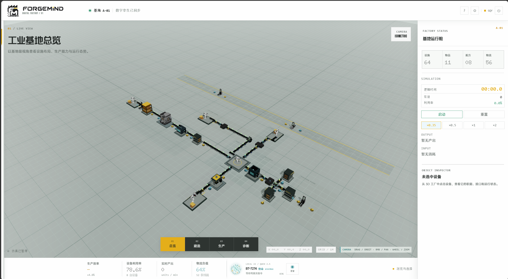<br><sub>工业基地总览：三维场景、运行状态与仿真控制。</sub></td>
    <td width="50%">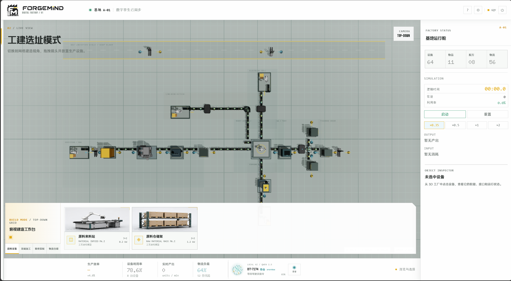<br><sub>工建选址模式：网格、设备、传送带和建造目录。</sub></td>
  </tr>
  <tr>
    <td width="50%">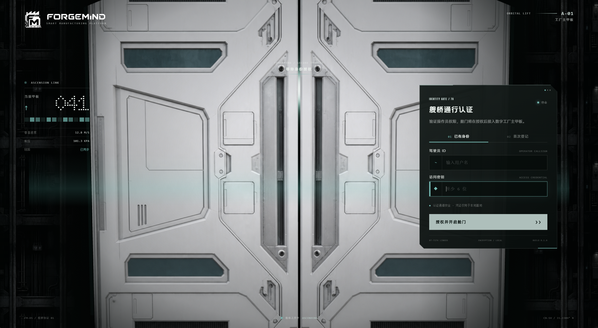<br><sub>ForgePass：统一身份认证和 ForgeMind 工作台入口。</sub></td>
    <td width="50%">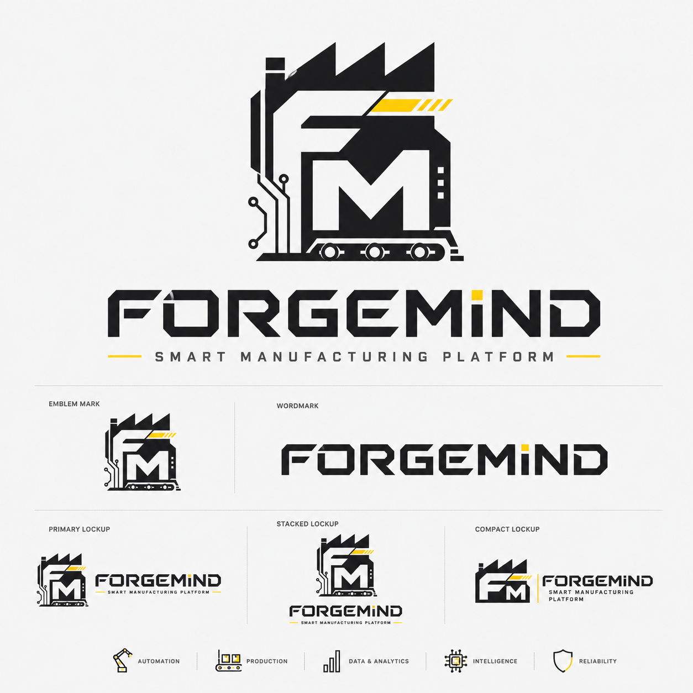<br><sub>ForgeMind 品牌资产：图案、字标和不同锁定组合。</sub></td>
  </tr>
  <tr>
    <td colspan="2">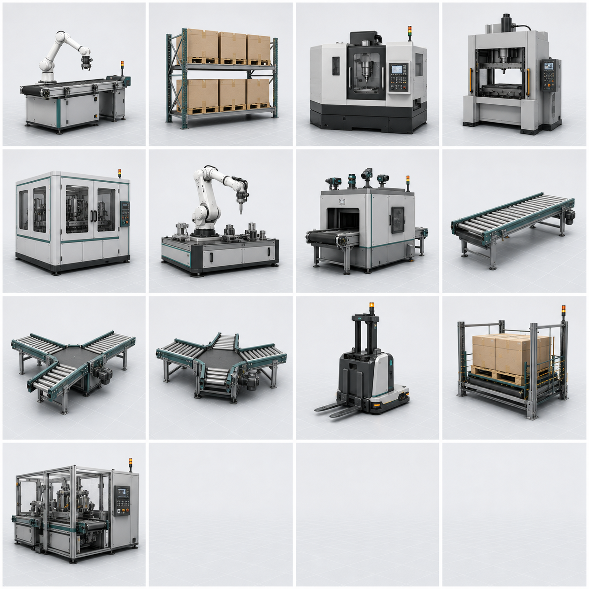<br><sub>工业资产图集：机械臂、仓储、加工设备、传送带、AGV 和存取设备。</sub></td>
  </tr>
</table>

## 总体架构

### 运行时部署拓扑

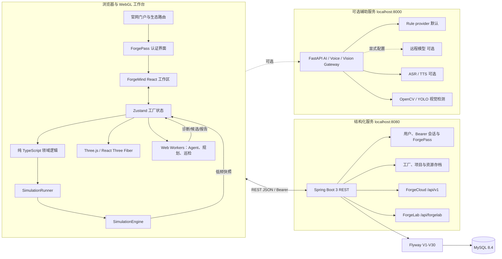

### 六层职责

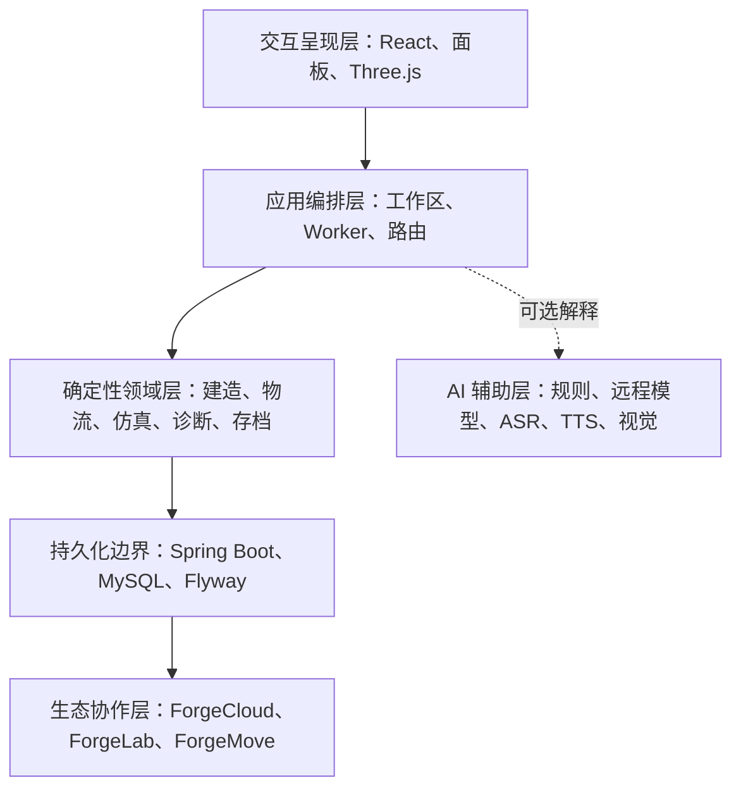

| 层 | 代码位置 | 事实职责 | 禁止越权 |
| --- | --- | --- | --- |
| 交互呈现 | `src/components/`、`src/scene/` | 页面、交互、三维模型、状态灯和视觉反馈 | 不自行修改仿真真相 |
| 应用编排 | `src/App.tsx`、各 Workspace、`src/workers/` | 工作区切换、任务调度、取消、快照消费 | 不跳过领域校验 |
| 确定性领域 | `src/game/`、`src/store/` | 工厂状态、坐标、连接、库存、寻路、仿真、诊断、存档 | 不依赖 React、Three.js 或 LLM 才能运行 |
| 渲染引擎 | `src/engine/daiyu/` | 模型批处理、传送带批处理、DPR、阴影和运行时预算 | 不替代 `simulation.ts` |
| 服务端持久化 | `backend/` | 用户、结构化存档、资源、云端协作与审计事实 | 不逐 tick 保存浏览器运行态 |
| 智能与语音服务 | `ai-service/`、`voice-chat/` | 规则助手、远程模型、语音、视觉辅助 | 根目录完整入口默认启动；不直接决定坐标、碰撞、数量和指标 |

### 运行时真相源

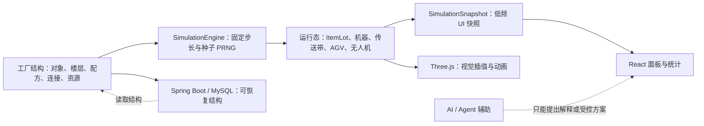

**结论：** Spring Boot 保存的是可恢复结构，浏览器确定性仿真才是当前运行时真相源；高频坐标、动画矩阵和 WebGL 纹理不逐 tick 写入数据库。

## 关键数据流

### 用户身份与跨模块访问

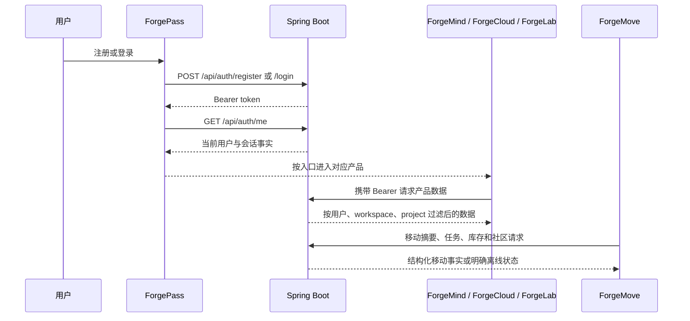

### 工厂从建造到运行

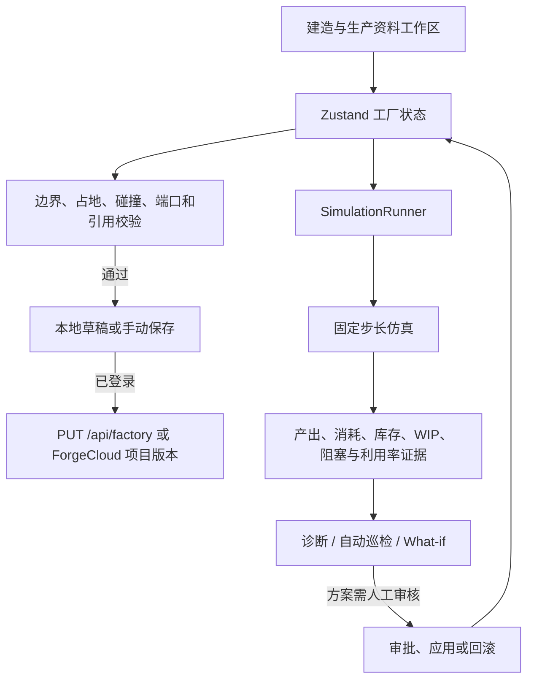

### 资源导入与许可证边界

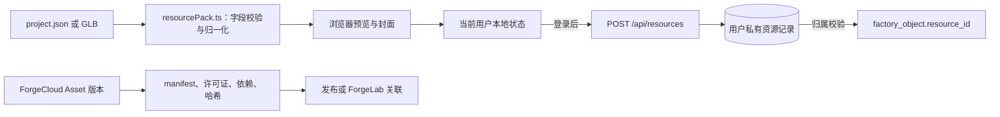

资源导入可以在浏览器内预览；正式保存时服务端校验资源归属。公开的 ForgeCloud 资源必须提供可接受的许可证声明；资产来源、修改声明和第三方许可见 [`docs/资产与许可审计.md`](docs/资产与许可审计.md)。

## 技术栈与工程结构

### 技术栈

| 领域 | 当前技术 |
| --- | --- |
| 前端 | React 18、TypeScript 5.6、Vite 5 |
| 三维 | Three.js、React Three Fiber、Drei、URDF Loader、WebGL |
| 状态与动效 | Zustand、Anime.js、Motion、Morphicons、Lucide |
| 领域逻辑 | 纯 TypeScript、固定步长、种子化 PRNG、离散传送带、机器状态机 |
| 并发执行 | Web Worker：Agent、生成式规划、自动巡检、分支 What-if |
| 后端 | Spring Boot 3、Java 17、Spring JDBC、Flyway |
| 数据库 | MySQL 8.4、Docker Compose |
| AI / 视觉 | FastAPI、Pydantic、OpenCV、NumPy、YOLOv8；远程模型可选 |
| 移动端 | 原生微信小程序 WXML / WXSS / JavaScript |
| 可选桌面端 | WebView2 + Unity/Tuanjie 渲染表面；Web 业务层保持不变 |

### 目录结构

```text
.
├─ src/                          # React Web 应用
│  ├─ components/                # 官网、认证、工作区、面板与生态页面
│  ├─ scene/                     # Three.js/R3F 场景、模型、楼层、物流与机械臂
│  ├─ engine/daiyu/              # 宝钗渲染层：批处理、模型与运行时预算
│  ├─ game/                      # 纯 TS 工厂领域逻辑与确定性仿真
│  ├─ workers/                   # Agent、规划、巡检与分支 Worker
│  ├─ store/                     # Zustand 工厂状态与认证状态
│  ├─ api/                       # 认证、工厂、资源、Agent、ForgeCloud API
│  └─ demos/                     # inspection.html 视觉检测工作台
├─ backend/                      # Spring Boot、MySQL、Flyway、Cloud/Lab API
├─ ai-service/                   # FastAPI 规则助手、远程 AI、语音与视觉网关
├─ ForgeMove/                    # 原生微信小程序配套生态
├─ desktop-host/                 # Windows WebView2 宿主（可选）
├─ unity-client/                 # Unity/Tuanjie 原生渲染客户端（可选）
├─ hardware/dm4310-arm/          # DM4310 六轴机械臂协议与 ESP32 套件
├─ voice-chat/                   # 独立语音助手与模型样例
├─ public/brand/                 # Forge 生态品牌资源
├─ public/models/                # 工业、ForgeCore 与用户模型资源
├─ public/photos/                # README 与官网使用的产品画面
├─ scripts/                      # 启动脚本、回归脚本和审计工具
├─ docs/                         # 用户、技术、架构、许可和迁移文档
├─ docker-compose.yml            # MySQL 8.4 开发实例
├─ package.json                  # 前端与回归命令
└─ README.md                     # 项目总入口
```

### 关键代码入口

| 主题 | 入口 |
| --- | --- |
| 仿真唯一真相源 | `src/game/simulation.ts` |
| 工厂状态与撤销/重做 | `src/store/forgeMind.ts` |
| 建造与线路编辑 | `src/scene/BuildPlacer.tsx`、`src/game/conveyorTrace.ts` |
| AGV / 无人机导航 | `src/game/agvNavigation.ts`、`src/game/droneNavigation.ts` |
| 生成式工厂 | `src/game/generativeFactory.ts`、`src/game/generativePlanner.ts` |
| Agent 诊断 | `src/game/factoryAgent.ts`、`src/components/FactoryAgentWorkspace.tsx` |
| AI 工具协议 | `src/game/assistantProtocol.ts`、`ai-service/main.py` |
| ForgeCloud 前端 | `src/components/ForgeCloudConsole.tsx`、`src/api/forgeCloud.ts` |
| ForgeLab 前端 | `src/components/ForgeLabPage.tsx` |
| ForgePass 前端 | `src/components/ForgePassPage.tsx`、`src/store/auth.ts` |
| ForgeMove | `ForgeMove/pages/`、`ForgeMove/services/api.js` |

## 快速开始

### 方式一：仅启动前端（推荐开发与演示）

这是最轻量的默认路径，不要求 Ollama、Qwen、MySQL、Spring Boot 或任何 AI 服务。规则建造、确定性仿真、寻路、诊断和资源预览仍可运行。

```powershell
npm install
npm run dev
```

访问：

| 页面 | 地址 |
| --- | --- |
| ForgeMind 官网与工作台 | <http://127.0.0.1:5173> |
| 视觉检测独立工作台 | <http://127.0.0.1:5173/inspection.html> |
| 官方文档 | <http://127.0.0.1:5173/docs> |
| ForgeCloud | <http://127.0.0.1:5173/forgecloud> |
| ForgeLab | <http://127.0.0.1:5173/forgelab> |

### 方式二：单终端一键启动

Windows 推荐双击 `启动ForgeMind.cmd`。启动器只保留一个可见终端，用一个大进度条显示真实启动状态；MySQL、Spring Boot、AI、ASR/TTS、独立语音监听和前端服务均在后台隐藏进程中运行，日志写入 `.forgemind/logs/`。只有前端和所有请求服务都通过健康检查、语音模型预热完成后才显示 `100% / SYSTEM READY`，失败会停在未完成进度并给出日志位置。

根入口和 `start-forgemind.bat` 都默认启动前端、MySQL、Spring Boot、FastAPI AI 网关、ASR/TTS 语音服务和独立语音监听，保证注册、登录、远端存档、AI 助手和语音能力在进度条结束后即可使用；不会启动 Ollama 或本地大语言模型，AI 默认走 `rule`。只需要离线前端时直接运行 `npm run dev`，或直接调用不带服务开关的 `scripts/start-forgemind.ps1`；需要保留 AI/语音但跳过数据库时可传 `-SkipSpring`。

```powershell
启动ForgeMind.cmd
启动ForgeMind.cmd -NoBrowser
启动ForgeMind.cmd -SkipSpring
启动ForgeMind.cmd -SkipMySql
启动ForgeMind.cmd -IncludeAI
启动ForgeMind.cmd -IncludeSpring -IncludeAI -Port 5174
stop-forgemind.bat
```

完整服务地址：

| 服务 | 地址 | 是否默认核心依赖 |
| --- | --- | --- |
| Vite | `127.0.0.1:5173` | 是 |
| Spring Boot | `127.0.0.1:8080` | 根入口默认启动；保存、认证和云端能力需要 |
| FastAPI | `127.0.0.1:8000` | 根入口默认启动；规则助手、ASR/TTS 和视觉网关 |
| BT TTS | `127.0.0.1:8001` | 根入口默认启动；语音 TTS 后端 |
| Ollama | `127.0.0.1:11434` | 否；远程/本地模型可选 |

`-IncludeAI` 和 `-IncludeVoiceChat` 可用于给直接调用 PowerShell 的轻量入口增加对应服务；两个一键入口已经自动传入这两个开关。`-IncludeAI` 默认仍使用 `rule`，不会自动拉起 Ollama；`-IncludeVoiceChat` 会等待 ASR/TTS 预热、BT TTS 端口和独立语音进程全部就绪后才完成启动。所有启动服务的标准输出和错误输出都在 `.forgemind/logs/` 中，不再打开多个服务终端。

### 方式三：手动启动后端

```powershell
# 1. 启动 MySQL 8.4
docker compose up -d mysql

# 2. 构建并启动 Spring Boot
cd backend
mvn.cmd package
java -jar target\forgemind-backend-0.1.0.jar

# 3. 另开终端启动前端
cd ..
npm run dev
```

首次启动后端会由 Flyway 自动执行数据库迁移。当前数据库版本为 V30：ForgeCloud 平台事实推进至 V25，V26–V27 增加 AI 助手提醒策略持久化与跨会话主动提醒 claim 去重，V28 增加用户批准的助手长期偏好记忆，V29 增加主动事件来源集合、累计次数和首次观察时间持久化，V30 增加助手质量指标日聚合。若只需要浏览器本地编辑和仿真，可不启动后端。

### ForgeMove 微信小程序

1. 用微信开发者工具导入 `ForgeMove/`。
2. 在 `ForgeMove/config/env.js` 设置 Spring Boot 地址。
3. 开发阶段可使用 `http://127.0.0.1:8080` 并关闭合法域名校验；真机必须使用 HTTPS 合法域名。
4. 点击“进入演示模式”可查看离线交互；登录后读取统一认证、移动摘要、任务和 ForgeLab API。

详细步骤见 [`ForgeMove/README.md`](ForgeMove/README.md) 和 [`ForgeMove 用户文档`](docs/ForgeMove-用户文档.md)。

## 用户操作路径

### 第一次使用 ForgeMind

1. 打开官网，点击“进入工作台”。
2. 通过 ForgePass 注册或登录；登录后选择“新建空白工厂”或打开已有项目。
3. 在“生产资料”中建立物品、配方、机器和仓储定义。
4. 在“建造”中放置设备、仓储、传送带和运输载具；旋转、移动、框选和删除都要经过边界/碰撞校验。
5. 连接真实输入/输出端口，检查传送方向和仓储吸附关系。
6. 启动仿真，观察物料、机器、库存、车辆、阻塞和产出。
7. 打开诊断或生成式工厂，查看证据、候选、What-if 和人工审批入口。
8. 明确点击“手动保存存档”后再写入正式项目；未保存草稿退出不会覆盖正式存档。

### 典型生产链

```text
入货仓库 → 货物存取站 → 传送带 → 加工机器 → 传送带 → 精密装配 → 质检 → 出货仓库
                         ↘ AGV / 无人机按真实库存阈值取放 ↗
```

对象的 `rotation` 表示输出方向，物品沿 `pos + dir` 进入下游对象。传送带采用离散槽位和头堵背压，不是单纯的恒速动画。

### 生态协作路径

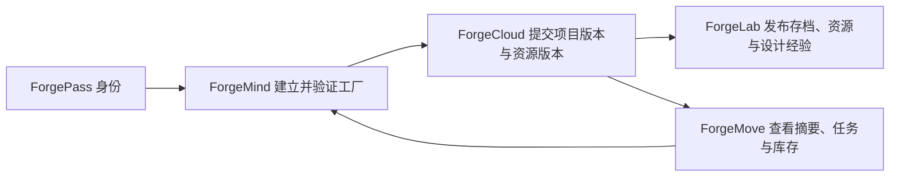

## 接口与数据边界

### 核心 Spring Boot API

| 方法 | 路径 | 作用 |
| --- | --- | --- |
| `POST` | `/api/auth/register` | 注册并返回 Bearer 会话 |
| `POST` | `/api/auth/login` | 登录并返回 Bearer 会话 |
| `POST` | `/api/auth/email/send-code` | 发送邮箱验证码并按邮箱/IP 限流 |
| `POST` | `/api/auth/email/login` | 邮箱验证码登录/首次创建账户 |
| `GET` | `/api/auth/github/start` | 开始 GitHub OAuth 登录 |
| `GET` | `/api/auth/github/callback` | GitHub OAuth 回调 |
| `POST` | `/api/auth/github/exchange` | 消费一次性 OAuth 兑换码 |
| `POST` | `/api/auth/phone/send-code` | 发送手机号登录验证码（腾讯云短信） |
| `POST` | `/api/auth/phone/login` | 手机号验证码登录/首次创建账户 |
| `GET` | `/api/auth/me` | 查询当前用户 |
| `POST` | `/api/auth/logout` | 注销当前会话 |
| `GET / PUT` | `/api/factory` | 读取/保存当前用户工厂结构 |
| `GET` | `/api/factory/health` | 后端健康检查 |
| `GET / POST` | `/api/resources` | 查询/保存当前用户导入资源 |
| `GET` | `/api/resources/{resourceId}/model` | 下载当前用户自己的模型 |
| `GET / POST` | `/api/forgelab/*` | 帖子、附件、回复、点赞和通知 |

### ForgeCloud `/api/v1`

ForgeCloud 当前覆盖工作空间、项目/资源版本、发布、协作、审批、活动、连接器、设备、孪生、数据、AI、工单、质量和维护等结构化 API。所有请求都必须经过 Bearer 会话、workspace 成员和项目角色校验。

| 能力 | 代表路径 | 当前说明 |
| --- | --- | --- |
| 工作空间 | `/api/v1/workspaces` | 查询、创建、切换和成员边界 |
| 项目与版本 | `/api/v1/projects`、`/versions` | 版本账本、并发冲突和幂等提交 |
| 资产与 Blob | `/api/v1/assets`、`/blobs` | manifest、许可证、依赖、哈希和对象本体 |
| 发布与审批 | `/api/v1/publications`、`/approvals` | 发布、资源审核和 Agent Patch 门禁 |
| 统一活动 | `/api/v1/activity` | Outbox 幂等消费、失败重试和 workspace 过滤 |
| Device/Twin/Data | `/api/v1/devices`、`/twins`、`/data/*` | 当前为结构化注册、回放和摘要 |
| 运行质量 | `/api/v1/work-orders`、`/quality/*`、`/maintenance/*` | 工单、质量和维护台账 |
| 移动摘要 | `/api/v1/mobile/summary` | ForgeMove 使用的结构化摘要 |

### FastAPI AI / Vision API

| 方法 | 路径 | 作用 |
| --- | --- | --- |
| `GET` | `/api/ai/health` | AI 服务与模型可用性检查 |
| `GET` | `/api/ai/tools` | ForgeMind 工具目录 |
| `POST` | `/api/ai/factory-spec` | 受限 `GenerationSpec` 提取 |
| `POST` | `/api/ai/assistant` | 文本回答与可选结构化动作 |
| `POST` | `/api/ai/assistant/stream` | 流式回答与最终动作 |
| `POST` | `/api/ai/asr`、`/api/ai/tts` | 语音识别与合成 |
| `POST` | `/api/vision/detect` | OpenCV/YOLO 视觉检测 |

### 安全与事实边界

- 用户、workspace、project、asset 和 ForgeLab 写操作必须由服务端鉴权，不能只依赖前端隐藏按钮。
- 工厂存档保存结构和版本，不保存逐 tick 的 ItemLot、AGV 或无人机坐标。
- ForgeCloud 设备命令当前默认进入可审计 `pending` 队列，不直接控制真实设备。
- 真实 OPC UA/MQTT、专业时序引擎、设备执行器和生产级离线队列尚未完成。
- AI 或演示数据不能伪装为已同步现场事实；ForgeMove 会明确显示在线/离线演示状态。

## 验证与质量门禁

### 前端构建与基础回归

```powershell
npm.cmd run build
npm.cmd run sim:regression
npm.cmd run sim:backpressure
npm.cmd run assistant:protocol
npm.cmd run agent:regression
npm.cmd run save:regression
npm.cmd run models:validate
npm.cmd run forgemove:validate
npm.cmd run forgecloud:regression
npm.cmd run forgecloud:intelligence:regression
git diff --check
```

### 按领域执行的回归

| 命令 | 覆盖范围 |
| --- | --- |
| `npm run interaction:regression` | 右键平移、拖绘、转点、回拖和建造取消 |
| `npm run selection:regression` | 选择、框选、焦点抢回和批量删除 |
| `npm run visual-scale:regression` | 模型、传送带、设备和车辆比例契约 |
| `npm run multifloor-conveyor:regression` | 跨层坡道、双向物流和楼层碰撞 |
| `npm run floor-visibility:regression` | 活动楼层、只读上下文和单一网格 |
| `npm run drone-navigation:regression` | 无人机 3D A*、停靠点和跨层运输 |
| `npm run manufacturing:regression` | 物品、路线、机器、端口和生产资料 |
| `npm run storage:regression` | 货架、存取站、库存、仓储和机械臂 |
| `npm run generative:regression` | 候选布局、校验、副本仿真和 What-if |
| `npm run models:validate:strict` | ForgeCore 默认物品严格模型审计 |

### 验证口径

回归输出必须区分“通过”“已知失败”和“未执行”。当前生成式回归的 A-02 候选生成已通过；A-01 调整阶段仍可能因可验证候选不足而失败。Unity/桌面端的真实登录存档全对象视觉验收、完整交互回传和正式 S-03 性能门禁仍不能写成全量通过。

## 当前边界与路线图

### 已落地

- ForgeMind Web 工作台、三维建造、生产资料、仓储、物流、确定性仿真和多楼层。
- AGV、无人机、真实库存、端口拓扑、背压、诊断、自动巡检和生成式工厂 Worker 化执行。
- ForgePass 统一身份、ForgeLab 社区、ForgeCloud V13–V25 结构化云能力、助手提醒/记忆/质量指标 V26–V30 和 ForgeMove 原生小程序。
- 用户私有 JSON/GLB 资源导入、模型预览、ForgeCore 36 个默认物品和严格模型验证链。
- 可选视觉检测、ASR/TTS、规则助手和人工审批/应用/回滚链路。

### 仍在路线图中

- 真实 OPC UA/MQTT 客户端、专业时序数据引擎、设备控制执行器和现场安全门禁。
- MinIO/S3 部署适配、公共资源市场、跨用户资产治理和完整 Fork/依赖解析。
- 生产级移动离线队列、完整远程 AI 编排和真实工厂数据校准。
- Unity/桌面端全量视觉等价、完整端口交互回传和最终性能门禁。

### 设计底线

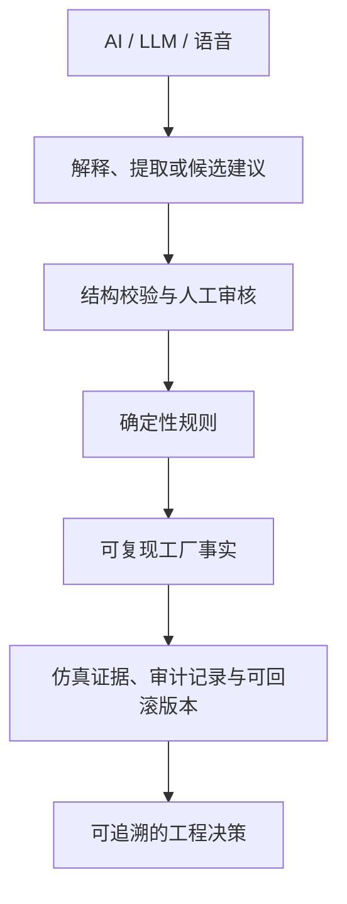

## 文档与资产

### 官方文档

- [官方文档在线入口](http://127.0.0.1:5173/docs)：核心手册、六模块用户文档和生态技术文档。
- [ForgeMind 用户使用手册](docs/ForgeMind-用户使用手册.md)
- [ForgeMind 功能模块技术文档](docs/ForgeMind-功能模块技术文档.md)
- [ForgeMind 模块用户文档](docs/ForgeMind-模块用户文档.md)
- [Forge 生态模块技术文档](docs/Forge生态-模块技术文档.md)
- [当前实现总览](docs/ForgeMind-当前实现总览.md)
- [文档索引](docs/README.md)
- [完整官方 PDF](public/docs/ForgeMind-官方文档.pdf)

### 专题文档

- [ForgeCloud 统一云平台实施文档](docs/ForgeCloud-统一云平台实施文档.md)
- [后端数据库设计](docs/ForgeMind-后端数据库设计.md)
- [AI 工厂与 A-02 设计文档](docs/ForgeMind-A02与Generative-Factory设计文档.md)
- [智能管家工具协议](docs/ForgeMind-智能管家工具协议.md)
- [视觉检测工作台设计文档](docs/ForgeMind-视觉检测工作台-设计文档.md)
- [宝钗渲染引擎](docs/daiyu-render-engine.md)
- [黛玉智能工厂思考引擎](docs/daiyu-intelligence-engine.md)
- [Unity 原生客户端规划](docs/ForgeMind-Unity原生客户端规划与要求.md)
- [Unity WebView2 桥接协议](docs/ForgeMind-Unity-WebView2-Unity桥接协议.md)

### 资产与许可

- [资产与许可审计](docs/资产与许可审计.md)
- [ForgeMove 开源声明](ForgeMove/OPEN_SOURCE_NOTICES.md)
- [ForgeCore 模型归属](public/models/forgecore/ATTRIBUTION.md)
- `public/brand/`：ForgeMind、ForgePass 和生态产品品牌资源。
- `public/models/`：工业模型、ForgeCore 默认物品和用户模型运行时资源。

资产不得因为被放入仓库就自动视为 ForgeMind 原创或可自由商用；使用、修改、发布前必须阅读对应来源和许可证说明。

## 维护约定

- 只在当前 `D:\Code\factory` 项目目录维护代码和文档。
- 新功能先更新 [`ForgeMind 项目方案.md`](ForgeMind%20项目方案.md)，再更新当前实现总览、专题文档和用户文档。
- 文档中的“已落地”“预留”“路线图”必须与代码和验证结果一致。
- 修改模型、几何、参数或材质时必须通过生成器重建并执行模型审计。
- 每次形成可交付变更，都要在 [`AGENTS.md`](AGENTS.md) 的协作审计表中记录权威位置和实际验证。

---

<p align="center"><strong>ForgeMind Studio</strong><br>MADE FOR FACTORIES THAT MOVE</p>
