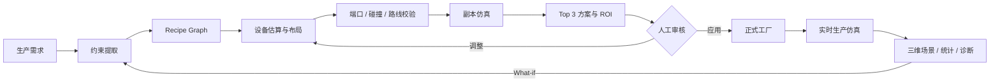
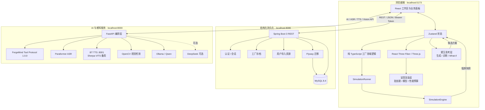
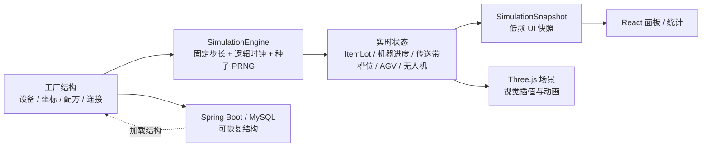
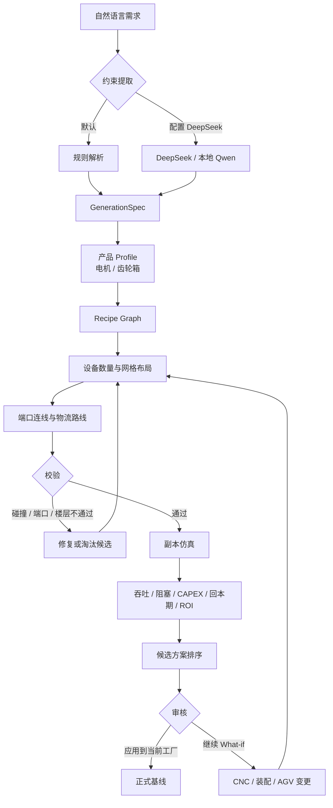
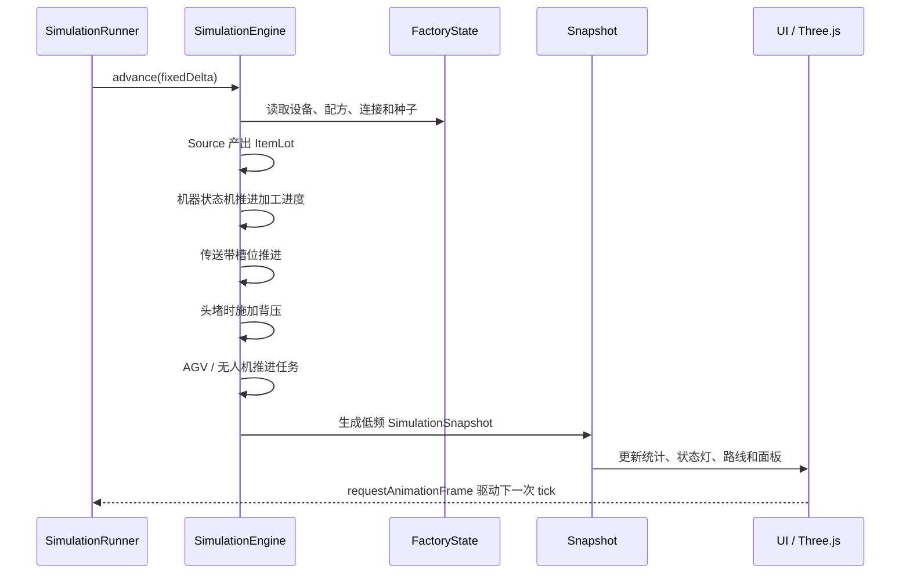
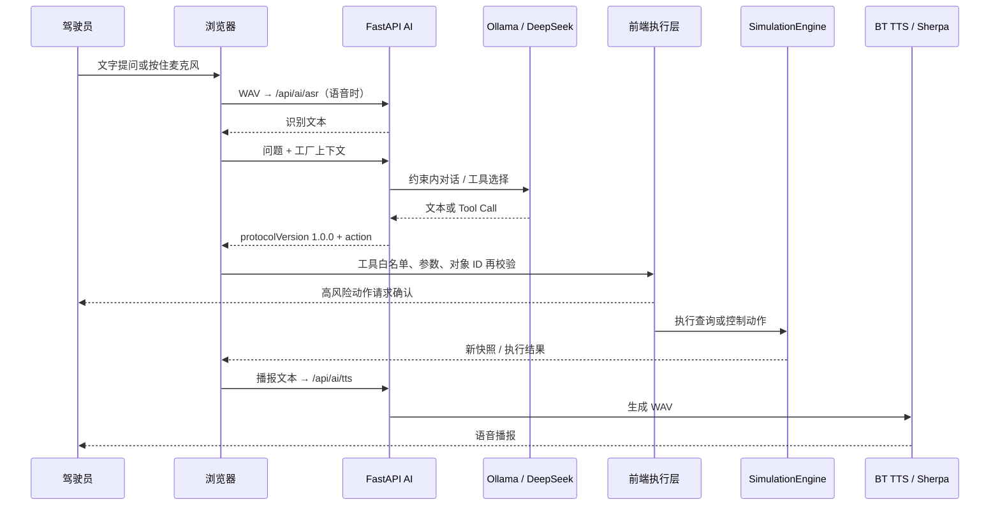
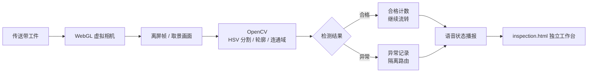
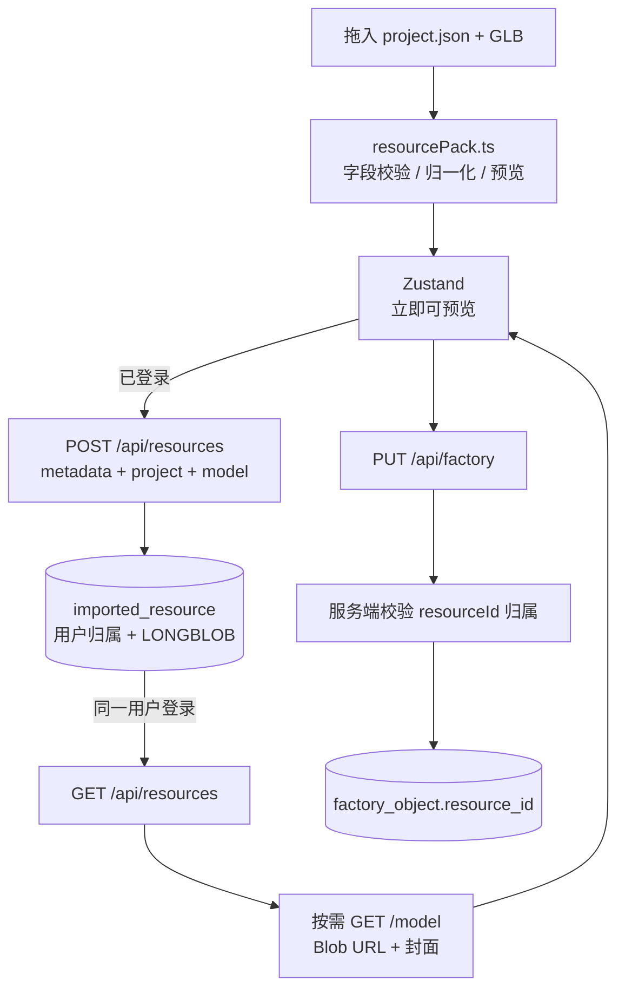
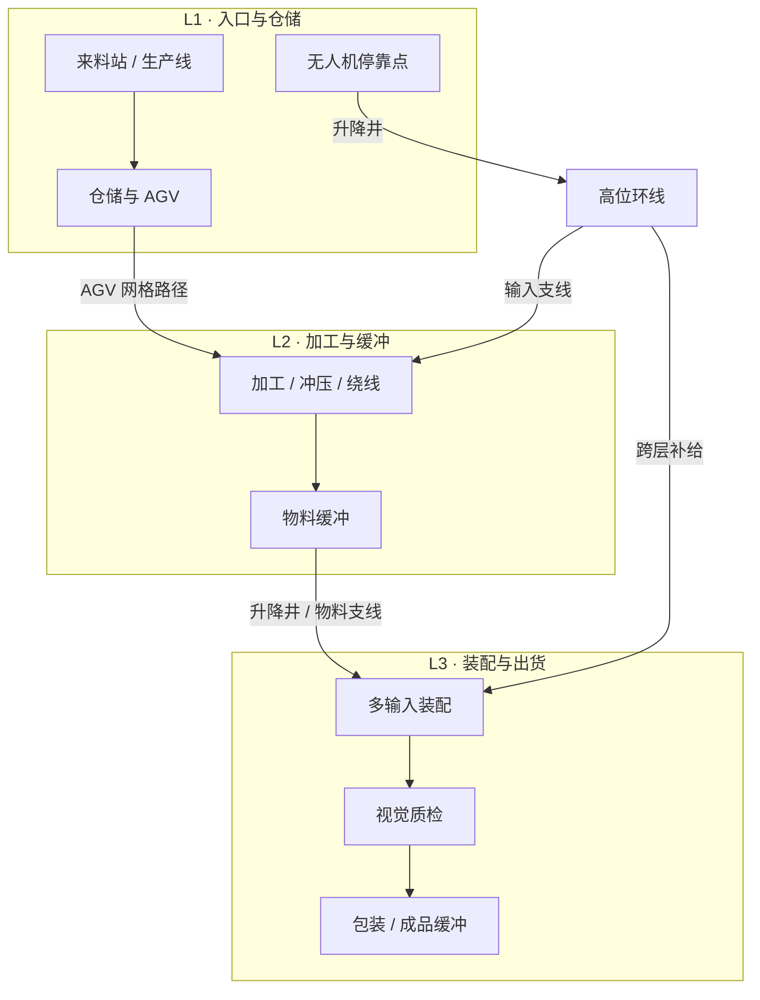

# ForgeMind · 智能工厂数字孪生

ForgeMind 是一个可运行的 AI 驱动智能工厂平台：用户可以搭建多楼层产线、连接设备与物流、运行确定性生产仿真，并用 AI 生成、诊断和比较工厂方案。

它把「工厂设计」「三维数字孪生」「离散仿真」「仓储物流」「AI 工厂规划」「语音管家」和「视觉质检」放进同一条可验证闭环。当前项目适合产品演示、技术答辩、算法验证和智能制造方案推演。

> 当前实现以代码和[当前实现总览](<docs/ForgeMind-当前实现总览.md>)为准。早期方案中的 Redis/Kafka、实时仿真服务端和公共资源市场尚未作为运行依赖启用。

## 目录

- [产品闭环](#产品闭环)
- [系统架构](#系统架构)
- [关键流程图](#关键流程图)
- [功能地图](#功能地图)
- [技术栈](#技术栈)
- [快速开始](#快速开始)
- [工程结构](#工程结构)
- [API 与数据边界](#api-与数据边界)
- [验证与已知边界](#验证与已知边界)
- [设计文档](#设计文档)

## 产品闭环



核心原则：AI 负责理解需求和提出方案，确定性的 TypeScript 规划器负责布局与仿真，前端执行层负责最终校验；任何未经验证的模型输出都不会直接改写工厂状态。

## 系统架构

### 部署拓扑



### 四层职责

| 层 | 主要目录 | 负责什么 | 明确不负责什么 |
| --- | --- | --- | --- |
| 交互与呈现 | `src/components/`、`src/scene/` | 页面、建造、三维模型、面板、交互反馈 | 不自行推进生产业务状态 |
| 状态与领域 | `src/store/`、`src/game/` | 工厂对象、物品、配方、导航、仿真、诊断、存档 | 不依赖 React/Three.js 才能运行 |
| 自研引擎 | `src/engine/daiyu/` | 静态模型批次、传送带批次、运行时渲染预算 | 不替代业务仿真真相源 |
| 外部服务 | `backend/`、`ai-service/` | 用户数据、资源持久化、AI/语音/视觉编排 | 不把每一帧位置写入数据库 |

### 运行时真相源



Spring Boot 保存可恢复的工厂结构；浏览器中的 `SimulationEngine` 才是当前运行时真相源。高频位置、动画矩阵和 WebGL 纹理不进入 Zustand 的高频更新，也不逐 tick 持久化。

## 关键流程图

### 1. AI 工厂生成与调整



### 2. 固定步长生产仿真



传送带是“离散槽位 + 头堵背压”模型，不是单纯的恒速路径动画；因此产出、在途物料、阻塞和利用率可以被回归脚本验证。

### 3. 智能管家与语音闭环



### 4. 视觉质检工作台



### 5. 用户资源与工厂存档



### 6. 多楼层物流



## 功能地图

| 工作区 | 已实现能力 | 代码入口 |
| --- | --- | --- |
| 总览 / 3D 场景 | 多楼层视角、设备详情、状态灯、模型和物流可视化 | `src/scene/FactoryCanvas.tsx` |
| 建造 | 网格放置、旋转、占地、碰撞、ghost、设备资源导入 | `src/components/BuildMenu.tsx` |
| 生产控制台 | 产线俯视图、设备登记、流向、仿真启动/暂停/倍率/重置 | `src/components/ProductionWorkspace.tsx` |
| 生产路线 | 生产节点、端口连线、路线关系和产能提示 | `src/components/ProductionRouteWorkspace.tsx` |
| 仓储 | 库位、物料台账、AGV 任务和无人机跨层运输 | `src/components/WarehouseWorkspace.tsx` |
| AI 工厂 | A-01/A-02、需求生成、诊断、What-if、Top 3、ROI | `src/components/GenerativeFactoryWorkspace.tsx` |
| 视觉检测 | 虚拟相机、检测结果、合格/异常隔离和语音状态 | `src/demos/InspectionDemo.tsx` |
| 智能管家 | 查询、定位、仿真控制、配方/来料变更确认、ASR/TTS | `src/game/assistantProtocol.ts` |

## 技术栈

| 领域 | 技术 |
| --- | --- |
| 前端 | React 18、TypeScript 5.6、Vite 5 |
| 三维 | Three.js、React Three Fiber、Drei、URDF Loader、WebGL |
| 状态与动效 | Zustand、Anime.js、TailwindCSS、自定义 design tokens |
| 仿真 | 纯 TypeScript、固定步长、种子化 PRNG、离散传送带、机器状态机 |
| 后端 | Spring Boot 3.3、Java 17、Spring JDBC、Flyway |
| 数据库 | MySQL 8.4、Docker Compose |
| AI 服务 | FastAPI、Pydantic、Ollama/Qwen；DeepSeek 可选 |
| 语音与视觉 | Paraformer ASR、BT Bert-VITS2、Sherpa VITS、OpenCV、NumPy |

## 快速开始

### Windows 一键启动

前置条件：Node.js、Docker Desktop、Python 3.10、Java 17、Ollama；AI 服务还需要安装 `ai-service/requirements.txt` 中的依赖。若使用默认语音音色，BT TTS 位于 `D:\local\bt7274-space`。

```powershell
.\start-forgemind.bat                   # MySQL + Ollama + TTS + AI + 前端
.\start-forgemind.bat -NoBrowser         # 启动但不自动打开浏览器
.\start-forgemind.bat -SkipSpring       # 跳过 Spring Boot 8080
.\start-forgemind.bat -SkipMySql        # 使用已有 MySQL，跳过 Docker MySQL
.\start-forgemind.bat -IncludeVoiceChat # 额外启动独立语音助手
.\stop-forgemind.bat                    # 停止 ForgeMind 服务，默认保留 MySQL/Ollama
.\stop-forgemind.bat -StopMySql         # 停止 MySQL 容器，保留数据卷
```

启动完成后：

| 服务 | 地址 |
| --- | --- |
| 前端 | `http://127.0.0.1:5173` |
| 视觉检测工作台 | `http://127.0.0.1:5173/inspection.html` |
| Spring Boot | `http://127.0.0.1:8080` |
| FastAPI AI | `http://127.0.0.1:8000/api/ai/health` |
| BT TTS | `http://127.0.0.1:8001/health` |

如果 BT TTS 或 Ollama 不在默认路径，可在启动前设置：

```powershell
$env:FORGEMIND_BT_TTS_ROOT = 'D:\local\bt7274-space'
$env:FORGEMIND_OLLAMA_EXE = "$env:LOCALAPPDATA\Programs\Ollama\ollama.exe"
$env:FORGEMIND_OLLAMA_MODEL = 'qwen2.5:7b'
```

### 手动启动前端

```powershell
npm install
npm run dev       # http://localhost:5173
npm run build     # 生产构建
```

### 手动启动后端与 AI 服务

```powershell
# MySQL 8.4
docker compose up -d mysql

# Spring Boot 8080
cd backend
mvn package
java -jar target/forgemind-backend-0.1.0.jar

# FastAPI 8000
cd ..\ai-service
py -3.10 -m venv .venv
.venv\Scripts\pip install -r requirements.txt
.venv\Scripts\python -m uvicorn main:app --host 127.0.0.1 --port 8000
```

数据库表由 Spring Boot 启动时的 Flyway 自动创建。后端不可用时，前端仍可使用本地工厂存档、资源预览和浏览器内仿真；未登录或离线时不会把本地数据伪装成已云端持久化。

## 工程结构

```text
.
├─ src/
│  ├─ components/             # 页面、建造、生产、仓储、AI、资源导入
│  ├─ scene/                  # Three.js/R3F 场景、模型、楼层、物流、机械臂
│  ├─ engine/daiyu/           # 宝钗渲染层的批处理与运行时目录
│  ├─ game/                   # 纯 TS 领域逻辑与确定性仿真
│  │  ├─ simulation.ts        # 仿真唯一真相源
│  │  ├─ generativeFactory.ts # 生成布局、调整、What-if、ROI
│  │  ├─ factoryDiagnostics.ts # 工厂诊断
│  │  ├─ agvNavigation.ts     # AGV 网格导航
│  │  ├─ droneNavigation.ts   # 无人机跨层导航
│  │  ├─ assistantProtocol.ts # AI 工具协议 1.0.0
│  │  └─ resourcePack.ts      # JSON/GLB 资源包校验
│  ├─ store/                  # Zustand 工厂状态与用户会话
│  ├─ api/                    # 认证、工厂和资源 REST 客户端
│  └─ demos/                  # 独立视觉检测工作台
├─ backend/                   # Spring Boot + MySQL + Flyway
├─ ai-service/                # FastAPI + LLM / ASR / TTS / OpenCV
├─ voice-chat/                # 独立语音助手、模型和音频样例
├─ public/models/             # 内置 GLB、URDF 和工业模型
├─ scripts/                   # 启动脚本与回归脚本
├─ docs/                      # 技术设计、数据库、语音、视觉和引擎文档
├─ docker-compose.yml         # MySQL 8.4
└─ README.md
```

## API 与数据边界

### Spring Boot

| 方法 | 路径 | 作用 |
| --- | --- | --- |
| POST | `/api/auth/register` | 注册并返回 bearer token |
| POST | `/api/auth/login` | 登录并返回 bearer token |
| GET | `/api/auth/me` | 获取当前用户 |
| POST | `/api/auth/logout` | 注销会话 |
| GET / PUT | `/api/factory` | 读取 / 保存当前用户工厂结构 |
| GET | `/api/factory/health` | 后端健康检查 |
| GET | `/api/resources` | 列出当前用户的导入资源 |
| POST | `/api/resources` | 保存 metadata、project JSON 和 GLB |
| GET | `/api/resources/{resourceId}/model` | 下载当前用户自己的模型 |

### FastAPI AI / Vision

| 方法 | 路径 | 作用 |
| --- | --- | --- |
| GET | `/api/ai/health` | AI、Ollama、TTS 可用性检查 |
| GET | `/api/ai/tools` | 发布 ForgeMind 工具目录 |
| POST | `/api/ai/factory-spec` | 将自然语言转为受限 `GenerationSpec` |
| POST | `/api/ai/assistant` | 返回文本和可选结构化动作 |
| POST | `/api/ai/assistant/stream` | 流式文本与最终工具动作 |
| POST | `/api/ai/asr` | PCM WAV 转中文文本 |
| POST | `/api/ai/tts` | 文本转 WAV |
| POST | `/api/vision/detect` | OpenCV 缺陷检测 |
| POST | `/api/vision/debug` | 输出视觉调试数据 |

所有用户数据接口使用 `Authorization: Bearer <token>`。资源列表、模型下载和工厂存档都在服务端按用户过滤；保存工厂时还会校验 `resourceId` 的归属。

## 演示脚本

1. 在「物品」中创建原料和成品，例如“铁板”和“齿轮”。
2. 在「配方」中创建“铁板 × 1 → 齿轮 × 1”，时长设为 `1s`。
3. 在「建造」中放置原料源、传送带和通用机器，并分别绑定物品与配方。
4. 启动仿真，观察物料沿带运输、机器加工、成品产出和统计变化。
5. 切换到「AI 工厂」输入产能需求，比较候选布局和 ROI，再决定是否应用。
6. 打开双臂视觉质检单元，进入独立检测工作台查看合格/异常隔离。
7. 点击语音入口，用“查询工厂状态”“暂停仿真”等指令测试工具协议与确认门控。

连接语义：对象的 `rotation` 是输出方向，物品沿 `pos + dir` 进入下游对象；典型链路为 `Source → 传送带 → 机器 → 传送带 → 出口`。

## 验证与已知边界

```powershell
npm run build
npm run sim:smoke
npm run sim:backpressure
npm run sim:regression
npm run generative:regression
npm run assistant:protocol
npm run save:regression
npm run models:validate
```

稳定回归项包括 `sim:regression`、`assistant:protocol`、`save:regression` 和 `models:validate`。`generative:regression` 的候选生成主流程已接入，但 A-01 调整分支仍可能出现“没有返回 3 个全部可验证候选”的已知失败，发布前应单独修复。

当前边界：

- Spring Boot 负责结构化存档和资源存储，不是实时仿真服务器。
- AI 服务通过 HTTP 被前端调用；Redis Stream/Kafka 仍是未来异步部署方向。
- 导入资源是用户私有资源，还没有公共市场、跨用户分享和对象存储。
- 资源封面来自浏览器预览截图，不是服务端离线渲染农场。
- “生产效率”面板仍有演示读数；真实设备利用率、在途、产出和消耗以仿真快照为准。

## 设计文档

- [项目创新与展望](<docs/ForgeMind-创新与展望.md>)：已落地创新、技术价值、当前边界和后续路线。
- [技术点完整介绍](<docs/ForgeMind-技术点完整介绍.md>)：按 10 个技术方向说明方法、公式、效果、代码入口和当前边界。
- [当前实现总览](<docs/ForgeMind-当前实现总览.md>)：事实索引、API、数据边界和已知边界。
- [全面技术文档](<docs/ForgeMind-全面技术文档.md>)：架构、算法、功能和答辩技术底稿。
- [功能模块技术文档](<docs/ForgeMind-功能模块技术文档.md>)：应用、建造、仿真、认证和存档细节。
- [后端数据库设计](<docs/ForgeMind-后端数据库设计.md>)：表结构、迁移和用户隔离。
- [AI 工厂与 A-02 设计](<docs/ForgeMind-A02与Generative-Factory设计文档.md>)：生成、诊断、What-if 和 ROI。
- [语音控制模块接入](<docs/ForgeMind-语音控制模块-接入文档.md>)：ASR、LLM、工具协议和 TTS。
- [视觉检测工作台](<docs/ForgeMind-视觉检测工作台-设计文档.md>)：虚拟相机、OpenCV 和隔离路由。
- [宝钗渲染引擎](<docs/daiyu-render-engine.md>)：渲染批处理、预热和性能预算。
- [黛玉智能工厂思考引擎](<docs/daiyu-intelligence-engine.md>)：需求解析、规划、诊断和方案评分。

## 模型与许可证

内置机械臂模型位于 `public/models/robot_arm_6dof_white.glb`，来源与归属说明见 [ForgeCore 模型说明](<public/models/forgecore/ATTRIBUTION.md>)。用户导入模型只在当前会话或当前用户资源空间中使用，不会被自动打包进前端。

---

ForgeMind · DIGITAL FACTORY / DESIGN · SIMULATE · OPTIMIZE
