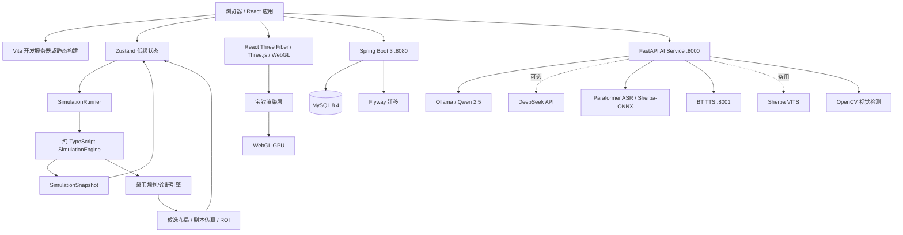
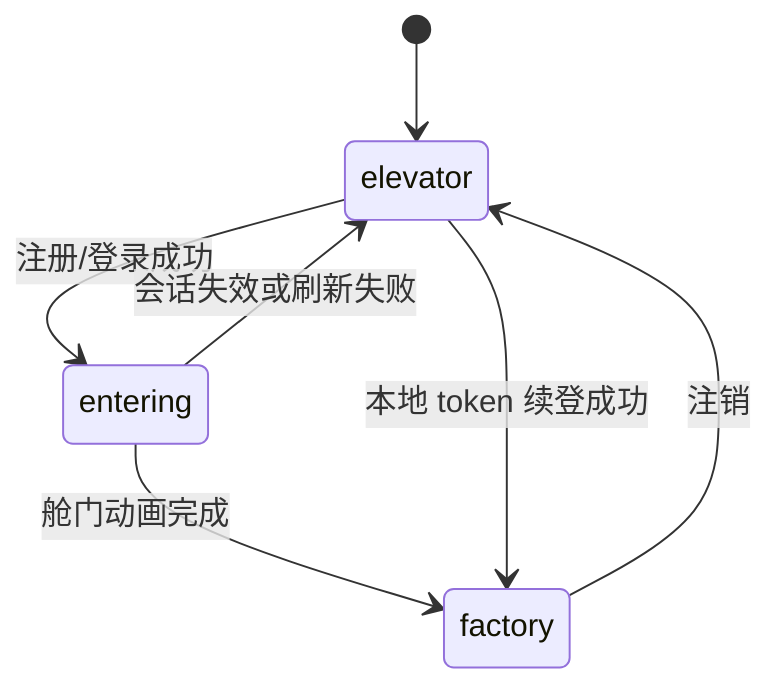
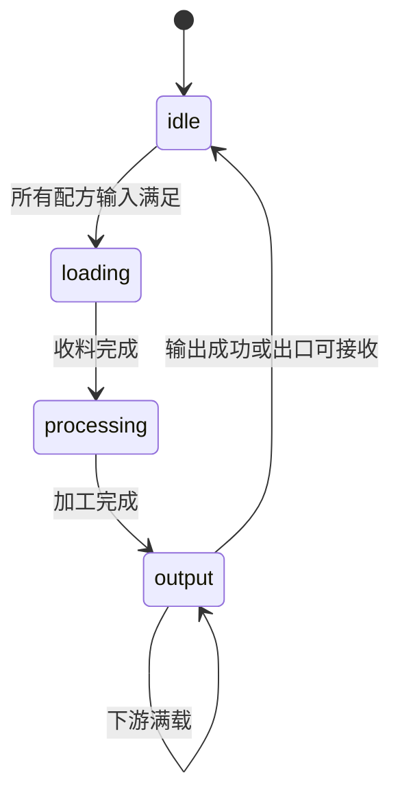
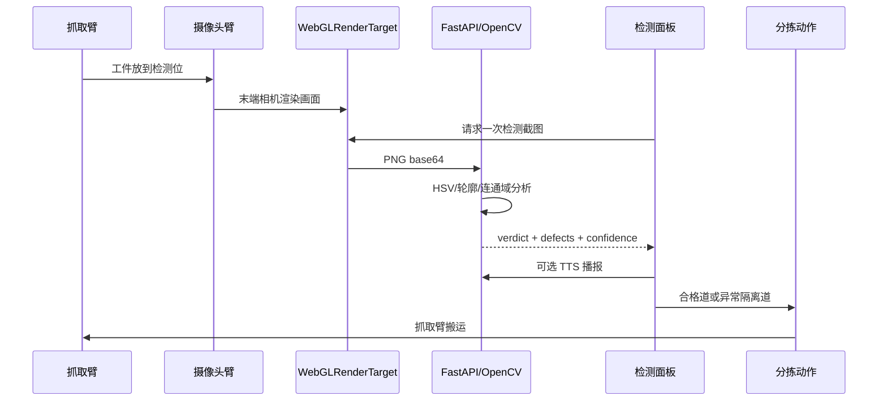
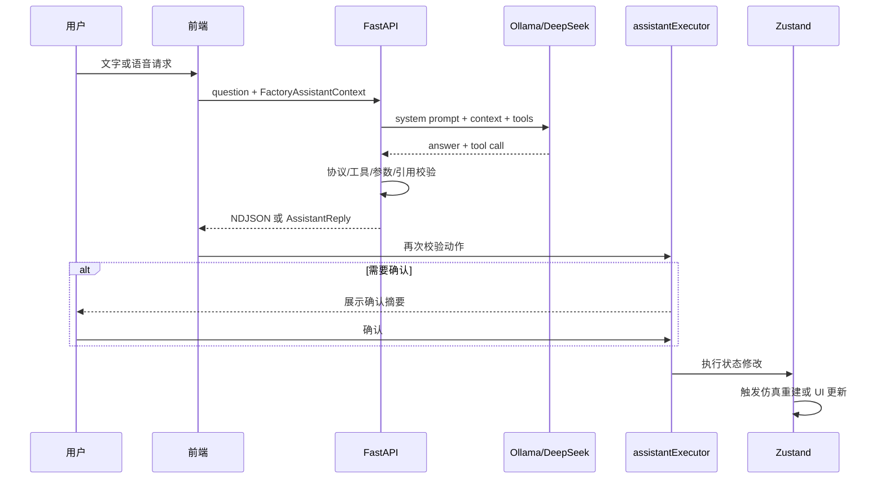

# ForgeMind 全面技术文档

> 项目：ForgeMind 智能工厂数字孪生、生产路线与仿真平台  
> 文档性质：当前仓库实现的全面技术说明、架构说明和演示答辩底稿  
> 更新时间：2026-08-19  
> 适用代码：`D:\Code\factory`  
> 事实优先级：当前代码与[当前实现总览](ForgeMind-当前实现总览.md)高于早期方案文档

---

## 0. 阅读说明

### 0.1 文档目标

本文用于统一解释 ForgeMind 的全部主要技术点，包括：

- 系统总体架构和服务边界；
- 前端应用、三维场景和编辑器；
- 宝钗（Baochai）工厂渲染引擎层；
- 黛玉（Daiyu）智能工厂思考引擎；
- 工厂对象、物品、配方、设备和资源包数据模型；
- 固定步长离散生产仿真；
- 传送带、分流器、汇流器、AGV、无人机和仓储物流；
- Panda 机械臂、DLS IK、抓取和视觉质检工作台；
- LLM、工具调用、语音识别、语音合成和安全确认；
- OpenCV 工业视觉检测；
- Spring Boot、MySQL、Flyway 和用户隔离资源持久化；
- 测试、性能预算、运行方式、已知边界和后续路线。

本文不是把所有源代码逐行复制，而是描述每个功能点的职责、输入输出、状态变化、关键算法、代码入口和当前实现边界。

### 0.2 实现状态标记

| 标记 | 含义 |
| --- | --- |
| 已实现 | 当前代码中存在入口，并已接入应用或可通过脚本验证 |
| 已实现/依赖服务 | 前端和协议已接入，但需要 MySQL、Ollama、TTS 或 AI 服务等外部进程 |
| 演示能力 | 为演示保留的固定或简化读数，不能当成生产级指标 |
| 接口/骨架 | 已有数据结构或接口契约，但完整生产链路仍需后续实现 |
| 设计目标 | 早期方案或未来规划，不应当描述为当前已经具备 |

### 0.3 相关文档

- [当前实现总览](ForgeMind-当前实现总览.md)：当前实现的事实索引。
- [功能模块技术文档](ForgeMind-功能模块技术文档.md)：应用、建造、仿真、认证、存档等模块细节。
- [宝钗渲染引擎技术文档](daiyu-render-engine.md)：渲染批处理、预热、性能预算和 Panda 资源策略。
- [黛玉智能工厂思考引擎技术文档](daiyu-intelligence-engine.md)：需求解析、生成、诊断、What-if 和 ROI。
- [语音控制模块接入文档](ForgeMind-语音控制模块-接入文档.md)：Ollama、BT TTS、工具协议和语音链路。
- [视觉检测工作台设计文档](ForgeMind-视觉检测工作台-设计文档.md)：虚拟相机、OpenCV 和分拣闭环。
- [后端数据库设计](ForgeMind-后端数据库设计.md)：MySQL 表结构与持久化边界。
- [A-02 与 Generative Factory 设计文档](ForgeMind-A02与Generative-Factory设计文档.md)：A-01/A-02 场地和方案生成工作区。

---

## 1. 项目定位与核心价值

### 1.1 项目定位

ForgeMind 是一个面向智能制造演示和工厂方案推演的数字孪生平台。它把“工厂设计”“设备连接”“生产物流”“三维呈现”“AI 规划”“语音控制”和“视觉检测”放到同一个可运行闭环中。

平台不是单纯的 3D 展示，也不是单纯的聊天机器人：

1. 用户可以在网格中搭建设备和物流线路。
2. 生产设备按照物品和配方真实推进。
3. 传送带采用离散槽位和背压模型，而非只播放动画。
4. 仿真快照驱动设备状态、物料状态和统计数据。
5. AI 生成的产线必须通过碰撞、端口连接和副本仿真验证。
6. LLM 只能通过版本化工具协议提出受约束动作。
7. 工业视觉检测从虚拟相机画面中提取像素，再由 OpenCV 判定缺陷。

### 1.2 核心技术亮点

| 亮点 | 技术本质 | 代码入口 |
| --- | --- | --- |
| 宝钗渲染引擎 | 基于 Three.js/R3F 的工厂领域渲染层，包含精确实例化、预热、审计和预算控制 | `src/engine/daiyu/` |
| 黛玉思考引擎 | 将生产需求转为 Recipe Graph、布局、路线、仿真结果和经济性方案 | `src/game/generativeFactory.ts` |
| 确定性仿真 | 固定步长、逻辑时钟、种子化 PRNG、机器状态机和背压 | `src/game/simulation.ts` |
| 机械臂控制 | Panda URDF、DLS IK、夹爪、自动/手动任务和动态接管 | `src/scene/PandaArmModel.tsx` |
| LLM 工具调用 | Qwen/Ollama 或 DeepSeek + 版本化工具目录 + 双重校验 + 确认门控 | `ai-service/main.py`、`src/game/assistantProtocol.ts` |
| 本地语音闭环 | Paraformer ASR → LLM → 工具执行 → BT/Sherpa TTS | `src/game/assistantVoice.ts`、`src/game/assistantRuntime.ts` |
| 工业视觉检测 | WebGL 离屏相机 + OpenCV HSV 分割、轮廓、连通域和缺陷分类 | `ai-service/vision.py` |
| 多层物流 | L1/L2/L3 楼层、AGV 网格路径、无人机升降井和高位环线 | `src/game/agvNavigation.ts`、`src/game/droneNavigation.ts` |
| 用户资源导入 | JSON + GLB 校验、预览、封面生成、用户隔离和 MySQL LONGBLOB 保存 | `src/game/resourcePack.ts`、`backend/` |

### 1.3 一句话技术介绍

ForgeMind 是一个以 React/Three.js 为交互和渲染基础、以纯 TypeScript 离散仿真为运行时真相源、以 Spring Boot/MySQL 做结构化持久化、以 FastAPI 编排本地 AI/语音/视觉能力，并通过宝钗渲染引擎和黛玉思考引擎实现“可视化、可仿真、可规划、可解释”的智能工厂平台。

---

## 2. 总体架构

### 2.1 系统部署拓扑



### 2.2 分层架构

#### A. 表现层

负责页面、面板、交互和用户反馈：

- `src/App.tsx`：登录态、视图、工作区、全局布局。
- `src/components/`：建造菜单、物品、配方、生产、仓储、诊断、语音、资源导入等面板。
- `src/scene/`：3D 场景、模型、相机、机械臂、物流和交互对象。
- `src/index.css`、`src/production.css`、`src/generative.css`：页面和工作区样式。

#### B. 状态协调层

使用 Zustand 保存低频、可持久化或需要驱动 UI 的状态：

- 当前工厂对象数组；
- 物品和配方定义；
- 当前选中对象；
- 建造工具、ghost 和路径预览；
- 仿真运行/暂停和倍率；
- 仿真低频快照；
- 当前楼层、场地和工作区；
- 撤销/重做历史；
- 用户会话和资源目录。

高频数据不进入响应式 store，例如：

- 每帧传送带物料偏移；
- Panda 机械臂每帧关节矩阵；
- WebGL 离屏相机每帧纹理；
- 大量静态模型的每帧变换矩阵。

#### C. 领域逻辑层

`src/game/` 是不依赖 React 和 Three.js 的工厂领域逻辑：

- 网格、方向、足迹和端口；
- 工厂对象、物品、配方；
- 仿真引擎和快照；
- AGV/无人机导航；
- 诊断和方案生成；
- 存档和资源包；
- AI 助手协议和动作执行。

#### D. 渲染层

`src/scene/` 和 `src/engine/daiyu/` 把领域状态映射到 Three.js 场景。渲染层可以根据对象类型选择：

- GLB 精确模型；
- 程序化几何；
- InstancedMesh 批次；
- 动态机械臂关节树；
- 物料实例；
- 端口、箭头、状态灯和路线标记。

#### E. 外部服务层

- Spring Boot：结构化数据和身份相关持久化。
- MySQL：用户、工厂结构、资源元数据和 GLB 二进制。
- FastAPI：LLM 编排、工具协议、ASR、TTS 和视觉接口。
- Ollama/DeepSeek：需求理解和自然语言回答。
- BT TTS/Sherpa：语音合成。

### 2.3 运行时真相源

项目有三种不同层次的“事实”，必须分开：

| 数据类型 | 真相源 | 是否持久化 | 用途 |
| --- | --- | --- | --- |
| 工厂结构 | Zustand 当前场地状态 | JSON 或 Spring Boot/MySQL | 设备、坐标、旋转、绑定关系 |
| 实时生产状态 | `SimulationEngine` | 当前不逐 tick 写库 | 机器、物料、传送带、AGV、无人机 |
| 三维显示状态 | Three.js 场景和宝钗运行时 | 不作为业务事实 | 模型矩阵、动画、阴影、DPR、相机 |

核心原则是：

```text
工厂配置 → SimulationEngine → SimulationSnapshot → UI/Three.js
```

React 和 Three.js 不自行推进生产逻辑；它们只消费仿真结果并做视觉插值。

### 2.4 服务间边界

| 服务 | 负责 | 不负责 |
| --- | --- | --- |
| 浏览器前端 | 编辑、渲染、浏览器内仿真、交互、候选预览 | 不把高频位置发给数据库 |
| Spring Boot | 登录、工厂存档、用户资源、归属校验 | 不接管每 tick 仿真 |
| FastAPI | AI/语音/视觉编排和离线辅助 | 不直接修改前端工厂、不进入实时 tick |
| LLM | 需求提取、解释、工具选择 | 不决定未经校验的坐标、产能事实 |
| Three.js | 3D 几何、材质、GPU 渲染 | 不理解配方、吞吐和业务连接 |

---

## 3. 技术栈与工程结构

### 3.1 前端依赖

| 技术 | 版本/用途 |
| --- | --- |
| React | 18.3，组件和页面组织 |
| TypeScript | 5.6，领域类型和构建期校验 |
| Vite | 5.4，开发服务器、入口和生产构建 |
| Three.js | 0.169，三维图形、模型、相机、WebGL |
| React Three Fiber | 8.17，React 声明式 Three 场景 |
| Drei | 9.114，Grid、OrbitControls、PerformanceMonitor 等辅助组件 |
| Zustand | 5.0，轻量状态管理 |
| urdf-loader | 0.13，Panda URDF 加载和关节树 |
| Anime.js | 4.5，工作区、面板和状态动效 |
| TailwindCSS | 3.4，基础样式和主题扩展 |

### 3.2 后端依赖

| 技术 | 用途 |
| --- | --- |
| Spring Boot 3.3 | Java REST 服务 |
| Java 17 | 后端运行时 |
| Spring JDBC | MySQL 访问 |
| MySQL Connector/J | MySQL 驱动 |
| Flyway | 数据库版本迁移 |
| spring-security-crypto | BCrypt 密码哈希 |
| MySQL 8.4 | 结构化持久化 |
| Docker Compose | MySQL 开发环境编排 |

### 3.3 AI/视觉依赖

| 技术 | 用途 |
| --- | --- |
| FastAPI | AI 服务 HTTP API |
| Pydantic | 请求、响应和动作结构校验 |
| Ollama | 本地 Qwen 2.5 LLM |
| DeepSeek | 可选云端需求约束提取 |
| sherpa-onnx | Paraformer ASR、VITS TTS |
| OpenCV | 工业视觉检测 |
| NumPy | 音频、图像和数值处理 |

### 3.4 目录结构

```text
D:\Code\factory
├─ src/
│  ├─ App.tsx                         # 应用壳和场地/视图组织
│  ├─ components/                    # UI 工作区和业务面板
│  ├─ scene/                         # Three/R3F 场景、模型和交互
│  ├─ engine/daiyu/                  # 宝钗渲染运行时的历史兼容目录
│  ├─ game/                          # 纯 TypeScript 工厂领域逻辑
│  ├─ store/                         # Zustand 状态
│  ├─ api/                           # 认证和资源 API
│  ├─ data/                          # 模型目录和资源数据
│  ├─ styles/                        # CSS token
│  └─ demos/                         # 独立视觉检测页面
├─ public/
│  ├─ models/                        # 内置 GLB、URDF 和物品模型
│  ├─ textures/                      # 登录和场景纹理
│  ├─ audio/                         # 欢迎音频
│  └─ fonts/                         # 工业风字体
├─ backend/                          # Spring Boot + MySQL 持久化服务
├─ ai-service/                       # FastAPI AI/ASR/TTS/视觉服务
├─ voice-chat/                       # 独立本地语音助手
├─ contracts/                        # LLM 工具协议 JSON
├─ scripts/                          # 仿真、模型、语音和回归脚本
├─ docs/                             # 设计和技术文档
└─ docker-compose.yml                # MySQL 开发容器
```

---

## 4. 前端应用壳、工作区与认证

### 4.1 应用入口

主要入口为 `src/main.tsx` 和 `src/App.tsx`。应用启动后根据认证状态决定显示：

1. 电梯舱/登录界面；
2. 入场动画；
3. 登录后的完整工厂应用。

主应用包含四类工作视图：

| 视图 | 作用 |
| --- | --- |
| `overview` | 等距查看工厂整体、设备和场地状态 |
| `build` | 网格建造、旋转、删除、线路编辑和资源导入 |
| `flow` | 生产控制台、物流流向、设备登记和统计 |
| `diagnostics` | 工厂诊断、瓶颈、楼层状态和候选方案 |

另有独立的 A-02 Generative Factory 工作区和 `/inspection.html` 视觉检测工作台。

### 4.2 登录认证状态机

`src/store/auth.ts` 管理用户和会话；`src/api/auth.ts` 访问 Spring Boot。



认证流程：

1. 用户在登录面板输入用户名和密码。
2. 前端请求 `POST /api/auth/register` 或 `POST /api/auth/login`。
3. 后端校验密码并创建数据库会话。
4. 后端返回原始 bearer token，前端写入 `localStorage['forgemind.token']`。
5. 应用启动时通过 `GET /api/auth/me` 验证 token。
6. 验证成功后进入工厂；失败则清理 token 并回到电梯舱。
7. 注销时请求 `POST /api/auth/logout`，服务端删除会话。

密码使用 BCrypt 保存；数据库仅保存 token 的 SHA-256 摘要，原始 token 只返回给客户端。当前没有完整 Spring Security 过滤链、角色权限和限流，这属于本地演示级认证边界。

### 4.3 登录舱和入场演出

`LoginCameraRig.tsx` 和 `ElevatorCabin.tsx` 使用帧循环驱动动画，不依赖单个 CSS transition：

- 舱门打开约 1350 ms；
- 门开后停顿约 360 ms；
- 相机推入工厂约 2100 ms；
- 门体、灯光、入口光幕和地板轨道共享 `doorState.t`；
- 相机越过隐藏阈值后隐藏电梯舱，减少无意义渲染；
- 欢迎音频播放失败不阻塞入场流程。

### 4.4 工作区和快捷键

- `Esc`：退出建造工具或返回总览；
- `R`：旋转 ghost 或当前工具；
- `Ctrl+Z`：撤销；
- `Ctrl+Shift+Z` / `Ctrl+Y`：重做；
- `1/2/3`：机器人任务切换；
- `M`：机器人自动/手动切换；
- `Space`：发送夹爪命令。

输入框、文本域和可编辑元素会屏蔽全局快捷键，避免输入表单时误操作工厂。

---

## 5. 核心数据模型

### 5.1 FactoryObject

工厂中的设备、物流节点和运输设备统一由 `FactoryObject` 表示。主要字段包括：

```ts
interface FactoryObject {
  id: string
  type: BuildType
  resourceId?: string
  floorId?: 1 | 2 | 3
  pos: { x: number; z: number }
  rotation: 0 | 90 | 180 | 270
  recipeId?: string
  itemId?: string
  agvProgram?: AgvProgram
}
```

字段含义：

- `id`：对象稳定身份，选择、仿真、AI 工具调用和存档引用均使用它。
- `type`：内置设备类型或 `imported`。
- `resourceId`：用户导入设备的资源身份。
- `floorId`：楼层，未指定时兼容为 L1。
- `pos`：网格最小角锚点。
- `rotation`：对象输出方向，也是 3D Y 轴旋转来源。
- `recipeId`：加工设备绑定配方。
- `itemId`：Source 绑定的产出物品。
- `agvProgram`：AGV 的起点、终点、物品、路线、策略和优先级。

### 5.2 ObjectDef 和设备目录

`src/game/types.ts` 中的 `OBJECT_DEFS` 是设备业务定义的唯一来源。每个定义包含：

- 业务角色：source、machine、conveyor、storage、vehicle 等；
- 中文名、英文副标题、描述；
- 足迹和高度；
- 默认颜色、强调色；
- 资产路径和资产类型；
- 吞吐、能耗、输入、输出；
- 端口布局；
- 模型加载失败时的程序化回退信息。

当前设备覆盖：

- 来料站 `source`；
- 原料仓储、成品缓存 `storage`；
- 普通工作站 `machine`；
- 数控/机加工 `smelter`；
- 液压冲压 `press`；
- 机器人装配 `assembler`；
- 视觉检测 `inspection`；
- 清洗去毛刺 `washing`；
- 传送带 `conveyor`；
- 分流器 `splitter`；
- 汇流器 `merger`；
- AGV、无人机；
- 用户导入设备 `imported`。

内置模型的视觉尺寸和业务足迹分开维护。模型只负责显示，`OBJECT_DEFS`、`grid.ts` 和端口计算负责碰撞与连接，避免视觉模型边界影响生产逻辑。

### 5.3 Item、Recipe 和 ItemLot

`Item` 是物品类型定义，不是工厂中正在移动的实体：

```ts
interface Item {
  id: string
  name: string
  category: 'raw' | 'intermediate' | 'product'
  color: string
  size: number
  note?: string
  modelPath?: string
  modelId?: string
}
```

`Recipe` 描述工艺：

```ts
interface Recipe {
  id: string
  name: string
  inputs: { itemId: string; qty: number }[]
  outputs: { itemId: string; qty: number }[]
  durationSec: number
}
```

`ItemLot` 是仿真运行时在传送带上移动的物料实例：

```ts
interface ItemLot {
  id: string
  itemId: string
  conveyorId: string
  offset: number
}
```

这种区分使同一种物品可以有多个在途实例，也使数据库只需要保存物品类型，而不需要把每一帧移动实体写入 MySQL。

默认工业工艺包括：

```text
钢制毛坯 → 机加工壳体
冷轧钢板 → 冲压壳体
铜线盘   → 定子线圈
标准紧固件 ×4 → 紧固件齐套包
机加工壳体 → 洁净零件
洁净零件 + 冲压壳体 + 紧固件齐套包 + 定子线圈 → 电机总成
电机总成 → 已检电机
已检电机 → 包装入库
```

### 5.4 仿真快照

`SimulationSnapshot` 是仿真内核向 UI、诊断、AI 助手和候选方案输出的低频数据边界，主要包括：

- `timeSec`：逻辑仿真时间；
- `machines`：机器状态、进度、输入缓冲和加工时间；
- `sources`：Source 状态和阻塞原因；
- `itemLots`：当前在途物料；
- `agvs`：AGV 位置、路线、任务、阻塞和让行状态；
- `drones`：无人机位置、楼层、路线和当前任务；
- `stats`：消耗、产出、吞吐等；
- `floorStats`：按 L1/L2/L3 聚合的统计。

### 5.5 AI Assistant Context

AI 助手使用的 `FactoryAssistantContext` 不等于工厂存档。它是对当前实时状态的安全、紧凑投影，包含：

- 协议版本；
- 仿真是否运行、倍率、时间；
- 在途物料、消耗、产出；
- 设备 ID、类型、角色、位置、旋转、配方、物品绑定和运行态；
- 物品目录；
- 配方目录。

LLM 只能使用该上下文提供的真实 ID，不能用自然语言中的“第二台机器”代替实际 `objectId`。

---

## 6. 网格建造、端口和线路编辑

### 6.1 坐标系统

`src/game/grid.ts` 统一处理业务网格和 Three 世界坐标：

- 1 个网格单元约等于 1 米；
- `pos.x/z` 是占地最小角锚点；
- 旋转只有 0、90、180、270 度；
- 旋转后足迹宽深可能交换；
- 视觉中心由旋转后足迹计算；
- 默认建造边界为 `[-24, 24]`。

转换过程：

```text
屏幕指针
  → Three Raycaster
  → y = 0 地面交点
  → floor/Math.floor
  → GridPos
  → occupiedCells / objectPortCells
  → 业务合法性判断
  → gridToWorld
  → Three 场景位置
```

### 6.2 足迹和碰撞

`rotatedFootprint` 根据旋转计算有效宽深；`occupiedCells` 枚举设备占用的每个格子。

`canPlace` 的判断顺序：

1. 读取设备定义和旋转后的足迹；
2. 检查是否越过建造边界；
3. 计算候选对象的占用集合；
4. 计算已有对象的占用集合；
5. 使用格子集合判断交集；
6. 返回合法/非法和必要的提示。

这是业务碰撞，不依赖 Three.js 包围盒，因此不会因为模型细节、阴影或动画导致生产连接随机变化。

### 6.3 Ghost 预览和放置

`BuildPlacer.tsx` 的流程：

1. 用户从 `BuildMenu` 选择设备；
2. 建造工具进入激活状态；
3. 鼠标/手柄指针被投射到网格地面；
4. 生成 ghost 对象；
5. 每次位置或旋转变化都重新执行 `canPlace`；
6. `GhostPreview` 根据合法性显示颜色和透明度；
7. 左键确认后写入 store；
8. 右键可锁定路径锚点并继续铺设；
9. `Esc` 清除建造状态。

### 6.4 输送带拖拽

右键锁定的多个锚点和当前指针会生成 Manhattan 路径：

```text
起点 → 沿 X 方向补齐 → 沿 Z 方向补齐 → 下一个锚点
```

`pathRotations` 根据相邻格计算每一段输出方向，然后逐段调用放置逻辑。每一段都经过边界和碰撞校验，避免“视觉上画了一条线、实际对象没有放置”的情况。

### 6.5 端口语义

对象的 `rotation` 同时表示输出方向。`objectPortCells` 根据设备类型计算外部端口：

| 对象 | 输入端口 | 输出端口 |
| --- | --- | --- |
| 普通机器 | 后侧 | 前侧 |
| Source | 单条内部皮带出口 | 前侧输出 |
| Conveyor | 后/左/右可接入 | 沿 rotation 的单一出口 |
| Splitter | 后侧 | 前/左/右三路 |
| Merger | 后/左/右三路 | 前侧 |
| Assembler | 多个独立 line-side dock | 前侧 |
| Storage | 按仓储站点定义 | 运输口或出库口 |

有效连接不仅要求格子相邻，还要求：

1. 上游输出格存在下游对象；
2. 下游对象存在对应输入格；
3. 上游输出和下游输入在同一格或符合端口连接规则；
4. 楼层一致；
5. 仿真阶段实际可以把 ItemLot 推入下游。

视觉端口标记、生成器路线校验和仿真连接判断共享同一套端口语义。

---

## 7. 生产仿真内核

### 7.1 设计目标

仿真内核位于 `src/game/simulation.ts`，不导入 React、Three.js 和 DOM。它可以被：

- 浏览器中的 `SimulationRunner` 驱动；
- Node 仿真脚本调用；
- Generative Factory 用于副本仿真；
- 诊断模块读取快照；
- AI 助手生成当前状态上下文。

### 7.2 固定步长

核心参数：

| 参数 | 当前值 | 作用 |
| --- | ---: | --- |
| `SIM_STEP` | 0.05 秒 | 20 Hz 固定逻辑步长 |
| 传送带速度 | 2 格/秒 | ItemLot 每步推进 |
| Source 产出间隔 | 1.0 秒 | Source 进入下一轮生产的时间 |
| Source transfer | 1.2 秒 | 拾取/放置过渡逻辑时间 |
| 机器收料 | 0.5 秒 | `loading` 阶段 |
| 机器出料 | 0.3 秒 | `output` 阶段 |

真实帧时间通过累加器转换成固定步：

```text
advance(realDelta)
  → accumulator += realDelta
  → while accumulator >= 0.05
       step(0.05)
       accumulator -= 0.05
  → 把剩余小数部分用于视觉插值
```

单次 `advance` 的最大步数受限制，避免标签页长时间冻结后无限追赶。

### 7.3 种子化随机数

`src/game/rng.ts` 使用 `mulberry32` 和字符串 FNV-1a 种子：

- 同一布局、同一种子得到同一仿真结果；
- 生成器候选方案可以公平比较；
- 回归测试可以复现问题；
- 后续可以加入废品率、概率产出和扰动，而不破坏可重现性。

### 7.4 Source 状态机

Source 状态：

```text
idle → picking → placing → idle
                  ↓
                blocked
```

具体流程：

1. 没有 `itemId` 或没有合法下游时，进入 `blocked`；
2. 达到产出间隔后进入 `picking`；
3. 经过拾取比例后进入 `placing`；
4. transfer 完成时尝试把物料送入传送带或机器输入缓冲；
5. 下游空闲则生成 `ItemLot` 或直接进入机器；
6. 下游满载则保持阻塞，不凭空生成物料；
7. 下游恢复可接收后继续生产。

### 7.5 传送带离散模型

传送带不是一条只移动纹理的曲线，而是具有容量和连接语义的离散运输节点。

当前 MVP 中每段传送带运行容量为 1 个 `ItemLot`。`offset` 表示物料在该段的 0 到 1 进度：

```text
offset += conveyorSpeed * dt
offset >= 1
  → 检查下游连接
  → 传送到下一段 / 机器 / 出口
  → 或停在 offset = 1 形成头堵
```

这样可以表现：

- 下游满载导致上游停住；
- 物料不会穿透另一件物料；
- Source 会受到真实物流背压；
- 诊断可以区分断链和满载阻塞；
- 分流、汇流和机器出料具有真实连接行为。

### 7.6 机器状态机



处理逻辑：

1. `idle` 检查所有输入物品和数量；
2. 满足条件后扣除输入缓冲并进入 `loading`；
3. `loading` 完成后进入 `processing`；
4. `processing` 按配方 `durationSec` 增加进度和 `processingTime`；
5. 加工完成生成输出候选并进入 `output`；
6. `output` 尝试将输出放入下游传送带、下游机器或出口；
7. 下游满载时停留在 `output`，形成机器出料背压。

当前结构支持多输入、多输出配方及统计，但部分物流路径仍以第一个输出端口作为 MVP 路由入口；完整多输出拓扑属于后续扩展点。

### 7.7 分流器和汇流器

- Splitter 读取一个输入，并在有效输出分支中轮询选择；
- Merger 接收多个方向的输入，并统一输出；
- 分流/汇流必须满足端口连接；
- 回归脚本覆盖分流、汇流和转角；
- 视觉箭头和仿真输出方向均来自同一 rotation/port 语义。

### 7.8 SimulationRunner

`SimulationRunner.tsx` 负责把浏览器 `requestAnimationFrame` 与仿真内核连接起来：

1. 根据 `simPlaying` 判断是否推进；
2. 使用真实帧 delta 乘以仿真倍率；
3. 调用 `SimulationEngine.advance`；
4. 以较低频率把 `SimulationSnapshot` 写入 Zustand；
5. Three 场景可以使用快照和内部引用做平滑渲染；
6. 配置变化、撤销、重做、存档加载会触发仿真重建。

### 7.9 统计与诊断指标

快照提供：

- 逻辑时间；
- 物料消耗；
- 产品产出；
- 在途数量；
- 机器加工时间；
- 机器利用率；
- Source 阻塞；
- AGV/无人机运输状态；
- 按楼层聚合的生产统计。

诊断模块进一步判断：

- 是否存在无配方机器；
- Source 是否断开；
- Source 是否受到背压；
- 在途物料是否异常堆积；
- 当前楼层是否 BLOCKED、ATTENTION 或 STABLE。

---

## 8. 多楼层、仓储和物流

### 8.1 L1/L2/L3 工厂

`FactoryFloorSystem.tsx` 管理楼层空间和高度；`FloorSwitcher.tsx` 管理用户切换。

| 楼层 | 当前展示内容 |
| --- | --- |
| L1 | 主基地、来料、仓储、AGV 和跨层运输入口 |
| L2 | 机加工、冲压、绕线、物料缓冲 |
| L3 | 多输入装配、视觉质检、包装和成品缓存 |

楼层的关键技术点：

- 每个楼层拥有独立布局过滤；
- `floorId` 进入对象、物料、统计和诊断；
- 楼层有固定高度差；
- 端口连接默认不跨楼层直接成立；
- 跨层运输由无人机升降井和运输任务承担；
- 楼层切换不会让两个场地的仿真同时推进。

### 8.2 仓储系统

`WarehouseWorkspace.tsx` 提供：

- 库位和库存展示；
- 物料台账；
- 入库/出库任务；
- AGV 导航入口；
- 无人机跨层补给入口；
- 运输层和路线状态。

仓储数据和生产数据通过物料类型、目标设备和物流任务关联，但高频位置仍由仿真运行时持有。

### 8.3 AGV 导航

`src/game/agvNavigation.ts` 使用网格地图和最小堆实现 A* 风格路径搜索：

1. 把起点和目标站点转换为网格单元；
2. 根据设备占用格生成静态障碍；
3. 根据其他车辆生成动态障碍；
4. 使用四方向邻居扩展节点；
5. 使用 Manhattan 启发式估算代价；
6. 通过 `cameFrom` 回溯路径；
7. 合并连续共线节点，得到可视化路线；
8. 对装卸站计算 dock 候选点。

AGV 运行时还支持：

- 任务阶段：去仓库、去产线、去 Source、去目的地；
- 优先级和 balanced/shortest/priority 策略；
- 动态阻塞检测；
- 让行路径；
- 持续冲突后的恢复路径；
- 阻塞秒数和重规划状态；
- 运输任务可视化。

### 8.4 无人机跨层运输

`src/game/droneNavigation.ts` 定义：

- L1 固定停靠点；
- 升降井入口；
- L2/L3 高度；
- 各楼层交付点；
- 高位环线和输入支线；
- 路线标签。

无人机流程：

```text
L1 停靠
  → 进入升降井
  → 升至目标楼层
  → 沿高位环线
  → 进入楼层输入支线
  → 交付物料
  → 原路或返航路径回到 L1
```

只有仿真启动后运输任务才推进，暂停状态只保留可视化和当前任务。

---

## 9. 宝钗（Baochai）工厂领域渲染引擎

### 9.1 引擎定位

宝钗不是替代 Three.js 的新 GPU 驱动，而是建立在 Three.js、React Three Fiber 和 WebGL 之上的工厂领域渲染策略层。

Three.js 负责：

- Geometry、Material、Texture；
- Camera、Light、Scene；
- WebGL 指令和 GPU 光栅化。

宝钗负责：

- 工厂对象分类；
- 模型生命周期；
- 精确实例化；
- 静态/动态对象切换；
- Panda 资源复用；
- 登录预热；
- 帧、Draw Call、三角形和资源数量预算；
- 大场景动态降载；
- 场景运行时审计。

产品命名为宝钗，代码目录仍为 `src/engine/daiyu/`，这是历史路径兼容问题，不代表该目录仍然承担黛玉的规划职责。

### 9.2 引擎生命周期

```text
cold
  → prewarming
  → ready
  → running
```

- `cold`：尚未挂载或没有可用渲染器；
- `prewarming`：工厂场景隐藏挂载，加载模型和编译材质；
- `ready`：预热完成，可以进入正常工厂；
- `running`：工厂可见并参与正常渲染。

### 9.3 隐藏工厂预热

登录舱门动画期间，工厂场景可以保持挂载但不可见：

1. React 场景树先建立；
2. GLB、URDF 和材质资源开始加载；
3. 按延迟阶段临时显示场景根节点；
4. 调用 `renderer.compileAsync(scene, camera)`，不支持时回退到 `compile`；
5. 恢复原始可见性；
6. 最终标记 `ready`。

这样模型第一次真正进入画面时，很多着色器编译成本已经被登录动画吸收。

注意：`Object3D.visible = false` 不会自动阻止所有 `useFrame`。宝钗运行时会检查祖先可见性，在隐藏阶段跳过 Panda IK 和动态矩阵更新。

### 9.4 精确实例化

宝钗的实例化不修改原始模型、不减面、不替换低模：

1. `useGLTF` 加载原始 GLB；
2. `scene.clone(true)` 创建结构副本；
3. 保持几何体和材质资源共享；
4. 按 `geometry.uuid + material.uuid` 分组；
5. 每组创建 `InstancedMesh`；
6. 计算每个业务对象的世界矩阵；
7. 写入实例矩阵；
8. 用 `instanceId` 反向映射业务对象 ID；
9. 点击实例仍然能回到 Zustand 中的对象。

因此优化的是 GPU 提交数量，不是业务对象数量，也不损失选中状态和对象身份。

### 9.5 批处理分类

#### 传送带批次

`DaiyuConveyorBatch.tsx` 复用直线滚筒模型、支架、护轨和材质；运动箭头和状态标记也可实例化。转角不放入直线批次，而由专用转角几何保持真实物流方向。

#### 静态设备批次

`DaiyuStaticModelBatch.tsx` 负责没有逐帧形变需求的设备：

- 通用机器；
- AGV 外形；
- 液压冲压；
- 清洗去毛刺；
- 仓储设备。

运行状态灯、选择边框和状态条仍由业务组件控制。

#### 复合设备内部批次

`DaiyuEmbeddedModelBatch.tsx` 对复合设备中反复出现的内部组件进行批处理：

- 来料站内部传送带；
- 检测站传感器；
- 检测站控制柜。

复合设备外壳和业务状态仍保留独立组件。

### 9.6 Panda 静止/动态接管

Panda 由 URDF 和多个视觉资源组成。宝钗把运行时分为两条路径：

```text
URDF/DAE 模板只解析一次
        ├─ 静止、非抓取 → Panda InstancedMesh 批次
        └─ picking/placing → 独立关节树 + DLS IK
```

静止机械臂只需要 Home 姿态，因此可共享视觉几何并批处理；进入抓取或放置状态时，从静态批次中移除该实例，恢复独立关节树，确保每台机械臂的关节角和夹爪状态独立。

### 9.7 DLS IK 降载

机械臂使用阻尼最小二乘（Damped Least Squares, DLS）逆运动学：

- 输入末端目标位置和姿态；
- 使用上一帧关节角作为热启动；
- 根据目标误差计算关节增量；
- 通过阻尼避免接近奇异位形时不稳定；
- 对每帧关节步长做上限限制；
- 自动动作每帧少量迭代；
- 手动控制增加迭代次数以提高跟手性；
- 隐藏场景跳过 IK。

当前机械臂代码支持：

- 7 轴 Panda URDF；
- 夹爪开闭；
- `sort`、`weld`、`assemble` 任务类型；
- `infeed` 来料搬运行为；
- 自动/手动模式；
- 键盘、手柄和 `forgemind:robot-command` 事件；
- 另一台 IRB2400 GLB 作为展示或协作机械臂。

### 9.8 性能监控和预算

`DaiyuEngine` 监控：

- 当前帧时间；
- 最近约 180 帧平均帧时间；
- P95 帧时间；
- Draw Call；
- 可见三角形；
- 几何体数量；
- 纹理数量。

规划基线为 RTX 4060 Laptop 8 GiB，且需要为本地 LLM 预留显存和系统资源。超过预算时生成标签，例如：

```text
frame-time
draw-calls
triangles
geometries
textures
```

标签用于定位问题，不会未经判断自动删除模型。

### 9.9 大场景自适应策略

当对象数量较多时：

- 远景设备减少投影阴影；
- 未选中对象隐藏端口标记；
- 关键批次和近景对象保留较高视觉质量；
- PerformanceMonitor 允许调整 DPR，但运行时最低 DPR 为 1.0；
- 场景审计按批次、独立对象和其他对象聚合统计。

### 9.10 模型加载失败回退

`EquipmentModel.tsx` 使用 `Suspense` 和程序化几何回退：

- GLB 成功时显示高精度资产；
- 加载失败时显示基础设备结构；
- 整个场景不因单个模型失败而白屏；
- 业务足迹、端口和仿真仍可继续工作。

---

## 10. 机械臂、机器人工作区与视觉质检

### 10.1 Panda 机械臂组成

机械臂系统由以下部分构成：

- URDF 关节树；
- DAE/GLB 视觉网格；
- 末端执行器；
- 两指夹爪关节；
- 目标位姿控制器；
- DLS IK 求解器；
- 自动动作状态机；
- 手动输入采集；
- 物料 payload 跟随。

### 10.2 手动模式

手动模式读取手柄或键盘输入：

- 左摇杆：末端平面方向移动；
- 右摇杆：高度和姿态；
- A/Grip：夹爪开合或触发操作；
- Back/Reset：回 Home；
- 扳机：移动加速；
- 键盘作为手柄不可用时的演示后备。

输入经过死区和阻尼处理，避免摇杆微小噪声造成机械臂抖动。

### 10.3 自动模式

自动模式按照任务状态推进：

```text
待机 → 移动到来料位 → 下降 → 夹取 → 抬升
    → 移动到加工/检测位 → 放置 → 释放 → 返回
```

`infeed` 行为会让物料在夹爪和目标位姿之间跟随，状态和动画由运行时驱动，不把每帧关节角写入 Zustand。

### 10.4 外部机器人事件

系统通过浏览器 `CustomEvent` 暴露机器人控制边界：

```js
window.dispatchEvent(new CustomEvent('forgemind:robot-command', {
  detail: { mode: 'auto', task: 'sort', action: 'grip' }
}))
```

该机制允许：

- 语音助手触发机器人动作；
- 视觉检测工作台触发检查；
- UI 按钮和手柄共用同一控制入口；
- 两台机械臂通过同一事件进行协调演示。

### 10.5 双臂视觉检测工作台

入口为 `/inspection.html`，独立于主工厂页面，以便隔离检测场景和高频相机画面。

工作台角色：

- 抓取臂：取件、搬运、分拣；
- 摄像头臂：末端安装虚拟相机，负责对准工件；
- 检测台：深色背景，便于颜色分割；
- 合格道：绿色或正常输出；
- 异常隔离道：红色隔离。

### 10.6 虚拟相机和离屏渲染

`CameraFeedTarget.tsx` 创建 `WebGLRenderTarget`：

1. 使用摄像头机械臂末端相机；
2. 以约 512×384 分辨率渲染；
3. 目标刷新频率约 30 FPS；
4. 把结果作为右侧面板的实时画面；
5. 用户点击检测时才读取像素并编码为 PNG；
6. 不逐帧向 Python 服务发送截图，降低网络和 CPU 压力。

### 10.7 OpenCV 检测算法

`ai-service/vision.py` 当前是传统计算机视觉管线：

```text
BGR 图像
  → HSV 转换
  → 橙色范围阈值分割
  → 形态学开运算去噪
  → 形态学闭运算补洞
  → 外部轮廓提取
  → 选择最大轮廓作为被测件
  → 腐蚀得到内部区域
  → 灰度图和自适应暗区阈值
  → 连通域分析
  → 最小外接矩形计算伸长率
  → 划痕/凹痕/毛刺分类
  → pass/fail
```

分类规则：

- 伸长率较高：划痕 `scratch`；
- 缺陷面积占比较大：凹痕 `dent`；
- 其余超过噪点阈值的小缺陷：毛刺 `burr`；
- 没有检测到被测件：`error`；
- 没有缺陷：`pass`；
- 有缺陷：`fail`。

缺陷输出包含：

- 类型；
- 像素坐标；
- 尺寸；
- 严重程度；
- 置信度；
- 被测件区域说明。

当前不是深度学习视觉模型，而是针对可控虚拟工件和固定检测台的可解释传统 CV 算法。

### 10.8 检测到分拣的闭环



当前视觉检测、结果面板、隔离路由和 TTS 结果播报已落地；检测结果的 LLM 解释和手柄全流程控制属于后续增强边界。

---

## 11. 黛玉（Daiyu）智能工厂思考引擎

### 11.1 引擎定位

黛玉负责“工厂应该怎样设计和运行”，而不是负责把模型画出来。

```text
宝钗：确定的工厂状态 → 稳定、高效、可审计地渲染
黛玉：生产目标/当前工厂 → 生成可连接、可仿真、可解释的方案
```

两者通过以下数据协作：

- `FactoryObject[]`；
- `FactoryState`；
- `GenerationSpec`；
- 布局候选；
- `SimulationSnapshot`；
- 诊断结果和方案差异。

### 11.2 GenerationSpec 输入

典型结构：

```ts
interface GenerationSpec {
  product: 'motor' | 'gearbox'
  targetThroughputPerHour: number
  floorWidth: number
  floorDepth: number
  maxCnc: number
  maxAgv: number
  objective: 'throughput' | 'energy' | 'balanced' | 'logistics'
  searchRounds: number
  economics?: {
    electricityPrice: number
    operatingHoursPerMonth: number
  }
}
```

来源可以是：

- 表单字段；
- 自然语言需求；
- A-01 当前工厂快照；
- A-02 空白实验场约束。

### 11.3 GeneratedCandidate 输出

候选方案包括：

- 产品画像和 Recipe Graph；
- 设备列表和设备数量；
- 每个对象的类型、坐标、旋转和绑定；
- 传送带路线；
- AGV 任务和路线；
- 碰撞校验；
- 上游/下游端口接入校验；
- 物流可达性；
- 副本仿真快照；
- 吞吐、利用率、物流效率、能耗；
- CAPEX、月收益、回本期和 12 个月 ROI；
- 方案差异、调整动作和风险；
- score、Pareto rank 和候选排序。

### 11.4 端到端生成流程


详细步骤：

1. 解析产品、目标产能、场地、设备上限和优化目标；
2. 根据电机或齿轮箱 Profile 生成工艺图；
3. 根据节拍估算每道工序的并行设备数量；
4. 先放置固定 Source、主设备、缓存和目标设备；
5. 按设备端口计算可行连接位置；
6. 生成 Manhattan 传送带路线；
7. 检查边界、碰撞、重复占用和跨楼层非法连接；
8. 检查 Source 到设备、设备到设备的物流可达性；
9. 使用完全独立的对象数组和仿真引擎运行候选；
10. 读取真实仿真快照，而不是让 LLM 编造产能；
11. 根据目标函数评分；
12. 围绕高分候选进行平移、并行设备、缓存和 AGV 邻域搜索；
13. 计算 What-if 对照；
14. 计算 CAPEX、月度收益、回本期和 ROI；
15. 输出 Top 3，并允许预览或应用。

### 11.5 产品 Profile

当前生成器支持至少两种演示画像：

- 电机：机加工、冲压、绕线、紧固件齐套、多输入装配、视觉质检和包装；
- 齿轮箱：使用不同中间物品、加工路径、终端成品和诊断目标。

Profile 的作用是把“产品类型”转成可执行工艺约束，而不是直接决定最终坐标。

### 11.6 自动扩容

对于单输入工序，生成器按目标产能和单台节拍估算并行设备数量。对于多输入装配，只有当以下条件都满足时才允许扩容：

- 每台设备占用不冲突；
- 每个输入 dock 都可以接入；
- 分流器输出数量足够；
- 物流路线不穿过其他设备；
- 副本仿真可以运行。

无法证明连接时，保留需求估算并输出警告，不放置一个“看起来存在、实际断开”的假设备。

### 11.7 Beam Search 和候选搜索

候选搜索不是一次随机生成：

1. 生成初始布局；
2. 进行连接校验和仿真；
3. 计算候选评分；
4. 保留高分候选作为 beam；
5. 生成邻域变体，例如平移设备、增加并行机、改变缓存、调整 AGV；
6. 再次校验和仿真；
7. 按目标函数和 Pareto 等级筛选。

这种设计允许同一输入产生多个可比较方案，而不是只返回一个没有验证依据的布局。

### 11.8 诊断和 Adjustment Engine

诊断模块首先读取 A-01 当前工厂：

- 断开的 Source；
- 无有效配方的机器；
- Source 背压；
- 物料堆积；
- 楼层级瓶颈；
- 当前产出和利用率。

已有工厂不会被直接全部重建，而是输出：

1. 基线保持；
2. 最小重布线；
3. 局部调整；
4. 完整重构。

每个调整候选应该拥有差异列表、改造成本、风险和仿真结果，用户确认后才应用。

当前 A-01 调整回归仍存在“未必返回三个全部可验证候选”的已知边界，因此发布文档不能把调整分支描述为全量稳定通过。

### 11.9 LLM 在黛玉中的位置

LLM 只处于需求理解边界：

```text
自然语言 → LLM/规则解析 → GenerationSpec → 确定性规划器
```

LLM 可以帮助：

- 从“每小时生产 120 台齿轮箱、尽量省电”提取字段；
- 生成诊断解释；
- 解释候选方案差异。

LLM 不直接负责：

- 设备坐标；
- 碰撞结论；
- 路线连接；
- 仿真产能；
- ROI 数值；
- 未经用户确认的修改。

---

## 12. LLM、工具调用与智能管家

### 12.1 FastAPI AI 服务职责

`ai-service/main.py` 提供以下能力：

| 接口 | 作用 |
| --- | --- |
| `GET /api/ai/health` | 检查协议、LLM、Ollama、TTS 状态 |
| `GET /api/ai/tools` | 返回版本化工具目录 |
| `POST /api/ai/factory-spec` | 从自然语言提取受限 GenerationSpec |
| `POST /api/ai/assistant` | 非流式助手回答和工具动作 |
| `POST /api/ai/assistant/stream` | Ollama NDJSON 流式回答和最终动作 |
| `POST /api/ai/asr` | PCM WAV → Paraformer 中文文本 |
| `POST /api/ai/tts` | 文本 → WAV |
| `POST /api/vision/detect` | 图像 → OpenCV 缺陷检测结果 |
| `POST /api/vision/debug` | 输出中间 mask，便于调试 |

服务启动时后台预热：

- Ollama 模型；
- Paraformer ASR；
- BT TTS 或 Sherpa TTS。

预热失败不会阻塞 API 进程启动，方便本地演示逐个启动服务。

### 12.2 LLM Provider

默认：

```text
Provider: Ollama
Model: qwen2.5:7b
URL: http://127.0.0.1:11434
```

可选 DeepSeek：

```powershell
$env:FORGEMIND_LLM_PROVIDER = 'deepseek'
$env:DEEPSEEK_API_KEY = '...'
```

需求解析的降级顺序：

```text
DeepSeek（如果配置）
  → 本地 Ollama/Qwen
  → 规则解析和默认约束
  → fallback 响应
```

API Key 只存在 AI 服务环境中，不下发浏览器。

### 12.3 系统提示词约束

智能管家使用 BT-7274 风格：

- 称呼用户为“驾驶员”；
- 语气沉稳、专业、简洁；
- 只能依据上下文回答；
- 不能编造设备、配方、产量和状态；
- 对控制意图必须使用工具；
- ID 必须使用上下文真实 ID；
- 对歧义对象不能猜测；
- 高风险动作由前端确认。

### 12.4 工具协议

权威契约为 `contracts/forgemind-assistant-tools.json`，协议版本 `1.0.0`。

当前工具：

| 工具 | 风险 | 是否确认 |
| --- | --- | --- |
| `query_factory_status` | 只读 | 否 |
| `inspect_object` | 只读 | 否 |
| `select_object` | 可逆 | 否 |
| `set_simulation_running` | 可逆 | 否 |
| `set_simulation_speed` | 可逆 | 否 |
| `reset_simulation` | 破坏运行态 | 是 |
| `change_machine_recipe` | 配置变更 | 是 |
| `bind_source_item` | 配置变更 | 是 |

### 12.5 双重校验流程



前后端均检查：

- 协议版本；
- 工具名称是否在白名单；
- 参数字段是否完全匹配；
- 参数类型和数值范围；
- `objectId` 是否存在；
- 对象角色是否允许该动作；
- `recipeId`/`itemId` 是否真实存在；
- 是否需要用户确认。

### 12.6 流式回答

`/api/ai/assistant/stream` 返回 NDJSON：

- 文本 token 事件；
- 工具动作事件；
- 最终确认事件；
- 错误事件。

前端一边读取文本，一边按中文标点切分短句，交给 TTS 队列。这样用户不需要等待整段回答生成完成才听到第一句话。

### 12.7 AI 服务不可用时

- 工厂编辑和仿真不依赖 AI 服务；
- Generative Factory 默认使用规则解析和本地确定性规划；
- Ollama 不可用时返回 fallback，不伪造动作；
- 前端显示服务不可用状态；
- 资源导入预览、离线 JSON 存档和本地仿真仍可以运行。

---

## 13. 语音系统

### 13.1 网页语音链路

```text
浏览器麦克风
  → MediaRecorder/AudioBuffer
  → 单声道 16 kHz PCM WAV
  → POST /api/ai/asr
  → Paraformer 中文文本
  → POST /api/ai/assistant/stream
  → 工具动作和自然语言回答
  → 断句
  → POST /api/ai/tts
  → BT TTS 或 Sherpa VITS
  → 浏览器播放
```

### 13.2 音频处理

`src/game/assistantVoice.ts`：

- 采集麦克风；
- 检查录音权限；
- 将输入重采样到 16 kHz；
- 编码为单声道 16-bit PCM WAV；
- 发送给 Paraformer；
- 计算 RMS 音量用于唤醒和声波显示。

### 13.3 BT 关键字唤醒

唤醒词为 `BT`。文本识别后：

1. 判断是否包含唤醒词；
2. 移除唤醒词；
3. 保留用户剩余指令；
4. 发送给 AI 助手。

关键字监听失败不会影响手动录音入口。

### 13.4 TTS 策略

默认调用 BT TTS HTTP 服务，服务不可用时回退本地 Sherpa VITS：

```text
BT TTS :8001
  ├─ 成功 → 返回 WAV
  └─ 失败 → sherpa-onnx VITS 本地推理
```

AI 服务启动阶段会使用“系统就绪”短语预热 TTS，减少第一次播放延迟。

### 13.5 独立语音助手

`voice-chat/voice_chat.py` 提供不依赖网页的本地闭环：

```text
录音 → Paraformer → Ollama → BT TTS/Sherpa → 播放
```

支持：

- 回车开始/结束录音；
- 历史轮数裁剪；
- Ollama 流式回复；
- 按标点切句；
- 当前句播放和后续句合成并行；
- BT TTS 失联时本地回退。

---

## 14. 用户资源包与模型资产

### 14.1 内置模型

内置资产包括：

- 工业设备 GLB；
- Panda URDF；
- AGV 和无人机模型；
- 物品模型；
- 登录舱和场景纹理；
- 用户导入模型。

高精度模型加载时执行：

```text
原始模型
  → 计算包围盒
  → 居中
  → 缩放到目标足迹
  → 底面归零 y = 0
  → 绑定业务对象的世界矩阵
```

### 14.2 资源包输入

建造页可以拖入或选择：

- `.forgemind-project.json` 或兼容 JSON；
- `.glb` 模型。

项目 JSON 可以定义：

- 设备名称和编码；
- 分类和描述；
- 占地、尺寸和高度；
- 输入/输出端口；
- 吞吐和功率；
- 模型引用和视觉信息。

### 14.3 前端导入流程

```text
选择/拖放 JSON + GLB
  → resourcePack.ts 解析 JSON
  → 校验必需字段和类型
  → 校验模型引用
  → Blob URL 预览 GLB
  → 模型归一化
  → 生成预览封面 PNG data URL
  → 注册 imported ObjectDef
  → 出现在 BuildMenu/ProductionModelLibrary
```

模型预览失败时显示设备类型占位图，不阻塞导入目录。

### 14.4 后端用户隔离

登录用户导入后：

1. `POST /api/resources` multipart 上传 metadata、project JSON 和 GLB；
2. Spring Boot 将资源保存到 `imported_resource`；
3. 资源记录绑定 `owner_user_id`；
4. 工厂对象保存 `resource_id`；
5. 保存工厂时校验 `resource_id` 属于当前用户；
6. 再次登录时只恢复该用户的资源；
7. 其他用户不能列出、下载或引用该资源。

当前使用 MySQL LONGBLOB 保存模型，尚未接入公共资源市场、对象存储和跨用户分享。

---

## 15. Spring Boot、MySQL 与存档

### 15.1 后端职责

Spring Boot 位于 `backend/`，负责：

- 用户注册和登录；
- 会话 token；
- 当前用户查询；
- 工厂结构 GET/PUT；
- 楼层、物品、配方、配方端口和设备布局持久化；
- 用户导入资源保存和下载；
- 资源归属校验。

### 15.2 REST API

| 方法 | 路径 | 认证 | 作用 |
| --- | --- | --- | --- |
| POST | `/api/auth/register` | 否 | 注册 |
| POST | `/api/auth/login` | 否 | 登录 |
| GET | `/api/auth/me` | 是 | 当前用户 |
| POST | `/api/auth/logout` | 是 | 注销 |
| GET | `/api/factory` | 是 | 读取工厂 |
| PUT | `/api/factory` | 是 | 保存工厂 |
| GET | `/api/factory/health` | 否 | 健康检查 |
| GET | `/api/resources` | 是 | 资源列表 |
| POST | `/api/resources` | 是 | 上传资源 |
| GET | `/api/resources/{id}/model` | 是 | 下载资源模型 |

### 15.3 数据库表

Flyway V1-V6 当前覆盖：

| 表 | 用途 |
| --- | --- |
| `app_user` | 用户和 BCrypt 密码哈希 |
| `auth_session` | token 摘要和过期时间 |
| `factory` | 工厂归属和存档版本 |
| `factory_member` | 预留工厂成员和角色 |
| `floor` | 多楼层 |
| `item` | 工厂级物品 |
| `recipe` | 工厂级配方 |
| `recipe_port` | 配方输入/输出端口 |
| `factory_object` | 设备类型、坐标、旋转和绑定 |
| `factory_connection` | 设备连接预留 |
| `simulation_snapshot` | 低频快照预留 |
| `imported_resource` | 用户私有 JSON/GLB 资源 |

### 15.4 不逐 tick 入库

以下数据保留在浏览器仿真引擎：

- `ItemLot`；
- 传送带槽位；
- 机器进度；
- AGV 每 tick 坐标；
- 无人机每 tick 坐标；
- 临时 AI 副本中间状态。

原因是避免把 MySQL 变成高频状态总线。未来如需历史分析，应采用批量快照、事件表或时序存储。

### 15.5 本地 JSON 存档

`src/game/save.ts` 支持：

- JSON 序列化；
- 浏览器下载；
- 文件读取；
- 版本校验；
- v1 → v2 迁移；
- 对象类型校验；
- 坐标和旋转校验；
- 物品 ID 唯一性校验；
- 配方端口引用校验；
- AGV 路线结构校验。

后端离线时，本地 JSON 是离线演示和备份路径；前端不会把“本地保存成功”伪装为云端已持久化。

---

## 16. 生产控制台、诊断和数据展示

### 16.1 生产控制台

`ProductionWorkspace.tsx` 提供：

- 工厂俯视地图；
- 设备总数和设备类别；
- 物流节点；
- 设备节点选择；
- 四段物流流向；
- 在途物料显示；
- 产出与消耗统计；
- 仿真启动、暂停、倍率和重置；
- 按设备、加工单元和物流节点筛选。

### 16.2 设备详情

`InfoPanel.tsx` 展示：

- 对象名称和类型；
- 网格坐标；
- 楼层；
- 旋转方向；
- 占地足迹；
- 输入/输出端口；
- 绑定配方；
- Source 绑定物品；
- 机器运行状态；
- 机器人任务和模式；
- 视觉检测入口。

### 16.3 诊断状态

诊断状态为：

- `STABLE`：当前结构可以继续仿真；
- `ATTENTION`：存在背压、堆积或轻微结构问题；
- `BLOCKED`：断链、无配方等问题阻止可信生产。

诊断输出：

- 总体评分；
- 产能/小时；
- 利用率；
- 活跃设备；
- 阻塞 Source；
- 断开 Source；
- 背压 Source；
- 在途数量；
- 按楼层指标；
- 开放问题；
- 推荐动作。

### 16.4 演示读数边界

生产控制台中的“生产效率”仍可能显示固定演示读数。正式的可追溯指标应以：

- `SimulationSnapshot.stats`；
- `MachineRuntime.processingTime`；
- `itemLots`；
- 楼层统计；
- 仿真运行时间；

为准，不能把演示读数解释成真实 OEE 或工业现场结论。

---

## 17. 工程化、测试与验证

### 17.1 构建和开发

```powershell
npm.cmd install
npm.cmd run dev
npm.cmd run build
```

生产构建会输出主页面和独立 `inspection.html`。

### 17.2 仿真回归

```powershell
npm.cmd run sim:smoke
npm.cmd run sim:regression
npm.cmd run sim:backpressure
npm.cmd run generative:regression
npm.cmd run assistant:protocol
npm.cmd run save:regression
npm.cmd run agv-navigation-check
```

测试覆盖：

- Source → 传送带 → 机器 → 传送带 → 出口闭环；
- 传送带转角；
- 分流和汇流；
- 头堵和背压不穿透；
- 固定步长和种子结果；
- 生成布局端口接入；
- AI 工具协议和风险门控；
- 存档版本和脏数据校验；
- AGV 可达性、动态障碍和路线；
- A-01 基础布局。

### 17.3 模型和资源工具链

```powershell
npm.cmd run models:previews
npm.cmd run models:validate
npm.cmd run models:validate:strict
npm.cmd run models:refresh
```

作用：

- 从 GLB 生成物品预览图；
- 检查模型文件存在性；
- 检查模型元数据；
- 检查资源目录与 `modelId` 映射；
- 为资源导入和设备目录提供稳定封面。

### 17.4 AI 和语音测试

脚本覆盖：

- Ollama 工具调用样例；
- 中文 TTS 音色测试；
- Edge/SAPI 语音对比；
- Sherpa ASR/TTS；
- 语音样例转录；
- 生成宣传片和演示语音素材。

这些脚本属于演示资产和本地服务验证，不应与核心生产仿真混淆。

### 17.5 当前验证状态

根据当前事实索引：

- `sim:regression`：稳定回归项；
- `assistant:protocol`：稳定回归项；
- `save:regression`：稳定回归项；
- `models:validate`：稳定回归项；
- Generative Factory 候选生成阶段已验证；
- A-01 调整分支仍可能因为候选数量和可验证性不足而失败。

---

## 18. 性能、安全和可靠性设计

### 18.1 性能原则

1. 业务仿真不进入 React 每帧渲染；
2. 高频模型矩阵不写 Zustand；
3. 静态重复模型使用 InstancedMesh；
4. Panda 静止时批处理，动作时动态接管；
5. 登录期间预热模型和着色器；
6. 视觉相机低分辨率实时显示，截图时才读像素；
7. AI 文本和 TTS 使用流式/队列降低首句延迟；
8. 仿真候选使用副本，不污染当前场地；
9. 远景阴影和端口标记采用预算控制。

### 18.2 数据安全边界

- 密码不明文保存；
- token 只保存 SHA-256 摘要；
- 用户资源按 owner 查询；
- 工厂对象引用导入资源时检查归属；
- LLM API Key 只在 AI 服务端；
- AI 动作必须经过服务端和前端双重校验；
- 高风险动作需要用户确认；
- 存档导入进行运行时类型校验。

### 18.3 当前安全限制

- `@CrossOrigin(origins = "*")` 适合本地演示，不适合生产；
- 没有完整 Spring Security 过滤链；
- 没有角色权限、刷新 token、限流和审计日志；
- AI 服务使用本地 HTTP/CORS 配置，未完成生产网关和服务间鉴权；
- 资源仍以 MySQL LONGBLOB 为主，没有对象存储和大文件策略。

### 18.4 故障降级

| 故障 | 降级行为 |
| --- | --- |
| Spring Boot/MySQL 不可用 | 使用本地 JSON 存档和浏览器内仿真 |
| Ollama 不可用 | AI 返回 fallback，编辑和仿真继续 |
| DeepSeek 不可用 | 切换本地 Qwen，再切换规则解析 |
| BT TTS 不可用 | Sherpa VITS 回退 |
| GLB 加载失败 | 程序化设备回退 |
| 手柄不可用 | 键盘控制和 UI 按钮回退 |
| 视觉接口不可用 | 工作台保留画面，检测结果提示服务不可用 |

---

## 19. 端到端业务流程

### 19.1 用户登录到工厂

```text
打开网页
  → 电梯舱
  → 注册/登录
  → Spring Boot 验证密码
  → 创建/恢复 session
  → 前端读取用户工厂和私有资源
  → 舱门动画和模型预热
  → 进入工厂总览
```

### 19.2 人工搭建并运行生产线

```text
创建物品
  → 创建配方
  → 选择 Source 并绑定原料
  → 铺设传送带
  → 放置机器并绑定配方
  → 端口/碰撞校验
  → 启动仿真
  → Source 产出
  → 传送带运输
  → 机器加工
  → 输出入带或出口
  → 快照更新 UI/3D
  → 查看产出、在途、利用率和背压
```

### 19.3 AI 生成产线

```text
输入自然语言目标
  → AI/规则提取 GenerationSpec
  → 选择产品 Profile
  → 构建 Recipe Graph
  → 估算设备数量
  → 生成布局和端口路线
  → 碰撞/连接/可达性校验
  → 创建副本
  → 固定步长仿真
  → 评分、Beam Search、What-if
  → ROI/Pareto/Top 3
  → 用户预览
  → 用户确认后应用 A-02
```

### 19.4 语音控制生产线

```text
用户说“BT，把仿真速度调到 2 倍”
  → 浏览器录音
  → 16 kHz WAV
  → Paraformer ASR
  → 获取工厂上下文
  → Ollama 选择 set_simulation_speed
  → FastAPI 校验
  → 前端校验
  → 立即执行或请求确认
  → Zustand 修改倍率
  → SimulationRunner 使用新倍率
  → BT TTS 播报结果
```

### 19.5 视觉质检

```text
抓取臂取件
  → 放到检测台
  → 摄像头臂对位
  → 虚拟相机实时画面
  → 用户触发检测
  → 离屏渲染读取 PNG
  → FastAPI/OpenCV 分割和缺陷分类
  → 返回 pass/fail
  → UI 展示缺陷坐标和严重程度
  → TTS 播报
  → 抓取臂进入合格道或异常隔离道
```

---

## 20. 当前边界与后续路线

### 20.1 当前不应夸大的能力

- Spring Boot 不是实时仿真服务器；
- FastAPI 不是实时控制总线；
- 当前 AI 不是完全自主修改工厂的 Agent；
- LLM 不直接决定布局和产能事实；
- 生产效率部分仍有演示读数；
- OpenCV 检测是传统 CV，不是训练好的工业深度模型；
- 视觉检测 LLM 解释和手柄全流程尚未完全闭环；
- A-01 调整候选回归还存在已知失败；
- 资源导入没有公共市场和对象存储；
- 没有完整的生产级权限、审计、限流和安全网关。

### 20.2 后续路线

1. 将生成器和副本仿真放入 Web Worker 或 headless runner，提升候选规模；
2. 为每次生成保存 generationId、输入快照、算法版本、随机种子和评分；
3. 完善 A-01 Adjustment Engine 的三个可验证候选保证；
4. 支持更多产品 Profile 和多输出真实路由；
5. 为仿真增加快照回放和历史趋势；
6. 将 Redis Stream/Kafka 作为 AI 与后端异步部署方案；
7. 增加生产级认证、角色、限流、审计和安全策略；
8. 增加真正的深度学习视觉检测模型；
9. 实现视觉质检结果驱动的完整机器人自动分拣；
10. 评估 WebGPU 和更大规模场景调度；
11. 增加 HLOD、遮挡剔除和区域级渲染调度；
12. 增加在线调整模式，在不停产的情况下生成微调方案。

---

## 21. 代码索引

| 主题 | 关键文件 |
| --- | --- |
| 应用壳 | `src/App.tsx`、`src/main.tsx` |
| 状态 | `src/store/forgeMind.ts`、`src/store/auth.ts` |
| 类型 | `src/game/types.ts`、`src/game/item.ts` |
| 网格 | `src/game/grid.ts`、`src/game/dir.ts` |
| 仿真 | `src/game/simulation.ts`、`src/game/SimulationRunner.tsx` |
| 随机数 | `src/game/rng.ts` |
| 存档 | `src/game/save.ts` |
| AGV | `src/game/agvNavigation.ts` |
| 无人机 | `src/game/droneNavigation.ts` |
| 诊断 | `src/game/factoryDiagnostics.ts` |
| AI 生成 | `src/game/generativeFactory.ts`、`src/game/factoryAI.ts` |
| AI 工具 | `src/game/assistantProtocol.ts`、`src/game/assistantExecutor.ts` |
| 语音 | `src/game/assistantVoice.ts`、`src/game/assistantRuntime.ts` |
| 三维场景 | `src/scene/FactoryCanvas.tsx`、`src/scene/FactoryObjectMesh.tsx` |
| 机械臂 | `src/scene/PandaArmModel.tsx`、`src/scene/RobotArmModel.tsx` |
| 视觉工作台 | `src/demos/InspectionDemo.tsx`、`src/scene/CameraFeedTarget.tsx` |
| 宝钗运行时 | `src/engine/daiyu/DaiyuEngine.ts`、`DaiyuRuntime.tsx` |
| 宝钗批次 | `DaiyuConveyorBatch.tsx`、`DaiyuStaticModelBatch.tsx`、`DaiyuPandaBatch.tsx` |
| 资源导入 | `src/game/resourcePack.ts`、`src/components/ResourceImportDialog.tsx` |
| Spring Boot | `backend/src/main/java/com/forgemind/` |
| AI 服务 | `ai-service/main.py` |
| 视觉算法 | `ai-service/vision.py` |
| 工具契约 | `contracts/forgemind-assistant-tools.json` |
| 回归脚本 | `scripts/sim-regression.ts`、`generative-regression.ts`、`assistant-protocol-check.ts` |

---

## 22. 术语表

| 术语 | 解释 |
| --- | --- |
| 数字孪生 | 用数字模型、运行状态和仿真映射实体工厂结构与生产过程 |
| FactoryObject | 工厂中的设备、物流节点或运输设备对象 |
| Item | 物品类型定义 |
| ItemLot | 生产过程中实际移动的物料实例 |
| Recipe | 多输入、多输出和加工时长组成的工艺定义 |
| SimulationSnapshot | 仿真引擎向 UI/诊断/AI 暴露的低频状态快照 |
| 背压 | 下游满载导致上游设备暂停或阻塞 |
| Port | 设备输入/输出连接位置和连接语义 |
| InstancedMesh | Three.js 用同一几何和材质批量绘制多个实例的对象 |
| DLS IK | 阻尼最小二乘逆运动学，用于从末端目标求关节角 |
| Baochai/宝钗 | 工厂领域渲染、批处理、预热和性能预算层 |
| Daiyu/黛玉 | 工厂需求理解、布局生成、诊断、仿真评估和方案解释层 |
| GenerationSpec | 产线生成的结构化输入约束 |
| GeneratedCandidate | 经过验证和仿真的候选产线方案 |
| What-if | 对某个设备、物流或优化目标变化的对照推演 |
| Pareto | 多目标下不被其他方案全面支配的候选等级 |
| LLM | 大语言模型，当前用于需求提取、回答、工具选择和解释 |
| ASR | Automatic Speech Recognition，自动语音识别 |
| TTS | Text-to-Speech，文本转语音 |
| WebGLRenderTarget | Three.js 离屏渲染目标，用于虚拟相机画面和截图 |
| A-01 | 人工设计和运行示范产线 |
| A-02 | AI 生成、比较和验证方案的实验场 |

---

## 23. 总结

ForgeMind 的技术完整性来自多个层次的闭环，而不是某一个孤立功能：

```text
工厂数据模型
  → 网格建造和端口连接
  → 固定步长生产仿真
  → 仿真快照和诊断
  → 宝钗三维呈现
  → 黛玉方案生成和副本验证
  → LLM/语音自然交互
  → OpenCV 视觉质检
  → Spring Boot/MySQL 结构化持久化
```

其中最关键的工程原则是：

1. 业务仿真和三维渲染解耦；
2. LLM 负责理解和解释，确定性逻辑负责事实；
3. 视觉模型和业务碰撞/端口语义分离；
4. 高频运行态不进入数据库逐帧写入；
5. 高风险 AI 动作需要双重校验和用户确认；
6. 方案只有通过碰撞、连接和副本仿真才可被标记为可信；
7. 渲染性能优化不牺牲原始工业模型精度和业务对象身份。

