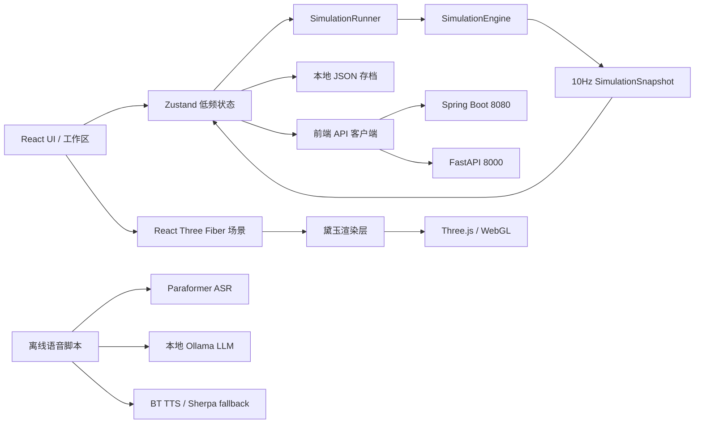
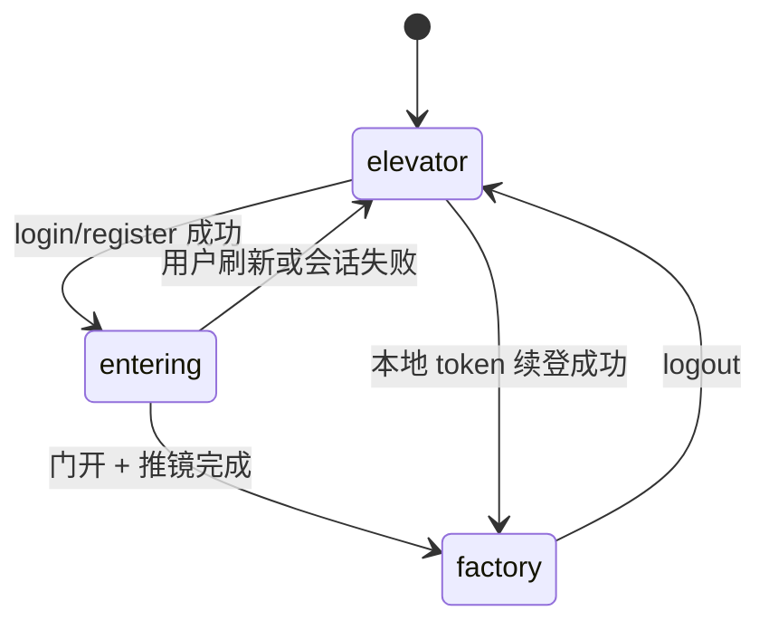
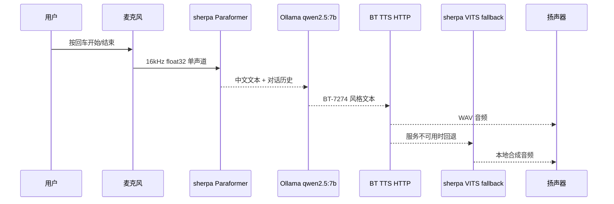
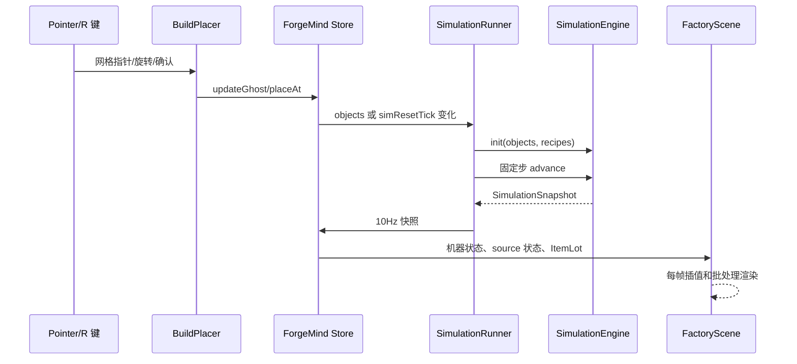

# ForgeMind 已实现功能模块技术文档

**项目：** ForgeMind 智能工厂数字孪生平台  
**文档版本：** 0.1.0  
**整理日期：** 2026-08-15  
**适用范围：** 当前仓库中已经实现、可运行或已经建立接口契约的功能模块

本文档补充 [黛玉自研工厂渲染引擎技术文档](D:/Code/factory/docs/daiyu-render-engine.md)，重点说明 ForgeMind 除黛玉渲染层之外的业务、交互、仿真、数据和 AI 模块。文档中的“已实现”表示代码已经存在并可被当前应用调用；“骨架/占位”表示接口和数据契约已建立，但还没有接入完整生产能力。

## 1. 功能总览

| 模块 | 主要入口 | 当前状态 | 核心职责 |
| --- | --- | --- | --- |
| 应用壳与工作区 | `src/App.tsx` | 已实现 | 登录态切换、四种工作视图、全局快捷键、指标栏 |
| 认证与登录演出 | `src/store/auth.ts`、`src/scene/LoginCameraRig.tsx` | 已实现 | 注册、登录、续登、登出、舱门动画和欢迎音频 |
| 工厂状态管理 | `src/store/forgeMind.ts` | 已实现 | 低频编辑状态、选择态、撤销重做、仿真快照 |
| 网格建造系统 | `src/scene/BuildPlacer.tsx`、`src/game/grid.ts` | 已实现 | 放置、碰撞、旋转、拖拽输送带、转角识别 |
| 设备目录与模型映射 | `src/game/types.ts`、`src/scene/EquipmentModel.tsx` | 已实现 | 设备规格、足迹、端口、吞吐、资产路径和视觉回退 |
| 物品与配方 | `src/game/item.ts`、`ItemPanel.tsx`、`RecipePanel.tsx` | 已实现 | 多输入/多输出配方、加工时长和引用关系维护 |
| 离散事件仿真 | `src/game/simulation.ts`、`SimulationRunner.tsx` | 已实现 | 固定步生产物流、机器状态机、分流汇流、背压 |
| 场景和模型系统 | `src/scene/`、`public/models/` | 已实现 | 高精度工艺设备、Panda URDF、物料可视化、登录舱 |
| 黛玉渲染层 | `src/engine/daiyu/` | 已实现 | 精确实例化、预热、运行时审计和 4060 预算策略 |
| 本地 JSON 存档 | `src/game/save.ts` | 已实现 | 导出、导入、运行时校验和浏览器下载 |
| Spring Boot 存档/认证后端 | `backend/` | 已实现骨架 | JSON 文件 CRUD、BCrypt 密码、内存会话 token |
| AI 服务 | `ai-service/main.py` | 接口占位 | FastAPI 健康检查和 AI 助手契约，当前返回 stub |
| 离线语音助手 | `voice-chat/voice_chat.py` | 独立可运行 | 本地 ASR → Ollama → TTS → 播放闭环，尚未接入网页 UI |
| 仿真回归工具链 | `scripts/` | 已实现 | 闭环、转弯、分流、汇流、背压和 A-01 基地验证 |

## 2. 系统总体架构



### 2.1 分层原则

1. **业务数据层**：`FactoryObject`、`Item`、`Recipe` 描述工厂结构和工艺定义。
2. **仿真层**：`SimulationEngine` 只处理离散生产逻辑，不依赖 React 或 Three.js。
3. **状态协调层**：Zustand 保存编辑态和低频仿真快照；高频物料位置不进入响应式状态。
4. **渲染层**：Three.js/R3F 将对象和快照映射为视觉；黛玉负责批处理、预热和运行时预算。
5. **外部服务层**：Spring Boot 负责持久化与认证，FastAPI 负责未来 AI 编排，均不进入实时仿真主循环。

## 3. 应用壳与工作区模块

### 3.1 视图模型

`src/App.tsx` 定义四种工作区视图：

| 视图 | 代码 | 相机 | 用途 |
| --- | --- | --- | --- |
| `overview` | 01 | 等距视角 | 查看基地布局和设备概况 |
| `build` | 02 | 俯视 | 网格放置、旋转和线路编辑 |
| `flow` | 03 | 流线视角 | 观察物料方向、入口出口和在途物料 |
| `diagnostics` | 04 | 俯视 | 查看仿真状态、堵塞和利用率 |

切换视图时，`changeView` 会自动退出建造工具，避免隐藏的 ghost 或拖拽状态继续影响场景。顶部导航、左侧工作区导航和视口快速切换 dock 共用同一个 `view` 状态。

### 3.2 指标和面板

当前右侧面板由以下低频组件组成：

- `SimPanel`：逻辑时间、在途物品、机器平均利用率、播放/暂停、倍率和产出/消耗。
- `InfoPanel`：选中设备的坐标、朝向、足迹、端口、配方或 source 输出绑定。
- `BuildMenu`：按采集、加工、装配、物流分类显示设备目录。
- `ItemPanel`：创建和删除物品类型。
- `RecipePanel`：创建和删除多输入/多输出配方。

KPI 条中的生产效率、设备利用率和物流负载目前部分是演示指标，真正可追溯的实时量应以 `SimulationSnapshot.stats`、`MachineRuntime.processingTime` 和 `itemLots` 为准。

### 3.3 全局快捷键

- `Esc`：退出建造工具，并从非总览视图返回总览。
- `R`：旋转 ghost 或当前放置工具。
- `Ctrl+Z`：撤销。
- `Ctrl+Shift+Z` / `Ctrl+Y`：重做。
- 设备工作面板：`1/2/3` 切换分拣、焊接、装配任务；`M` 切换自动/手动；`Space` 发送夹爪命令。

输入框、文本域、下拉框和可编辑元素会屏蔽应用级快捷键，避免编辑表单时误操作工厂。

## 4. 认证与登录演出模块

### 4.1 认证状态机

`src/store/auth.ts` 使用三个阶段驱动 UI 和相机：



- `elevator`：只显示电梯舱，`LoginCameraRig` 独占相机。
- `entering`：登录成功后打开舱门、播放欢迎音频并推镜进厂。
- `factory`：挂载完整 UI、`OrbitControls` 和正常工厂交互。

### 4.2 前端认证流程

`src/api/auth.ts` 提供：

| 方法 | 路径 | 作用 |
| --- | --- | --- |
| `register` | `POST /api/auth/register` | 注册并返回 token |
| `login` | `POST /api/auth/login` | 登录并返回 token |
| `fetchMe` | `GET /api/auth/me` | 用 Bearer token 获取当前用户 |
| `logout` | `POST /api/auth/logout` | 删除服务端内存会话 |

请求默认 5 秒超时。成功 token 写入 `localStorage['forgemind.token']`；应用挂载时调用 `restoreSession`，续登失败会清理 token 并回到电梯舱。

### 4.3 舱门与推镜

`LoginCameraRig` 采用帧循环而非 CSS 动画：

- 舱门打开：1350 ms，`smoothstep` 缓动。
- 门开确认停顿：360 ms。
- 推镜进入工厂：2100 ms，`easeInOut` 缓动。
- `ElevatorCabin` 通过共享的 `doorState.t` 驱动门叶位移、灯光强度、入口光幕透明度和地板轨道运动。
- 相机越过 `x < -11.92` 的舱体隐藏阈值后立即隐藏电梯舱，避免进入工厂后继续渲染舱体。

登录成功后 `App.tsx` 播放 `/audio/welcome_home_bt.wav`。音频播放失败不会阻塞入场动画。

### 4.4 后端安全边界

Spring Boot 当前使用 BCrypt 保存密码哈希；会话 token 是 UUID，并保存在 `AuthController` 的进程内 `ConcurrentHashMap`。因此：

- 密码不会明文落盘。
- 后端重启后所有 token 失效。
- 当前没有完整 Spring Security 过滤链、刷新 token、角色权限和限流。
- `@CrossOrigin(origins = "*")` 适合本地演示，不适合生产部署。

## 5. 工厂状态管理模块

### 5.1 Zustand 状态边界

`src/store/forgeMind.ts` 是编辑器和 UI 的低频状态中心。主要字段包括：

```ts
objects: FactoryObject[]
items: Item[]
recipes: Recipe[]
selectedId: string | null
buildType: BuildType | null
ghost: Ghost
ghostPath: GridPos[]
simSnapshot: SimulationSnapshot
simPlaying: boolean
simSpeed: number
```

设计约束是：对象布局、绑定关系和 UI 状态进入 store；每一帧的传送带 offset、机器骨骼和渲染矩阵不进入 store。

### 5.2 编辑历史

编辑器维护最多 80 个 `FactoryHistoryEntry`，每条记录包含 `objects` 和 `selectedId`。放置、删除、旋转、绑定配方和绑定物品会进入历史栈；撤销/重做同时递增 `simResetTick`，让 `SimulationRunner` 重新初始化仿真。

导入存档和清空工厂会清空历史栈，避免跨存档撤销产生对象引用错乱。

### 5.3 引用一致性

删除物品时，store 会同步删除所有配方中引用该物品的输入/输出端口，并移除完全没有端口的配方，避免仿真读取悬空 `itemId`。删除配方不会自动清理机器上的 `recipeId`，因此后续可增加绑定引用检查或自动解绑。

## 6. 网格建造与线路编辑模块

### 6.1 坐标和足迹

`src/game/grid.ts` 规定：

- 1 格 = 1 米。
- `GridPos` 的 `x/z` 是对象足迹的最小角锚点。
- `gridToWorld` 将格子中心转换为 Three.js 世界坐标。
- 对象视觉锚点使用旋转后足迹的几何中心。
- `rotation` 只允许 `0/90/180/270` 四个方向。
- 建造边界为 `BUILD_BOUND = 24`。

`rotatedFootprint` 在 90°/270° 时交换宽深；`occupiedCells` 枚举旋转后的所有占用格。

### 6.2 放置合法性

`canPlace` 按以下顺序判断：

1. 计算旋转后的足迹。
2. 检查足迹是否越出 `[-24, 24]` 建造边界。
3. 枚举候选对象和已有对象的占用格。
4. 使用格子集合判断是否重叠。

因此碰撞是离散格碰撞，不依赖 Three.js 包围盒，也不会因模型视觉细节或阴影边界造成误判。

### 6.3 指针、ghost 和旋转

`BuildPlacer` 使用 Three.js `Raycaster` 将屏幕指针投射到 `y=0` 平面，再通过 `Math.floor` 转成网格坐标。移动时更新 ghost 的位置和合法性；`GhostPreview` 根据 `ghost.valid` 显示合法/非法状态。

按 `R` 后旋转 90°，旋转结果会立即重新经过 `canPlace` 校验。左键确认放置，空工具状态下点击地面会清除选择。

### 6.4 输送带连续拖拽和转角

右键会把当前位置写入拖拽锚点，随后 `buildPath` 将多个锚点和当前指针拼成 Manhattan 路径：先沿 X，再沿 Z。`pathRotations` 根据相邻格计算每段方向，逐段调用 `placeAt`。

线路转角由 `getConveyorLinks` 根据上游/下游连接方向识别：

- 直线段使用精确滚筒模型和方向箭头。
- 90° 转角使用专用程序化 `ConveyorCorner`，避免模型朝向和实际物流方向不一致。
- 转角不使用普通直线滚筒批次，保证视觉和仿真端口语义一致。

### 6.5 端口语义

`objectPortCells` 为每类对象计算外部输入/输出格：

- 普通设备：后侧输入、前侧输出。
- `splitter`：后侧输入，前/左/右三路输出。
- `merger`：后/左/右三路输入，前侧输出。
- `assembler`：三个独立 line-side dock，允许不同物料从不同方向进入。
- `source`：3×2 复合来料站只使用近中心实体皮带所在的单条输出通道。
- `conveyor`：输入允许后/左/右，输出保持单一方向，支持 Manhattan 转角线路。

真实连接不仅要求端口格相邻，还要求上游输出端和下游输入端重合；仿真和视觉端口标记共用这套计算。

## 7. 设备目录、资产映射与模型回退

### 7.1 设备定义

`src/game/types.ts` 中的 `OBJECT_DEFS` 是设备目录唯一来源，包含：

- 业务类型和角色。
- 中文名称、英文副标题、功能描述。
- 模型或资产路径。
- 足迹、颜色、强调色、高度。
- 吞吐、能耗、输入、输出和端口定义。

当前设备类型包括原料源、原料仓储架、滚筒输送线、通用工作站、数控中心、液压冲压、机器人装配、视觉检测、清洗去毛刺、AGV、成品缓存、分流器和汇流器。

### 7.2 资产来源分类

`BUILD_ASSET_PATHS` 将设备划分为：

- **中心拆分资产**：从中心工业模型中抽取的通用工作站、输送段、数控中心、Panda 装配单元和检测模块。
- **独立高精度工艺资产**：冲压、清洗、仓储、流节点等独立 GLB。
- **程序化结构**：没有对应外部节点的简单货架、基础底座、箭头和状态指示。

`EquipmentModel` 为每类设备提供 `Suspense` 回退。GLB 加载失败时显示程序化设备，而不是让整个场景挂起或出现空白。

### 7.3 精度保护

运行时优化共享几何、材质和实例矩阵，不修改 `public/models` 中的原始 GLB、DAE 和 URDF。模型精度、业务足迹和端口作用分开管理：模型负责视觉，`OBJECT_DEFS`/`grid.ts` 负责业务碰撞和连接。

## 8. 物品与配方模块

### 8.1 数据模型

`src/game/item.ts` 定义：

```ts
type ItemCategory = 'raw' | 'intermediate' | 'product'

interface Item {
  id: string
  name: string
  category: ItemCategory
  color: string
  size: number
  note?: string
}

interface Recipe {
  id: string
  name: string
  inputs: RecipePort[]
  outputs: RecipePort[]
  durationSec: number
}
```

`Item` 是类型定义；仿真中的在途实体是 `ItemLot`，二者不能混淆。

### 8.2 默认工业词汇

系统预置钢制毛坯、冷轧钢板、铜线盘、标准紧固件、机加工壳体、冲压壳体、洁净零件、电机总成和已检电机等物品，并提供机加工、冲压、线圈绕制、紧固件齐套、清洗、电机装配、视觉终检和包装配方。

### 8.3 配方编辑器

`RecipePanel` 支持：

- 选择输入物品和数量。
- 选择输出物品和数量。
- 设定加工时长。
- 在提交前删除端口行。
- 在列表中删除配方。

提交条件是名称非空、至少一个输入和至少一个输出；加工时长在 store 中被限制为不小于 0.1 秒。

### 8.4 设备绑定

`InfoPanel` 为机器提供配方下拉框，为 source 提供输出物品下拉框。绑定结果写回 `FactoryObject.recipeId` 或 `FactoryObject.itemId`，随后触发仿真重建，保证运行时使用最新配置。

## 9. 离散生产仿真模块

### 9.1 运行原则

`src/game/simulation.ts` 是纯 TypeScript 仿真内核，也是生产逻辑唯一真相源。它不导入 React、Three.js 或 DOM，可在浏览器、Node 脚本和未来后端引擎中复用。

固定参数：

| 参数 | 值 | 含义 |
| --- | ---: | --- |
| `SIM_STEP` | 0.05 s | 固定逻辑步长，20 Hz |
| `CONVEYOR_SPEED` | 2 格/s | 传送带离散槽位推进速度 |
| `SOURCE_INTERVAL` | 1.0 s | source 产出计时 |
| `SOURCE_TRANSFER_TIME` | 1.2 s | source 拾取/放置动画对应的逻辑时长 |
| `LOAD_TIME` | 0.5 s | 机器收料过渡 |
| `OUTPUT_TIME` | 0.3 s | 机器出料过渡 |

引擎使用累加器吸收真实时间，将每次 `advance(dtSec)` 拆成多个固定 50 ms 步；最多执行 1000 步，避免浏览器长时间冻结后出现无限追赶。

### 9.2 Source 生命周期

Source 状态为 `idle`、`picking`、`placing`、`blocked`：

1. 没有绑定 `itemId` 或没有下游时进入 `blocked`。
2. 达到产出间隔后开始 transfer。
3. 前 52% 进入 `picking`，后续进入 `placing`。
4. 到达 100% 时尝试把物品放入下游传送带或机器输入缓冲。
5. 下游满时保持 `blocked`，物品不会凭空生成。

### 9.3 传送带和在途物品

每个传送带运行时容量为 1 个 `ItemLot`：

```ts
interface ItemLot {
  id: string
  itemId: string
  conveyorId: string
  offset: number // 0..1，沿当前段的进度
}
```

物品每个固定步增加 `CONVEYOR_SPEED * dt`。到达 `offset >= 1` 后按输出端口尝试进入下游：

- 空的传送带：转移到下一段并重置 offset。
- 可接收的机器：进入机器输入缓冲。
- 空格：作为工厂出口，物品离开场景。
- 下游满或端口不连接：offset 固定为 1，形成头堵。

传送带按对象 ID 排序后推进，保证同一布局和同一种子下的结果稳定。

### 9.4 机器状态机

机器状态为 `idle → loading → processing → output`：

- `idle`：检查配方所有输入是否满足数量。
- `loading`：消耗输入并执行收料过渡。
- `processing`：按配方时长推进，并累加 `processingTime`。
- `output`：尝试把第一个输出端口的产品送入下游；下游满时停留在 output。

`SimulationSnapshot` 对 UI 暴露机器状态、进度、输入缓冲、累计加工时间、在途物品和产出/消耗统计。

当前数据结构支持多输出配方统计，但机器路由仍按 `recipe.outputs[0]` 放入下游，这是 MVP 的明确边界。

### 9.5 分流、汇流和连接校验

- `splitter` 使用 `branchCursor` 轮询三条输出，优先选择当前游标后第一个可接收分支。
- `merger` 使用后/左/右三个输入端口，统一从前侧输出。
- `isConnected` 要求上游占用格和下游输入端口格相交；不满足时不允许传输。
- 大尺寸设备的中心双通道和装配单元的多 dock 均由 `objectPortCells` 统一处理。

### 9.6 仿真驱动器

`SimulationRunner.tsx` 在 App 顶层挂载一个模块级 `SimulationEngine` 单例：

- 固定种子 `20260813`。
- `requestAnimationFrame` 获取真实时间。
- 根据 `simPlaying` 和 `simSpeed` 推进引擎。
- 仅每秒 10 次把 `getSnapshot()` 写入 Zustand。
- 对象、配方变化或 `simResetTick` 变化时重建引擎。

这样 React 只处理低频快照，Three.js 可以继续以每帧频率渲染物料位置和机械动作。

## 10. 场景、物料与机器人模块

### 10.1 场景组织

`FactoryCanvas` 负责 Canvas、相机、灯光、雾、网格地面、场景预热、登录舱和相机控制；`FactoryScene` 负责对象分组和渲染批次选择。

对象按类型拆分为传送带、通用机器、AGV、冲压、清洗、仓储、source、inspection 和 Panda 批次。动态对象仍可回退到 `FactoryObjectMesh` 独立渲染。

### 10.2 物料视觉

`ItemLotMesh` 将仿真快照中的 `ItemLot` 映射到当前传送带对象的位置和方向，显示为轻量占位物料。物料位置来自仿真状态，不在渲染层自行决定物流结果。

### 10.3 Panda 机械臂

`PandaArmModel` 使用 `/models/panda/panda.urdf` 和 DAE visual link：

- 模板 Promise 单例加载，避免每台机械臂重复解析 URDF。
- 加载完成后等待视觉 Mesh 和有限包围盒，再进行 Z-up 到 Y-up、归一化和底面对齐。
- 静止机械臂进入 `DaiyuPandaBatch` 精确批次。
- source 拾取/放置或装配工作时，恢复独立 URDF 关节树。
- 自动动作使用低迭代 Damped Least Squares IK；手动模式支持键盘和 Gamepad。
- 通过 `forgemind:robot-command` 自定义事件接收任务、模式和夹爪命令。

### 10.4 登录舱和正式工厂相机

登录阶段不挂载 OrbitControls，避免舱门推镜与用户控制抢夺相机。正式工厂阶段根据视图选择相机预设，并以 960–1380 ms 的过渡时间插值到目标位置。建造模式暂时禁用 OrbitControls，避免拖拽线路时同时旋转视角。

黛玉的批处理、预热、阴影和性能数据详见独立文档，不在本篇重复展开。

## 11. 存档、导入导出与后端同步

### 11.1 本地存档格式

`FactorySave` 当前版本为 1：

```ts
interface FactorySave {
  version: number
  savedAt?: string
  objects: FactoryObject[]
  items: Item[]
  recipes: Recipe[]
}
```

`serializeSave` 生成格式化 JSON；`downloadSave` 使用 Blob 和临时 URL 下载；`readFileAsText` 读取用户选择的 JSON 文件。

### 11.2 运行时校验

`parseSave` 会检查：

- 顶层对象是否有效。
- `objects/items/recipes` 是否为数组。
- 位置、旋转、类别、端口数量和物品引用是否合法。
- 配方端口引用的 `itemId` 是否存在。

未知字段会被忽略，关键字段错误会抛出中文错误，`LeftPanel` 将错误显示给用户。

### 11.3 当前兼容性注意

当前 `parseObjects` 的类型白名单仍只包含 `machine`、`conveyor` 和 `source`，而当前设备目录已经扩展到 `smelter`、`press`、`assembler`、`inspection`、`washing`、`agv`、`storage`、`splitter` 和 `merger`。因此完整 A-01 场景导出后再次导入，可能被校验器拒绝。该问题不影响内存中的建造和仿真，但应作为下一次存档版本升级的优先修复项。

### 11.4 Spring Boot 同步

`src/game/api.ts` 提供带超时的远端存档客户端：

| 方法 | 路径 | 作用 |
| --- | --- | --- |
| `isBackendOnline` | `GET /api/factory/health` | 探测后端 |
| `fetchRemoteSave` | `GET /api/factory` | 拉取整厂存档 |
| `pushRemoteSave` | `PUT /api/factory` | 覆盖远端存档 |

`LeftPanel` 的“推后端/拉后端”按钮先检查健康状态，再执行同步；后端离线不会阻塞本地编辑和本地 JSON 存档。

## 12. Spring Boot 后端模块

### 12.1 技术栈和数据文件

- Java 17。
- Spring Boot 3.3.5。
- `spring-boot-starter-web`。
- `spring-security-crypto`，只用于 BCrypt。
- `data/factory.json` 保存工厂结构。
- `data/users.json` 保存用户记录。

`JsonStore` 和 `UserStore` 在文件不存在时返回空结构，并在写入时自动创建 `data` 目录。

### 12.2 REST 接口

认证接口：

| 方法 | 路径 | 说明 |
| --- | --- | --- |
| `POST` | `/api/auth/register` | 用户名至少 2 个字符，密码至少 6 位 |
| `POST` | `/api/auth/login` | BCrypt 校验后签发 UUID token |
| `GET` | `/api/auth/me` | `Authorization: Bearer <token>` |
| `POST` | `/api/auth/logout` | 删除内存 token |

工厂接口：

| 方法 | 路径 | 说明 |
| --- | --- | --- |
| `GET` | `/api/factory` | 返回完整 `FactorySave` |
| `PUT` | `/api/factory` | 覆盖并返回完整 `FactorySave` |
| `GET` | `/api/factory/health` | 服务健康检查 |

后端只负责静态结构 CRUD，不推进前端实时仿真。未来如果迁移到 Java 仿真引擎，应先定义版本化事件协议，不能直接让 CRUD 接口修改运行时状态。

## 13. AI 服务模块

### 13.1 当前实现

`ai-service/main.py` 是 FastAPI 服务，监听默认 8000 端口，启用全域 CORS。当前接口：

| 方法 | 路径 | 返回 |
| --- | --- | --- |
| `GET` | `/api/ai/health` | `{"status":"ok","service":"forgemind-ai"}` |
| `POST` | `/api/ai/assistant` | `answer/source/note` 结构化响应 |

请求模型：

```json
{
  "question": "怎么提高产量？",
  "context": {
    "timeSec": 120,
    "bottlenecks": []
  }
}
```

当前助手返回 `source: "stub"`，不会调用真实 LLM，也不会改变工厂对象或仿真状态。前端客户端为 `src/game/api.ts::askAssistant`，已经预留上下文参数和超时处理。

### 13.2 设计边界

AI 未来只能输出动作库中的结构化建议，例如调整线路、替换设备、改变配方参数；不能直接自由修改工厂。所有候选方案必须复制工厂状态，在副本仿真中验证产能、阻塞和资源约束后，再由用户确认写回。

AI 服务不得进入 `SimulationRunner` 的每帧或每个固定步，否则会把 LLM 延迟引入实时链路。

## 14. 离线语音助手模块

### 14.1 处理链路

`voice-chat/voice_chat.py` 是独立的本地 Python 交互程序：



### 14.2 模型和运行约束

- ASR：Paraformer int8 ONNX，4 线程。
- TTS fallback：Sherpa-ONNX VITS 中文模型，4 线程。
- LLM：`http://localhost:11434/api/chat`，默认 `qwen2.5:7b`。
- BT TTS：`http://127.0.0.1:8001/tts`，不可用时回退本地 VITS。
- 输入小于 0.3 秒或低于静音阈值 `0.01` 时丢弃。
- 识别到“退出”或“再见”时结束循环。

该模块当前不与 React 页面共享会话，也不向工厂仿真发送动作。若将来接入网页，应通过异步命令队列和权限校验接入，不能让语音文本直接执行任意设备操作。

## 15. 测试与验证工具链

### 15.1 npm 脚本

```bash
npm run build
npm run sim
npm run sim:smoke
npm run sim:regression
npm run sim:backpressure
```

`npm run build` 执行 TypeScript 项目构建和 Vite 生产打包。`scripts/run-sim.mjs` 使用 esbuild 将 TypeScript 测试脚本临时 bundle 成 Node 可执行模块，结束后清理临时目录。

### 15.2 回归覆盖范围

`scripts/sim-regression.ts` 当前覆盖 7 类场景：

1. 基础 Source → 传送带 → 机器 → 出口闭环。
2. 90° 转弯线路。
3. 三向分流器轮询。
4. 双输入汇流器和多输入配方。
5. 下游拒收时的头堵与背压。
6. 3×2 大型设备的中间入口/出口通道。
7. Source `picking → placing → grid lot` 生命周期。

`base-a01-check.ts` 额外检查 A-01 预置布局的边界和碰撞、设备类型完整性，并运行 300 秒仿真确认电机装配、终检和包装链路闭合。

### 15.3 性能验证入口

黛玉开发诊断参数：

- `?daiyuStress=300`：生成最多 600 个不写入 store 的压力对象。
- `?daiyuDpr=1.86`：固定开发环境渲染 DPR，用于近 1080p 采样。

性能指标、P95 帧时、场景审计和 4060 Laptop 实测结果统一记录在 [黛玉渲染引擎文档](D:/Code/factory/docs/daiyu-render-engine.md) 中。

## 16. 端到端数据流和不变量

### 16.1 建造到仿真



### 16.2 必须保持的不变量

- `rotation` 只取四个方向，且同时决定视觉朝向和物流方向。
- 任何对象不能越出建造边界或与其他对象占用格重叠。
- 传送带满时只能头堵，不能穿透、丢失或凭空复制物料。
- 机器只有在输入数量齐备且配方存在时才能进入 loading。
- 渲染层不能替代仿真层决定物料去向。
- AI、网络请求和语音推理不能进入实时固定步循环。
- 原始模型资产不因性能优化而被隐式减面、替换或改变作用。

## 17. 启动和排障手册

### 17.1 仅运行前端

```bash
npm install
npm run dev
```

访问 `http://localhost:5173`。没有后端时可以继续使用建造、物品、配方、仿真和本地 JSON 存档；登录接口会显示后端连接错误。

### 17.2 启动 Spring Boot

```bash
cd backend
mvn package
java -jar target/forgemind-backend-0.1.0.jar
```

默认端口 8080。检查 `http://localhost:8080/api/factory/health`。

### 17.3 启动 AI 服务

```bash
cd ai-service
py -3.10 -m venv .venv
.venv/Scripts/pip install -r requirements.txt
.venv/Scripts/python -m uvicorn main:app --port 8000
```

检查 `http://localhost:8000/api/ai/health`。此接口正常只代表 FastAPI 在线，不代表真实 LLM 已接入。

### 17.4 典型问题定位

| 现象 | 优先检查 |
| --- | --- |
| 登录显示 `Failed to fetch` | Spring Boot 是否监听 8080，浏览器是否允许本地跨源请求 |
| 物料不动 | source 是否绑定物品、机器是否绑定配方、端口方向是否连接 |
| 传送带末端停住 | 下游是否满、是否没有配方、是否形成预期背压 |
| 机械臂不显示 | Panda URDF/DAE 路径、模型请求、Daiyu 批次是否接管、浏览器控制台错误 |
| 导入存档失败 | JSON 版本、对象类型白名单、配方引用的物品是否存在 |
| 舱门动画卡顿 | 黛玉预热状态、Panda 是否在隐藏祖先下跳过 IK、DPR 和阴影预算 |

## 18. 当前边界与后续路线

### 已知边界

- Spring Boot 认证 token 是内存态，重启失效。
- AI FastAPI 当前只返回 stub，未接真实 LLM。
- 离线语音助手是独立 Python 程序，未接入网页工作区。
- 本地存档解析器的对象类型白名单需要扩展到完整设备目录。
- 机器多输出配方的数据结构已支持，但运行时下游路由仍使用第一个输出。
- A-01 中部分 KPI 是演示读数，不等同于仿真统计。
- 4060 Laptop 与 5 GiB LLM 同时运行的长时间稳定性仍需实机认证。

### 推荐演进顺序

1. 修复存档版本校验，支持全部 `BuildType` 并加入迁移函数。
2. 将后端存档从单文件 JSON 升级为带用户/工厂归属的持久化存储。
3. 为 AI 增加 action schema、副本仿真、差异报告和用户确认流程。
4. 将语音助手改造成异步服务，并与 AI 助手共用安全命令协议。
5. 增加自动化浏览器验收、显存采样、温度采样和 LLM 并行压力测试。
6. 在模型资产不变的前提下评估 HLOD、WebGPU 和离线纹理压缩。

## 19. 代码索引

| 路径 | 说明 |
| --- | --- |
| `src/App.tsx` | 应用壳、视图切换、KPI、快捷键和登录音频 |
| `src/store/forgeMind.ts` | 编辑器、历史栈、物品/配方、仿真快照 |
| `src/store/auth.ts` | 认证阶段和本地 token 续登 |
| `src/game/types.ts` | 设备目录和 `FactoryObject` 类型 |
| `src/game/grid.ts` | 足迹、碰撞、端口和世界坐标 |
| `src/game/item.ts` | Item、Recipe 和默认工业词汇 |
| `src/game/simulation.ts` | 固定步长离散仿真唯一真相源 |
| `src/game/SimulationRunner.tsx` | rAF 驱动器和 10Hz 快照桥接 |
| `src/game/save.ts` | 本地存档序列化、解析和下载 |
| `src/game/api.ts` | Spring Boot 存档和 FastAPI AI 客户端 |
| `src/scene/BuildPlacer.tsx` | 射线拾取、ghost、拖拽线路和快捷键 |
| `src/scene/FactoryCanvas.tsx` | Canvas、相机、场景分组和黛玉接入 |
| `src/scene/FactoryObjectMesh.tsx` | 单对象渲染、端口标记和转角视觉 |
| `src/scene/EquipmentModel.tsx` | 设备模型映射、加载和程序化回退 |
| `src/scene/PandaArmModel.tsx` | Panda URDF、IK、自动/手动控制 |
| `backend/src/main/java/com/forgemind/web/` | 认证和工厂 REST 控制器 |
| `ai-service/main.py` | FastAPI AI 服务占位 |
| `voice-chat/voice_chat.py` | 本地 ASR/LLM/TTS 语音闭环 |
| `scripts/sim-regression.ts` | 仿真回归测试 |
| `scripts/base-a01-check.ts` | A-01 布局和 300 秒生产闭环检查 |

