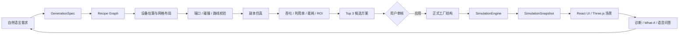
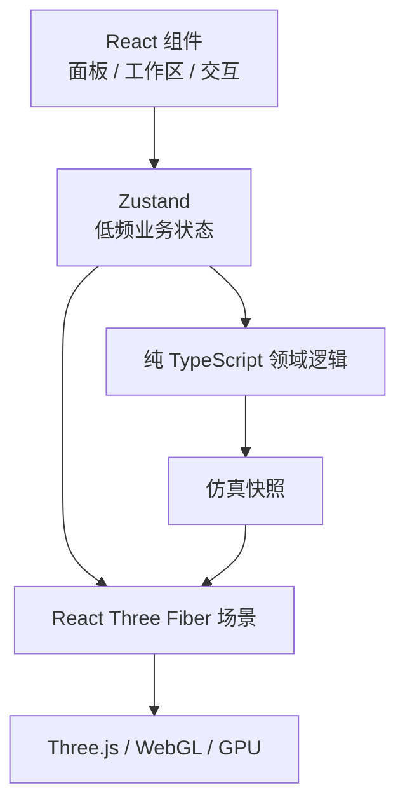
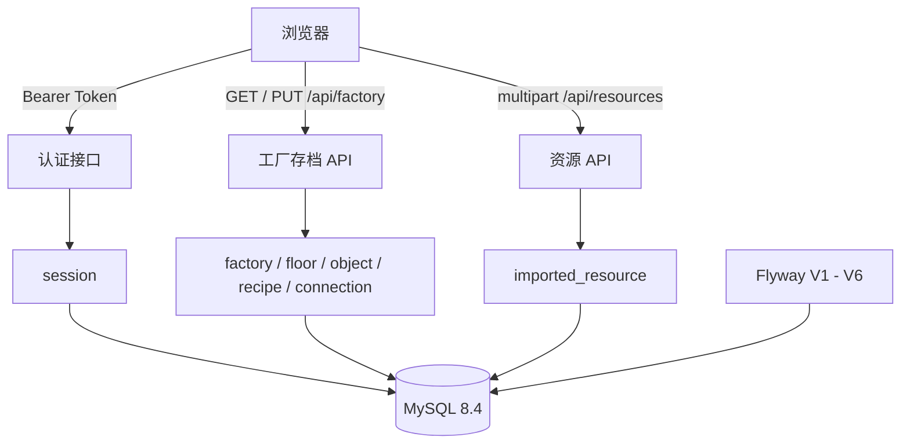
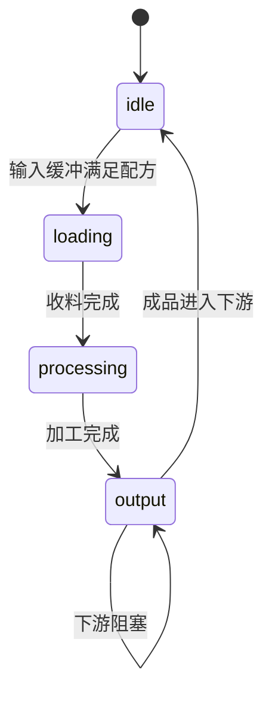
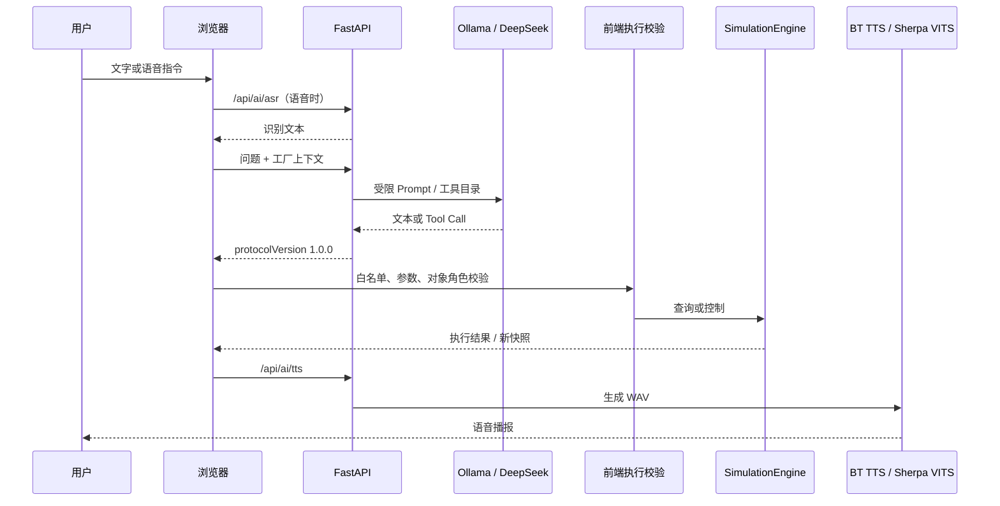
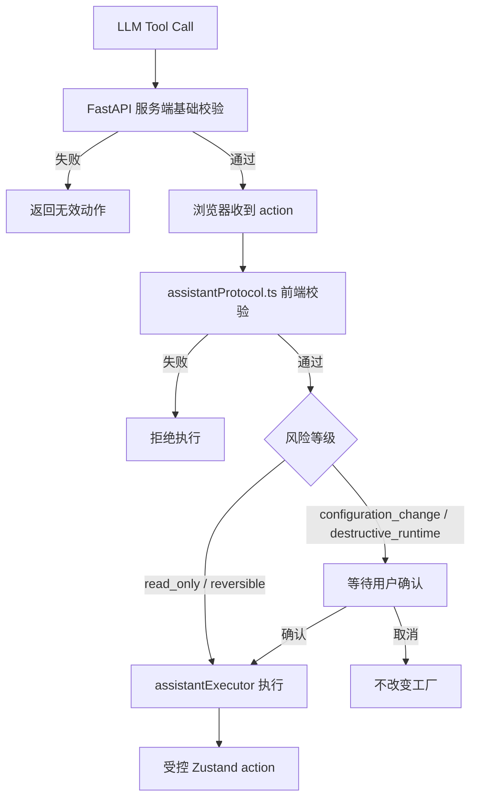
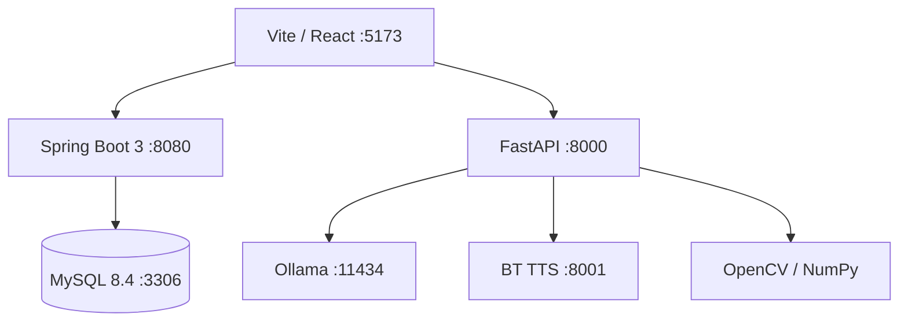

# ForgeMind 技术点完整介绍

> 项目：ForgeMind 智能工厂数字孪生、生产路线与仿真平台  
> 文档用途：技术答辩、项目说明、方案评审和开发交接  
> 文档状态：以当前仓库实现为准  
> 更新时间：2026-08-20

## 0. 文档说明

本文按照 ForgeMind 的 10 个核心技术点，说明每一项技术：解决的问题、实现方法、输入输出、算法指标、实际效果、代码入口，以及当前边界。

本文中的公式分为两类：

1. **代码正在使用的公式**：例如固定步长、吞吐、利用率、A* 代价、ROI 和视觉缺陷评分。
2. **用于解释算法的标准公式**：用于说明原理，实际代码可能使用简化版或启发式实现，文中会明确标注。

## 1. 平台总体技术闭环

ForgeMind 不是单一的 3D 展示系统，也不是只返回文本的 AI 聊天系统。它把工厂结构、生产仿真、三维渲染、物流导航、AI 规划和后端存储连接成一条闭环：



### 1.1 总体分工

| 技术模块 | 主要职责 | 当前实现位置 |
| --- | --- | --- |
| React + R3F | 页面、工作区、三维交互 | `src/App.tsx`、`src/components/`、`src/scene/` |
| 工厂领域模型 | 设备、物品、配方、端口、楼层 | `src/game/types.ts`、`grid.ts`、`item.ts` |
| 确定性仿真 | 机器、物料、传送带、AGV、无人机 | `src/game/simulation.ts` |
| 宝钗渲染引擎 | 模型批处理、预热、预算、审计 | `src/engine/daiyu/` |
| 黛玉思考引擎 | 需求解析、布局生成、诊断、优化 | `src/game/generativeFactory.ts`、`factoryDiagnostics.ts` |
| AI 服务 | LLM、ASR、TTS、视觉接口 | `ai-service/` |
| 持久化后端 | 认证、工厂存档、导入资源 | `backend/`、MySQL |

最重要的边界是：

```text
AI 可以提出方案，但不能直接成为事实；
仿真可以产生运行结果，但不负责渲染；
Three.js 可以显示场景，但不负责生产逻辑；
Spring Boot 保存结构，但不接管每一个实时 tick。
```

---

## 2. 技术点一：前端应用与三维数字孪生

### 2.1 要解决的问题

智能工厂平台同时包含两类状态：

1. **低频业务状态**：当前楼层、选中设备、建造工具、物品、配方、候选方案、登录用户。
2. **高频运行状态**：传送带上物料的偏移、机械臂关节角、AGV 位置、无人机位置、相机帧和动画。

如果所有状态都通过 React 响应式更新，仿真每推进一次就会触发大量组件重渲染；如果所有状态都直接写 Three.js，又会让业务状态难以保存、回放和测试。

### 2.2 实现方法

ForgeMind 采用“三层分离”：



- **React**：负责工作区、按钮、表单、设备详情和用户反馈。
- **Zustand**：保存需要驱动 UI 或存档的状态，避免引入复杂状态容器。
- **纯 TypeScript 领域逻辑**：负责网格、端口、配方、仿真、导航、诊断和存档，尽量不依赖 React。
- **React Three Fiber / Three.js**：负责把业务状态转换成 3D 场景。
- **高频对象**：通过 `useFrame`、Three 对象引用和批处理实例矩阵更新，不逐帧写入 Zustand。

### 2.3 网格建模与坐标公式

项目使用“1 格约等于 1 米”的网格坐标。网格锚点到世界坐标的映射为：

```text
World(x, z) = (x + 0.5, z + 0.5)
```

设备有宽度 `w`、深度 `d` 和旋转 `r`。旋转后的占地为：

```text
(w', d') = (w, d), r ∈ {0, 180}
(w', d') = (d, w), r ∈ {90, 270}
```

对象占用的格子集合为：

```text
Cells(o) = {(x+i, z+j) | 0 <= i < w', 0 <= j < d'}
```

两个设备发生碰撞，当且仅当：

```text
Cells(a) ∩ Cells(b) ≠ ∅
```

代码中的 `occupiedCells()`、`rotatedFootprint()` 和 `cellsOverlap()`直接实现了这套规则。

### 2.4 端口连接语义

每个设备通过 `rotation` 定义输出方向。若对象 `A` 的输出端口指向网格 `(x,z)`，该网格上的对象 `B` 就是候选下游：

```text
A.rotation → A.outputPortCell → B.inputPortCell
```

系统不仅检查“相邻”，还检查端口方向是否匹配。分流器、汇流器、装配单元和传送带拥有多个有效端口，因此端口模型比单纯的“设备中心点相邻”更准确。

### 2.5 三维呈现策略

- GLB/URDF 模型用于高精度设备、机械臂、AGV 和工业产线。
- 程序化几何用于网格、辅助线、状态灯、端口标记和简单设备外壳。
- `InstancedMesh` 用于重复的静态模型和传送带段。
- 动态机械臂、物料实例、选中描边和运行指示保持独立更新。
- 业务对象 ID 始终映射回选择状态，批处理不会破坏设备点击和详情面板。

### 2.6 起到的效果

- 业务状态可以保存、回放和单元测试。
- 三维场景只消费业务状态，不会把生产规则散落在渲染组件里。
- 高频对象不触发整棵 React 组件树重渲染。
- 网格、端口、旋转、碰撞和 Three.js 坐标保持一致。

### 2.7 代码入口

- `src/App.tsx`
- `src/store/forgeMind.ts`
- `src/scene/FactoryCanvas.tsx`
- `src/scene/FactoryObjectMesh.tsx`
- `src/game/grid.ts`
- `src/game/types.ts`

---

## 3. 技术点二：工厂建模与数据存储

### 3.1 领域对象模型

ForgeMind 的工厂不是一张图片，而是一组可校验、可仿真、可持久化的结构化对象：

| 对象 | 关键字段 | 作用 |
| --- | --- | --- |
| `FactoryObject` | `id`、`type`、`pos`、`rotation`、`floorId`、`recipeId`、`itemId` | 设备、传送带、仓储、AGV、无人机 |
| `Item` | `id`、`name`、`category`、`modelId` | 原料、中间品和成品 |
| `Recipe` | `inputs`、`outputs`、`durationSec` | 输入输出端口和加工节拍 |
| `FactorySave` | `version`、`objects`、`items`、`recipes` | JSON 存档和后端传输对象 |
| `ImportedResource` | 元数据、项目 JSON、GLB 二进制 | 用户私有设备资源 |

### 3.2 前端存档方法

前端提供 JSON 存档，用于离线演示、导入导出和无后端运行：


校验内容包括：对象类型、有限坐标、合法旋转、唯一 ID、物品引用、正数数量、正数加工时长，以及 AGV 路线和策略枚举。

存档当前版本为 `v2`。加载旧版本时，先迁移再验证，避免脏数据直接进入运行时状态。

### 3.3 Spring Boot + MySQL 持久化

后端保存的是“可恢复的结构”，不是每帧的实时运行状态：



后端职责：认证、工厂结构 CRUD、用户导入资源、资源归属校验和数据库迁移。

### 3.4 用户资源导入

导入包由项目 JSON 和 GLB 组成：

1. `resourcePack.ts` 检查字段、设备类别、足迹、端口和模型引用。
2. 浏览器生成 Blob URL，立即预览模型。
3. 模型归一化：包围盒居中、缩放到统一网格足迹、底面对齐 `y=0`。
4. 登录后通过 multipart 上传到 `/api/resources`。
5. 后端按用户写入 `imported_resource`，模型以 `LONGBLOB` 保存。
6. 下次登录时只加载当前用户资源列表，再按需下载 GLB。

### 3.5 起到的效果

- 离线时仍可运行本地工厂和仿真。
- 在线时可以跨会话恢复工厂。
- 存档格式可迁移、可验证、可回归测试。
- 用户导入模型不会被错误地打包进公共前端资源。
- 数据库只承担结构化持久化，不拖慢实时仿真。

### 3.6 代码入口

- `src/game/save.ts`
- `src/game/resourcePack.ts`
- `src/api/auth.ts`
- `src/api/resources.ts`
- `backend/src/main/java/com/forgemind/web/`
- `backend/src/main/resources/db/migration/`

---

## 4. 技术点三：生产仿真与状态机

### 4.1 仿真定位

`src/game/simulation.ts` 是 ForgeMind 当前运行时的唯一真相源。React 和 Three.js 不自行推进生产逻辑，只读取仿真状态和低频快照。

仿真对象包括 Source 来料站、Conveyor 传送带段、Machine 加工设备、ItemLot 在途物料、Splitter/Merger 分流与汇流、AGV 运输任务和 Drone 跨层运输任务。

### 4.2 固定步长方法

仿真采用固定步长：

```text
Δt = 0.05 s
```

即每秒推进 20 个逻辑 tick。外部传入任意 `dt` 时，先进入累加器：

```text
accumulator = accumulator + dt
steps = floor(accumulator / Δt)
执行 steps 次 step(Δt)
accumulator = accumulator - steps × Δt
```

这样可以避免浏览器帧率变化直接改变生产结果。

### 4.3 每个 tick 的处理顺序

```text
step(0.05)
  1. Source 计时与产出
  2. Conveyor 物料槽位推进
  3. Machine 输入、加工和输出
  4. AGV 路径、避让和任务推进
  5. Drone 升降、环线和投料推进
  6. 生成 SimulationSnapshot
```

### 4.4 传送带离散槽位模型

每段传送带容量为 1 个 `ItemLot`。传送带速度为：

```text
v = 2 格/秒
```

每个 tick 的槽位偏移为：

```text
Δoffset = v × Δt = 2 × 0.05 = 0.1
```

当 `offset >= 1` 时，系统尝试把物料移动到下游：

- 下游是空传送带：进入下一个槽位；
- 下游是机器：进入机器输入缓冲；
- 下游是出口：计入产出；
- 下游已满：物料停在 `offset = 1`，形成头堵背压。

因此背压不是视觉效果，而是对上游产出的真实约束。

### 4.5 机器状态机

机器状态为：



机器状态：

- `idle`：等待输入；
- `loading`：收料过渡，当前默认 `0.5s`；
- `processing`：按照 `Recipe.durationSec` 加工；
- `output`：输出成品，当前默认输出过渡 `0.3s`。

### 4.6 主要生产指标

#### 吞吐量

代码中的小时吞吐量为：

```text
Q_hour = outputUnits / simulationSeconds × 3600
```

其中 `outputUnits` 是仿真时间窗内的目标成品数量。

#### 设备利用率

代码中的利用率为：

```text
U = min(100, sum(machine.processingTime) / (machineCount × simulationSeconds) × 100)
```

它反映机器处于 `processing` 状态的时间比例，不等于设备综合效率 OEE。

#### 在途物料

```text
WIP = ItemLot 数量
```

在途物料过多可能意味着物流节拍小于加工节拍，诊断引擎会把它作为堆积风险。

### 4.7 确定性与可复现性

- 仿真使用种子化 `mulberry32` PRNG；
- 传送带按对象 ID 排序后推进；
- 状态推进顺序固定；
- 生成器副本仿真使用固定种子 `20260813`。

同一个工厂结构、配方、种子和仿真时长应产生可比较的产出结果，这使回归测试、方案比较和 What-if 分析具有可复现基础。

### 4.8 起到的效果

- 仿真结果不依赖显示器 FPS。
- 传送带堵塞、机器等待和源站阻塞可被真实观测。
- 产出、消耗、在途和利用率能被脚本验证。
- AI 生成的方案必须经过副本仿真，而不是只看几何布局。

### 4.9 代码入口

- `src/game/simulation.ts`
- `src/game/SimulationRunner.tsx`
- `src/game/item.ts`
- `src/game/rng.ts`
- `scripts/sim-smoke.ts`
- `scripts/sim-regression.ts`

---

## 5. 技术点四：导航与物流调度

### 5.1 AGV 网格导航

AGV 使用离散网格和确定性 A* 搜索。每个网格节点包含静态障碍、动态障碍、安全半径、起点和目标对接点。

A* 的评价函数为：

```text
f(n) = g(n) + h(n)
```

其中：

- `g(n)`：起点到当前节点的实际路径代价；
- `h(n)`：当前节点到目标的启发式估计，代码使用欧氏距离；
- 直线移动成本为 `1`，对角移动成本为 `sqrt(2)`。

系统按 AGV 车体尺寸计算导航安全半径：

```text
r_nav = AGV_BODY_HALF_WIDTH + 0.05
d_safe = 2 × r_nav
```

当两个 AGV 中心距离小于 `d_safe`，就进入避让、等待或重新规划流程。

### 5.2 AGV 避让与重规划

AGV 运行状态包括：

```text
idle → moving → waiting / yielding → replanning → recovering
```

当前策略：

- 预留其他 AGV 的预测路径作为动态障碍；
- 即将相遇时进入让行；
- 被阻塞时累计 `blockedSeconds`；
- 超过阈值后重新搜索恢复路径；
- 记录 `yieldCount`、距离、完成任务数和阻塞时间。

这比单纯沿固定样条线移动更适合展示“物流调度”而不是“物流动画”。

### 5.3 无人机跨层运输

无人机采用确定性航路，不使用实时三维自由空间规划：

```text
L1 停靠点
  → 升降井
  → 目标楼层高度
  → 高位环线
  → 输入支线
  → L2 / L3 交付点
  → 返回
```

无人机状态包括 `parked`、`taxi-to-lift`、`ascending`、`perimeter`、`to-input` 和 `returning`。

只有仿真运行后运输任务才推进，避免场景加载时物流对象自行移动。

### 5.4 物流效率指标

方案生成器当前使用一种可解释的启发式物流效率：

```text
E_logistics = clamp(100 - 0.32 × conveyorCount - 0.38 × turnCount, 0, 100)
```

该指标用于候选之间的相对比较，不等同于真实工厂的物流 OEE。

### 5.5 起到的效果

- AGV 能够绕开设备和其他车辆。
- 多车辆同时运行时有等待、让行和重规划行为。
- 无人机展示 L1 到 L2/L3 的跨层补给链路。
- 仓储、产线、来源站和目的地可以在同一仿真时间轴内运行。

### 5.6 代码入口

- `src/game/agvNavigation.ts`
- `src/game/droneNavigation.ts`
- `src/game/warehouse.ts`
- `src/components/AgvNavigationControl.tsx`
- `src/components/DroneNavigationControl.tsx`
- `src/components/WarehouseWorkspace.tsx`

---

## 6. 技术点五：机械臂与视觉质检

### 6.1 Panda 机械臂

项目使用 Panda URDF/DAE 资产建立 7 自由度机械臂，包含：

- 7 个旋转关节；
- 末端 link `panda_link8`；
- 双指夹爪；
- 自动装配、来料抓取和手动控制模式；
- 视觉检测相机挂载在末端执行器附近。

### 6.2 DLS 逆运动学

机械臂通过阻尼最小二乘法（Damped Least Squares, DLS）求解末端目标位置和姿态。

标准形式为：

```text
Δq = Jᵀ × (J × Jᵀ + λ²I)^(-1) × e
```

其中：

- `J`：6 × 7 雅可比矩阵；
- `e`：位置误差和姿态误差组成的 6 维向量；
- `λ`：阻尼系数，当前实现为 `0.18`；
- `Δq`：各关节角度增量。

代码每次迭代都会：

1. 更新关节树的世界矩阵；
2. 计算末端位置和四元数；
3. 计算位置误差；
4. 将四元数误差转换为旋转向量；
5. 根据关节轴和末端相对位置构建雅可比矩阵；
6. 用高斯消元求解 DLS 线性系统；
7. 根据关节上下限和最大步长更新关节。

当前安全限制：

```text
位置误差停止阈值：0.004
姿态误差停止阈值：0.02
单关节最大步长：0.010 rad
自动任务：每帧 1 次迭代
手动控制：每帧最多 3 次迭代
```

使用上一帧关节角作为热启动，可以减少连续轨迹中的迭代次数；阻尼和步长限制可以避免接近奇异位形时出现大幅跳动。

### 6.3 机械臂静态批处理与动态接管

```text
URDF/DAE 模板只解析一次
      ├── 静止状态 → PandaBatch / InstancedMesh
      └── picking / placing → 独立关节树 + DLS IK
```

静止机械臂共享几何与材质，动作机械臂恢复独立关节树。这样既保留高精度模型，又避免所有机械臂每帧都执行完整 IK。

### 6.4 工业视觉检测

视觉检测输入是 WebGL 虚拟相机生成的 PNG/BGR 图像，后端 `vision.py` 使用传统 OpenCV 管线：


### 6.5 视觉算法与公式

#### HSV 区域分割

将 BGR 转换到 HSV 空间，在指定范围内保留橙色被测件：

```text
H ∈ [5, 35]
S ∈ [25, 255]
V ∈ [60, 255]
```

之后使用形态学开运算去除噪点，使用闭运算填补小孔洞。

#### 内部暗区阈值

取零件内部灰度中位数 `median`，暗区阈值为：

```text
darkThreshold = max(30, median × 0.55)
```

这比固定亮度阈值更能适应不同渲染亮度。

#### 缺陷分类

对每个连通域计算面积 `area`、零件面积 `partArea` 和最小外接矩形长短边：

```text
relativeArea = area / max(partArea, 1)
elongation = longSide / max(shortSide, 1)
severity = min(relativeArea × 20, 1)
```

分类规则：

```text
relativeArea < 0.02      → 忽略微小噪点
elongation > 2.0         → scratch 划痕
relativeArea > 0.05     → dent 凹痕
否则                    → burr 毛刺
```

置信度采用当前实现的启发式估计：

```text
confidence = max(0.5, 0.92 - 0.04 × defectCount)
```

### 6.6 起到的效果

- Panda 机械臂具备可见的抓取、装配和检测相机运动。
- DLS 在接近奇异位形时比直接伪插值更稳定。
- 视觉检测链路从三维相机画面进入真实像素处理，而不是直接读取业务标签。
- 检测结果可以进入合格计数、异常隔离和语音播报流程。

### 6.7 当前边界

当前视觉算法是针对演示场景的传统视觉基线，不是经过工业数据集训练的通用缺陷识别模型。颜色范围、形态学核和分类阈值仍需根据真实相机、光照、材质和缺陷样本重新标定。

### 6.8 代码入口

- `src/scene/PandaArmModel.tsx`
- `src/scene/InspectionCameraArm.tsx`
- `src/demos/InspectionDemo.tsx`
- `src/scene/inspectionDetect.ts`
- `ai-service/vision.py`
- `ai-service/main.py` 的 `/api/vision/detect`

---

## 7. 技术点六：宝钗渲染引擎

### 7.1 引擎定位

宝钗是建立在 Three.js、React Three Fiber 和 WebGL 之上的工厂领域渲染引擎层。它不替代 Three.js 的底层 GPU 渲染，而是负责：

- 工厂对象分类；
- 高精度模型的运行时批处理；
- 几何和材质复用；
- 登录阶段预热；
- 静态对象和动态对象的生命周期切换；
- 帧时间、P95、draw call、三角形、几何体和纹理预算；
- 场景审计和压力验证。

代码路径仍然是 `src/engine/daiyu/`，这是历史兼容目录，产品正式命名为宝钗。

### 7.2 精确实例化

宝钗不修改原始 GLB，不减面，也不替换低模。批处理流程是：

```text
加载原始 GLB
  → clone 场景树但复用 Geometry / Material
  → 按 geometry.uuid + material.uuid 分组
  → 每组创建 InstancedMesh
  → 写入每个业务对象的世界矩阵
  → 用 instanceId 映射回业务对象 ID
```

实例化改变的是 GPU 提交方式，不改变模型细节和业务对象数据。

### 7.3 静态与动态对象分层

适合批处理的对象：

- 直线传送带；
- 静态工业设备；
- AGV 静态车体；
- 仓储模型；
- 静止 Panda。

需要保持独立更新的对象：

- 动态 Panda 关节树；
- ItemLot；
- 设备运行灯和进度条；
- 端口标记和选中描边；
- 传送带运行指示；
- 拐角专用模型。

### 7.4 生命周期与预热

宝钗运行时阶段：

```text
cold → prewarming → ready → running
```

预热阶段隐藏挂载正式工厂，分阶段加载 Panda、GLB 和着色器，并调用 `renderer.compileAsync(scene, camera)`；不支持异步编译时回退到 `renderer.compile()`。

当前预热时间点为：

```text
200 ms, 900 ms, 2400 ms, 5200 ms
```

这样可以把第一次材质编译和模型准备成本吸收到登录舱门动画时间中。

### 7.5 性能预算与统计

宝钗维护最近 180 帧样本，计算平均帧时间和 P95 帧时间：

```text
FPS = 1000 / averageFrameMs
P95 = sorted(frameSamples)[floor(0.95 × sampleCount)]
```

当前规划预算：

| 指标 | 规划值 |
| --- | ---: |
| 帧时间 | 16.67 ms |
| 目标帧率 | 60 FPS |
| draw call | 550 |
| 可见三角形 | 3,000,000 |
| 几何体数量 | 900 |
| 纹理数量 | 420 |
| 规划渲染显存 | 1024 MiB |

超过预算只会产生 `overBudget` 标签，不会擅自删除模型。这样可以先区分是模型数量、阴影、材质、DPR 还是批处理策略导致超预算。

### 7.6 动态降载

- 对象超过约 120 时，减少远景设备的投影阴影；
- 大场景默认隐藏未选中设备的端口标记；
- PerformanceMonitor 调整 DPR，但当前最低不低于 1.0；
- 隐藏场景跳过 Panda IK 和动画矩阵更新；
- 统计每 500 ms 发布一次，避免每帧触发 React 状态更新。

### 7.7 起到的效果

- 高精度模型数量增加时，GPU 提交次数和主线程对象更新压力更可控。
- 保留原始 GLB 细节、设备选择和业务 ID。
- 登录动画、工厂预热和正式运行可以分时承担资源成本。
- 性能问题可通过 P95 和场景审计定位，而不是只凭主观“卡不卡”。

### 7.8 代码入口

- `src/engine/daiyu/DaiyuEngine.ts`
- `src/engine/daiyu/DaiyuRuntime.tsx`
- `src/engine/daiyu/DaiyuConveyorBatch.tsx`
- `src/engine/daiyu/DaiyuStaticModelBatch.tsx`
- `src/engine/daiyu/DaiyuPandaBatch.tsx`
- `docs/daiyu-render-engine.md`

---

## 8. 技术点七：黛玉推理与生成式工厂

### 8.1 引擎定位

黛玉不是只生成一张“看起来合理”的布局图，而是把生产需求转成一组可以放置、连接、仿真、比较和解释的候选方案。

它的输入是自然语言需求或当前工厂快照，输出是 `GeneratedCandidate[]`，包含：

- Recipe Graph；
- 设备类型、数量、坐标和旋转；
- 端口驱动的传送带路线；
- 碰撞和连通校验；
- 副本仿真结果；
- 吞吐、利用率、物流效率、能耗；
- CAPEX、月度收益、回本期和 ROI；
- 从当前工厂到候选方案的调整差异。

### 8.2 需求结构化

自然语言先被归一化为 `GenerationSpec`：

```ts
{
  product,
  targetThroughputPerHour,
  floorWidth,
  floorDepth,
  cncLimit,
  agvLimit,
  objective,
  searchRounds,
  economics
}
```

当前支持两条路径：

- 规则解析：通过正则提取产品、每小时产能、场地尺寸、CNC/AGV 上限和目标偏好；
- AI 约束提取：调用 FastAPI 的 `/api/ai/factory-spec`，使用本地 Qwen 或可选 DeepSeek，返回的仍然是受限结构，不直接返回布局坐标。

### 8.3 Recipe Graph 与设备估算

Recipe Graph 由节点和边组成：

- 节点：一个工序、一个配方和一类设备；
- 边：物品从上游工序流向下游工序；
- 边上的 `qty`：输入或输出数量；
- 节点的 `parallelCount`：并行设备数量。

单台设备理论产能为：

```text
capacityPerHour = 3600 / recipe.durationSec
```

目标产能下的最低设备数量为：

```text
requiredCount = ceil(targetThroughputPerHour / capacityPerHour)
```

实际布局还要考虑设备上限、端口可达、楼层空间、传送带路由和副本仿真，因此 `requiredCount` 是需求估算，不是无条件放置指令。

### 8.4 候选布局生成

默认会生成三类初始策略：

1. `BALANCED FLOW`：平衡吞吐、路径长度和利用率；
2. `HIGH THROUGHPUT`：增加关键工序并行设备，优先产能；
3. `LOW ENERGY`：减少并行设备和物流距离，优先能耗。

每个候选都要经过：


### 8.5 Beam Search 邻域搜索

初始候选进入前沿集合，保留当前排名靠前的最多 4 个候选，然后生成邻域变体：

- 增加或减少 CNC；
- 增加或减少装配单元；
- 增加或减少 AGV；
- 改变设备间距；
- 平移关键设备；
- 调整缓冲和路线策略。

每一轮变体都要重新布局、校验和仿真。最终通过对象布局签名去重，再返回排名前 3 的候选，而不是把 3 张固定卡片直接展示给用户。

### 8.6 候选评分公式

代码将指标归一化后按目标进行启发式评分：

```text
throughputScore = clamp(actual / target, 0, 1.4) / 1.4
energyScore = clamp(1 - energyPerUnit / 99, 0, 1)
logisticsScore = logisticsEfficiency / 100
utilizationScore = utilization / 100
structuralScore = validation.passed ? 1 : 0
```

不同目标的评分：

```text
throughput objective
  score = structural×35 + throughput×42 + utilization×15 + logistics×8 - changePenalty×4

energy objective
  score = structural×35 + energy×36 + logistics×20 + throughput×9 - changePenalty×3

balanced objective
  score = structural×35 + throughput×28 + energy×18 + logistics×12 + utilization×7 - changePenalty×4
```

调整模式的变化成本为：

```text
changeCost = added + removed + moved×2 + rotated×0.5
changePenalty = clamp(changeCost / 120, 0, 1)
```

### 8.7 Pareto 支配判断

候选 `A` 支配候选 `B` 的条件是：

- 吞吐不低于 `B`；
- 单位能耗不高于 `B`；
- 物流效率不低于 `B`；
- 改造成本不高于 `B`；
- 至少一项严格更好。

这避免系统只用单一总分掩盖“吞吐更高但能耗明显更高”的方案差异。

### 8.8 起到的效果

- 自然语言需求能落到可验证的设备和产线结构。
- 候选方案不是静态图片，而是可以真实运行的工厂副本。
- 用户可以比较吞吐、能耗、利用率、物流效率和投资回报。
- 生成器服务不可用时，规则解析仍能完成本地演示闭环。

### 8.9 当前边界

当前生成器是浏览器内纯 TypeScript 规划器，候选规模和搜索深度受主线程预算限制；更大规模的搜索适合后续迁移到 Web Worker 或 headless runner。

### 8.10 代码入口

- `src/game/factoryAI.ts`
- `src/game/generativeFactory.ts`
- `src/components/GenerativeFactoryWorkspace.tsx`
- `docs/daiyu-intelligence-engine.md`

---

## 9. 技术点八：工厂诊断与方案优化

### 9.1 诊断输入

诊断引擎同时读取：

- 当前工厂对象结构；
- 设备的物品和配方绑定；
- 端口和下游连接；
- `SimulationSnapshot`；
- 楼层信息；
- 在途物料和源站状态。

### 9.2 诊断问题类型

当前能够识别：

- 来料站没有有效物流接口；
- 下游满载导致源站背压；
- 机器没有配方或配方引用失效；
- 在途物料堆积；
- 产能低于目标；
- 某楼层的局部产能和利用率异常。

### 9.3 产能与利用率计算

诊断使用与仿真一致的指标：

```text
throughputPerHour = producedTarget / timeSec × 3600
utilization = sum(machine.processingTime) / (machineCount × timeSec) × 100
```

### 9.4 诊断评分

当前工厂评分使用可解释的扣分模型：

```text
score = max(
  0,
  round(
    100
    - disconnectedSources × 24
    - backpressureSources × 4
    - noRecipeMachines × 16
    - max(0, itemLots - objects × 0.35) × 2
  )
)
```

这不是工业标准质量分，而是帮助用户快速定位当前工厂结构风险的解释型分数。

### 9.5 调整等级

对 A-01 当前工厂，调整引擎优先返回三类干预：

1. **当前基线**：保持原结构，确认当前方案的真实表现；
2. **最小重布线**：保留主要设备，只重建必要的传送带和端口连接；
3. **完整重构**：当前工艺锚点缺失或局部路由不可行时重新生成整条产线。

这套策略的价值在于：系统不会默认推倒重来，而是先计算改造成本和局部修复是否足够。

### 9.6 What-if 分析

What-if 使用同一套确定性仿真对比变化前后：

```text
增加 1 台 CNC
增加 1 台装配机
减少 1 台 CNC
增加 / 减少 1 台 AGV
```

结果至少包含：

- 吞吐变化；
- 单位能耗变化；
- 利用率变化；
- 月度收益变化；
- 回本期变化。

如果上游 Source 已经成为瓶颈，增加 CNC 可能不会提高吞吐；系统会把它解释为边际收益不足，而不是强行显示“优化成功”。

### 9.7 起到的效果

- 诊断结果能够定位到楼层、设备和物流问题。
- 方案优化从“凭经验改布局”变成“基线、候选、仿真、对比”。
- What-if 可以回答增设备、减设备和增 AGV 是否值得。
- 诊断结论能被 AI 管家读取并用自然语言解释。

### 9.8 代码入口

- `src/game/factoryDiagnostics.ts`
- `src/components/GenerativeFactoryWorkspace.tsx`
- `src/components/ProductionWorkspace.tsx`
- `src/game/generativeFactory.ts`

---

## 10. 技术点九：本地 LLM、语音与工具协议

### 10.1 LLM 的职责边界

本地 LLM 不直接决定工厂的最终事实。它主要负责：

- 理解自然语言生产需求；
- 提取产品、目标产能、场地和约束；
- 回答工厂状态问题；
- 选择受限工具；
- 生成简洁解释和语音播报文本。

确定性的前端领域逻辑负责：

- 坐标、端口和碰撞；
- 设备数量与路线；
- 仿真结果；
- 工具参数的最终校验；
- 高风险动作是否真的执行。

### 10.2 AI 服务链路



### 10.2.1 一次完整指令的具体例子

以用户说出“暂停仿真”为例，系统不是把这句话直接交给 React，而是经过下面的链路：

```text
驾驶员说“暂停仿真”
  ↓
浏览器录音并编码为 16 kHz PCM WAV
  ↓
FastAPI /api/ai/asr 返回“暂停仿真”
  ↓
浏览器把文本和当前工厂上下文发送给 /api/ai/assistant/stream
  ↓
Ollama 选择 set_simulation_running 工具
  ↓
FastAPI 返回 protocolVersion=1.0.0、工具名和 arguments
  ↓
前端验证工具是否在白名单、参数是否正确
  ↓
assistantExecutor 修改受控的 Zustand 仿真状态
  ↓
SimulationRunner 停止继续推进 SimulationEngine
  ↓
前端调用 /api/ai/tts 播报“仿真已暂停”
```

这里最关键的是：

```text
语音只负责把声音变成文本；
LLM 只负责理解意图和选择工具；
前端执行层才有权修改工厂状态。
```

### 10.3 Provider 与降级策略

- 默认使用本地 Ollama/Qwen；
- 配置 `FORGEMIND_LLM_PROVIDER=deepseek` 且有 Key 时，可使用 DeepSeek 提取约束；
- DeepSeek 不可用时尝试本地 Qwen；
- LLM 不可用时规则解析和 fallback 仍可工作；
- BT TTS 不可用时回退 Sherpa VITS；
- AI 服务离线时前端不阻塞本地工厂和仿真。

### 10.4 语音输入处理

浏览器麦克风链路：

1. `getUserMedia` 获取单声道音频；
2. 开启回声消除和噪声抑制；
3. 通过线性插值重采样到 `16 kHz`；
4. 编码为 16-bit PCM WAV；
5. 调用本地 Paraformer ASR；
6. 将文本复用到智能管家链路。

### 10.4.1 麦克风采集

浏览器通过 `navigator.mediaDevices.getUserMedia()`获取麦克风流，并设置：

```ts
{
  audio: {
    channelCount: 1,
    echoCancellation: true,
    noiseSuppression: true
  }
}
```

这样做有三个目的：

- 使用单声道，减少音频数据量；
- 回声消除，降低扬声器播报再次被麦克风录入的概率；
- 噪声抑制，改善本地 ASR 的输入质量。

当前录音数据先保存在浏览器内存中的 `Float32Array` 数组里，用户松开录音按钮后才合并并提交到本地 AI 服务，不会把每个音频片段实时上传到第三方平台。

### 10.4.2 重采样与 WAV 编码

浏览器声卡的采样率不一定是 16 kHz，可能是 44.1 kHz 或 48 kHz。Paraformer 接口统一要求 16 kHz，因此前端使用线性插值重采样：

```text
targetLength = round(sourceLength × targetRate / sourceRate)
position = index × (sourceLength - 1) / (targetLength - 1)
output[index] = left × (1 - amount) + right × amount
```

之后写入单声道、16-bit PCM WAV：

```text
声道数：1
采样率：16000 Hz
采样格式：16-bit signed PCM
WAV 头：44 bytes
```

浮点采样值 `[-1, 1]` 会被转换为 16 位整数：

```text
sample < 0 → sample × 0x8000
sample >= 0 → sample × 0x7fff
```

### 10.4.3 手动录音与 BT 唤醒

系统有两种语音入口：

#### 手动录音

用户按下语音按钮后进入：

```text
idle → listening → thinking → speaking → idle
```

停止录音后，完整 WAV 被发送到 `/api/ai/asr`，识别结果再进入智能管家。

#### BT 关键字唤醒

关键字监听不会持续发送完整对话，而是每隔约 `1.8s` 检查一小段内存音频：

```text
音频短窗
  ↓
计算 RMS 能量
  ↓
RMS < 0.012：认为接近静音，丢弃
  ↓
RMS >= 0.012：发送本地 ASR
  ↓
识别到“BT”或“逼提”才触发唤醒
```

唤醒词判断会先去掉空格、连字符和大小写差异，并支持：

```text
BT
BT，暂停仿真
逼提，查询状态
```

唤醒监听只保留短时音频片段，并且请求发送到本地 `127.0.0.1:8000`。

语音活动强度使用 RMS：

```text
RMS = sqrt(sum(sample[i]^2) / sampleCount)
```

同时支持 `BT` 关键字唤醒和手动录音。

### 10.5 工具协议 1.0.0

当前工具包括：

| 工具 | 风险 | 是否确认 |
| --- | --- | --- |
| `query_factory_status` | 只读 | 否 |
| `inspect_object` | 只读 | 否 |
| `select_object` | 可逆交互 | 否 |
| `set_simulation_running` | 可逆运行控制 | 否 |
| `set_simulation_speed` | 可逆运行控制 | 否 |
| `reset_simulation` | 破坏性运行操作 | 是 |
| `change_machine_recipe` | 配置变更 | 是 |
| `bind_source_item` | 配置变更 | 是 |

### 10.5.1 工具调用的数据结构

一个工具动作不是一段自由文本，而是版本化的动作信封：

```json
{
  "protocolVersion": "1.0.0",
  "name": "set_simulation_running",
  "arguments": {
    "running": false
  }
}
```

其中：

- `protocolVersion` 用于防止前后端协议不一致；
- `name` 必须来自固定工具目录；
- `arguments` 必须符合工具声明的字段和类型；
- 不允许模型额外添加未声明字段。

### 10.5.2 工具调用的双重校验

工具动作至少经过两层检查：



服务端校验主要防止异常模型输出进入浏览器；前端校验则结合当前真实工厂上下文，检查对象、配方、物品和权限语义。

### 10.5.3 只读、可逆和高风险动作

工具根据影响范围分为四类：

```text
read_only
  只查询，不改变状态

reversible
  可以随时恢复，例如暂停/启动和选中设备

configuration_change
  修改配方或来料绑定，会重建仿真运行态

destructive_runtime
  清空运行进度，例如重置仿真
```

低风险动作可以直接执行；修改配置和重置仿真必须先返回：

```text
awaiting_confirmation
```

前端把动作摘要展示给用户，例如：

```text
将“CNC-03”的配方修改为“齿轮加工”，确认后会重建当前仿真运行态。
```

用户确认后，前端才会调用：

```ts
executeAssistantToolCall(call, { confirmed: true })
```

### 10.5.4 工具参数不是自然语言名称

LLM 需要使用真实的对象 ID，而不是凭猜测生成“3 号机器”：

```json
{
  "objectId": "a01_machine_cnc_03",
  "recipeId": "recipe_gear_machining"
}
```

如果用户说“暂停三号机器”，但上下文中存在多个匹配对象，系统不会擅自猜测，而是要求用户确认具体对象。

### 10.5.5 工具执行示例：暂停仿真

```text
用户：暂停仿真
  ↓
LLM：选择 set_simulation_running
  ↓
arguments.running = false
  ↓
前端验证 running 是 boolean
  ↓
前端更新受控 store
  ↓
SimulationRunner 停止调用 advance()
  ↓
画面中的物料、机器和车辆停止推进
```

### 10.5.6 工具执行示例：修改配方

```text
用户：把 CNC-03 改成齿轮加工
  ↓
LLM 选择 change_machine_recipe
  ↓
前端检查 objectId 存在且对象角色是 machine
  ↓
前端检查 recipeId 存在
  ↓
标记为 configuration_change
  ↓
请求用户确认
  ↓
确认后修改 recipeId
  ↓
重建 SimulationEngine 的运行态
```

工具调用必须满足：

```text
protocolVersion == 1.0.0
工具名称在白名单中
arguments 只有协议声明的字段
objectId 真实存在
对象角色与工具匹配
recipeId / itemId 真实存在或明确为 null
参数范围合法
高风险操作已获得确认
```

服务端和前端各校验一次，避免把 LLM 输出直接当作可信命令。

### 10.6 流式回答与 TTS

`/api/ai/assistant/stream` 将 Ollama NDJSON 转成前端可消费的增量事件。前端把文本按标点和长度切成语音片段：

```text
目标片段长度约 14 个字符
最大片段长度约 18 个字符
优先在中文标点处切分
```

这样可以在完整回答结束前开始播报，降低首句语音延迟。

### 10.6.1 三段并行流水线

流式语音不是“等 LLM 全部生成后再一次性合成”，而是三个阶段并行：

```text
LLM 增量文本生成
        ↓
文本片段切分
        ↓
多个 TTS 请求提前合成
        ↓
按入队顺序播放
```

例如 LLM 逐步生成：

```text
“驾驶员，当前产线已经……”“达到目标产能，”“但三号 CNC 利用率较低。”
```

前端会优先按中文标点切成短片段：

```text
片段 1：驾驶员，当前产线已经……
片段 2：达到目标产能，
片段 3：但三号 CNC 利用率较低。
```

第一个片段播放时，后续片段已经在后台请求 TTS，从而降低首句等待时间。

### 10.6.2 语音播放队列

`createSpeechQueue()`负责保证多个音频片段不会重叠播放：

```text
TTS 请求可以并行发出
播放必须按照文本顺序排队
某个片段失败时，继续等待其他片段
全部播放结束后回到 idle
```

如果 TTS 服务不可用，文字回答仍然保留，界面会显示：

```text
文字回复已就绪，语音服务未连接
```

### 10.6.3 音频可视化

播放时浏览器通过 `AnalyserNode` 读取频域能量，计算归一化音量：

```text
audioLevel = average(frequencyBytes) / 255
```

这个值通过 `forgemind:assistant-audio-level` 事件发送给语音球或状态指示器，用于表现“正在说话”的动态效果。它只影响视觉反馈，不参与工具执行。

### 10.7 起到的效果

- AI 可以用自然语言查询和控制工厂。
- LLM 不掌握未经验证的坐标和产能事实。
- 高风险动作必须经过用户确认。
- 本地模型优先，减少 API Key 暴露和网络依赖。
- 文字、语音、工具执行和 TTS 共用同一套上下文。

### 10.8 代码入口

- `ai-service/main.py`
- `src/game/assistantProtocol.ts`
- `src/game/assistantExecutor.ts`
- `src/game/assistantRuntime.ts`
- `src/game/assistantVoice.ts`
- `contracts/forgemind-assistant-tools.json`

---

## 11. 技术点十：前后端架构、用户隔离与工程验证

### 11.1 服务拓扑



### 11.2 后端技术

- Spring Boot 3.3 REST Controller；
- Java 17；
- Spring JDBC；
- MySQL Connector/J；
- Flyway V1-V6；
- BCrypt 密码哈希；
- 会话 Token 的 SHA-256 摘要持久化；
- Docker Compose 提供 MySQL 8.4 开发环境。

### 11.3 用户隔离

用户数据接口统一读取 Bearer Token 对应用户：

```text
Authorization: Bearer <token>
  → currentUser()
  → userId
  → 查询或写入 user-scoped 数据
```

资源和工厂存档都按用户过滤。保存工厂时，后端还会检查每个 `resourceId` 是否属于当前用户，从而阻止通过修改 JSON 引用其他用户模型。

### 11.4 工程化验证

| 验证项 | 验证内容 | 当前脚本 |
| --- | --- | --- |
| 前端构建 | TypeScript 构建、Vite 生产构建 | `npm run build` |
| 仿真闭环 | Source → Conveyor → Machine → 出口 | `npm run sim:smoke` |
| 背压 | 头堵后物料不穿透 | `npm run sim:backpressure` |
| 综合仿真 | 转弯、分流、汇流和阻塞 | `npm run sim:regression` |
| AI 协议 | 白名单、参数、对象角色、确认门控 | `npm run assistant:protocol` |
| 存档 | v1/v2 迁移和大规模往返 | `npm run save:regression` |
| 模型 | 内置模型目录和预览资源 | `npm run models:validate` |
| 生成器 | 候选布局、路由和副本仿真 | `npm run generative:regression` |

### 11.5 当前验证状态

已通过的稳定项包括：

- 前端生产构建；
- 仿真闭环；
- AI 工具协议 1.0.0；
- 存档回归；
- 内置模型校验。

`generative:regression` 的基础候选生成 3/3 通过，但 A-01 调整分支仍可能因为没有返回 3 个全部可验证候选而失败。这是当前生成调整逻辑的已知边界，不应在答辩中写成“全部回归通过”。

### 11.6 起到的效果

- 前端、后端、AI 服务和数据库可以独立启动或组合启动。
- 服务不可用时仍保留本地演示能力。
- 数据库迁移、接口校验和回归脚本降低集成风险。
- 关键业务逻辑可以脱离浏览器通过 Node 脚本验证。

### 11.7 代码入口

- `package.json`
- `docker-compose.yml`
- `backend/pom.xml`
- `backend/src/main/resources/application.yml`
- `ai-service/requirements.txt`
- `scripts/start-forgemind.ps1`
- `scripts/stop-forgemind.ps1`

---

## 12. 核心公式与指标速查

| 类别 | 公式 / 规则 | 含义 |
| --- | --- | --- |
| 网格坐标 | `World(x,z)=(x+0.5,z+0.5)` | 逻辑格到世界坐标 |
| 碰撞 | `Cells(a) ∩ Cells(b) ≠ ∅` | 两设备占地重叠 |
| 固定步长 | `steps=floor(accumulator/Δt)` | 屏蔽显示帧率差异 |
| 传送带推进 | `Δoffset=v×Δt` | 离散槽位移动 |
| 吞吐 | `Q=output/time×3600` | 每小时产出 |
| 利用率 | `sum(processingTime)/(M×time)×100` | 设备加工时间占比 |
| A* | `f(n)=g(n)+h(n)` | AGV 路径搜索 |
| DLS IK | `Δq=Jᵀ(JJᵀ+λ²I)^(-1)e` | 机械臂逆运动学 |
| 物流效率 | `clamp(100-0.32×conveyors-0.38×turns,0,100)` | 候选相对指标 |
| 单机产能 | `3600/durationSec` | 配方理论小时产能 |
| 设备数量 | `ceil(target/capacity)` | 产能需求估算 |
| 回本期 | `incrementalCapex/monthlyBenefit` | 月数 |
| 12 个月 ROI | `(monthlyBenefit×12-incrementalCapex)/incrementalCapex×100%` | 经济性比较 |
| 视觉严重度 | `min(relativeArea×20,1)` | 缺陷面积启发式 |
| 语音强度 | `sqrt(sum(sample²)/N)` | RMS 音频能量 |

## 13. 技术边界与后续方向

当前实现仍有明确边界：

- 仿真主要运行在浏览器中，还不是实时仿真服务器；
- AI 服务通过 HTTP 调用，Redis Stream/Kafka 尚未成为运行依赖；
- 视觉检测是演示级传统视觉基线，不是通用工业缺陷模型；
- 经济性指标依赖代码中的成本假设，不等于真实财务核算；
- 物流效率是启发式相对指标，不等同于工厂真实 OEE；
- 生成器适合当前演示规模，更大规模搜索需要 Worker 或 headless runner；
- 用户资源目前是私有资源，还没有公共资源市场和跨用户分享；
- 宝钗当前主要优化运行时提交方式，没有修改原始模型资产。

建议的后续方向：

1. 将候选生成和副本仿真迁移到 Web Worker，避免阻塞主线程；
2. 保存 `generationId`、输入快照、算法版本和随机种子，支持方案回放；
3. 引入真实设备节拍、能耗、物流距离和维护成本数据；
4. 用真实缺陷数据标定视觉阈值或训练专用检测模型；
5. 增加在线运行中的不停车微调方案；
6. 完善 A-01 调整分支，确保稳定返回 3 个可验证候选。

## 14. 参考文档

- [README](../README.md)
- [当前实现总览](ForgeMind-当前实现总览.md)
- [全面技术文档](ForgeMind-全面技术文档.md)
- [功能模块技术文档](ForgeMind-功能模块技术文档.md)
- [后端数据库设计](ForgeMind-后端数据库设计.md)
- [宝钗渲染引擎](daiyu-render-engine.md)
- [黛玉智能工厂思考引擎](daiyu-intelligence-engine.md)
- [语音控制模块接入](ForgeMind-语音控制模块-接入文档.md)
- [视觉检测工作台](ForgeMind-视觉检测工作台-设计文档.md)
